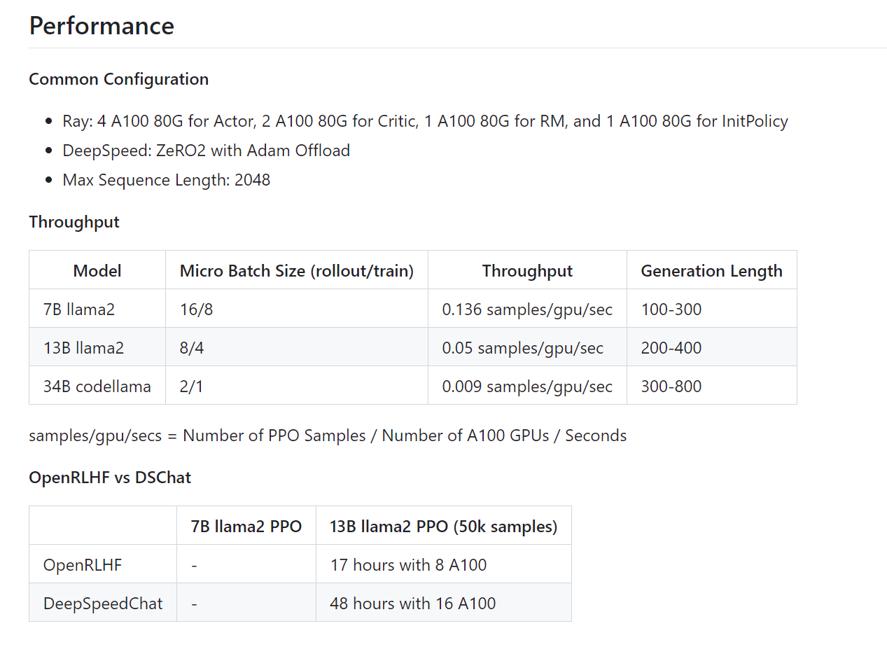

# Feasibility report
## Ray+ large model distributed deployment optimization

- 
- [Ray+ large model distributed deployment optimization](#Ray+ large model distributed deployment optimization)
- [Team members](#Team members)
- [Theoretical basis](#Theoretical basis)
- [Theoretical basis of Ray framework](#1Theoretical basis of ray framework)
- [Ray computing model](#11-ray computing model)
- [Ray distributed scheduler](#12-ray distributed scheduler)
- [Ray distributed object storage](#13-ray distributed object storage)
- [Ray's advantages over other distributed frameworks](#14-ray's advantages over other distributed frameworks)
- [Mapreduce](#141-mapreduce)
- [Spark](#143-spark)
- [Deepspeed ZERO theoretical basis](#deepspeed-zero-theoretical basis)
- [Three levels of ZERO optimization](#21-three levels of zero optimization)
- [ZeRO-1](#211-zero-1)
- [ZeRO-2](#212-zero-2)
- [ZeRO-3](#213-zero-3)
- [Zero copy technology](#3-Zero copy technology)
- [Technical basis](#Technical basis)
- [Ray's support for AI training](#Ray's support for AI training)
- [Ray+large model mature project](#Ray large model mature project)
- [Use Ray and other tools to achieve model training optimization](#Use Ray and other tools to achieve model training optimization)
- [Innovation](#Innovation)
- [Outline design report](#Outline design report)
- [Achievement goals](#Achievement goals)
- [Implementation steps](#Implementation steps)
- [References](#References)

## Team members

**Yin Yiming**
**He Yueqiang**
**Guo Ze**
**Peng Han**

## Theoretical basis
---
### 1. Theoretical basis of Ray framework
Ray is a high-performance distributed execution framework launched by UC Berkeley RISELab. It uses a different architecture and abstraction of distributed computing from traditional distributed computing systems. It has better computing performance than Spark and is a general cluster computing framework that supports both model training and simulation of the environment or interaction with the environment.

​ According to the official document:

​ Ray provides a simple, universal API for building distributed applications.

​ It has the following main features:

​ Provides a simple primitive that can build and run distributed applications;

​ Expand from single machine to parallel with almost no code changes;

​ Has a good ecosystem and can build complex applications on core Ray.

​Ray, as a flexible, scalable distributed computing engine with testing, deployment and monitoring, can more conveniently and efficiently support data processing, data analysis, real-time stream computing, and ML/DL/RL model services, distributed training, hyperparameter adjustment and other functions.

The Ray framework has the following advantages in various application scenarios:

+ Efficient distributed computing. The Ray framework supports efficient distributed computing, which can easily expand computing resources and improve the execution speed and computing efficiency of tasks.
+ Flexible task scheduling. The Ray framework provides a flexible task scheduling mechanism, which can dynamically adjust the execution order and allocation strategy of tasks according to the task type and the status of computing resources, thereby maximizing the utilization of computing resources.
3) High reliability and fault tolerance. The Ray framework provides a high reliability and fault tolerance mechanism, which can automatically handle resource computing failures and task anomalies to ensure the correct execution of tasks and the reliability of computing results.
+ Easy-to-use programming interface. The Ray framework provides a simple and easy-to-use programming interface and supports multiple programming languages ​​(such as Python, Java, C++, etc.), which allows developers to easily write distributed computing tasks.
+ High scalability. The Ray framework is highly scalable and can be integrated with other distributed computing frameworks (such as Hadoop, Spark, Kubernetes, etc.) to provide more complete and powerful distributed computing capabilities.
In short, the Ray framework has the advantages of high efficiency, reliability, flexibility and ease of use in various application scenarios, which can help users complete distributed computing tasks more easily and obtain better computing performance and efficiency.
#### 1.1 Ray computing model
The architecture of Ray consists of the application layer and the system layer. The application layer implements the Ray API as the front end for users to use, while the system layer serves as the back end to ensure the high scalability and fault tolerance of Ray. The overall framework is as follows

GCS, as a centralized server, is the link for transmitting messages between Workers. Each Server has a shared Object Store, which is the memory data built with Apache Arrow/Plasma. Local Scheduler is the internal scheduling of the Server (single-machine scheduling), and communicates with Workers on other Servers through GCS. Object Stores also communicate with each other to transfer data between Workers.

Local Scheduler, namely Raylet, is the core of local scheduling

**Scheduling process: After a task is created, it is first submitted to the local scheduler. In most cases, the task will be scheduled locally. If there are no resources, the local scheduler will pass the task to the global scheduler and the task information to GCS, and then the global scheduler will select the node with the shortest waiting time and sufficient resources to execute the task**

Task definition, submission, remote submission process: 0. Define remote function 1. Submit task 2. Submit task to global 3. Check object table 4. Execute global scheduling 5. Check task input 6. Query missing input 7. Object copy 8. Execute local scheduling 9. Access object storage

Get task execution result process:
1. Adjust get request
2. Register callback function
3. Task execution completed
4. Synchronize object to GCS
5. Trigger callback function
6. Execute callback function
7. Return to user program
#### 1.2 Ray Distributed Scheduler
The task scheduler in Ray is divided into two layers, consisting of a global scheduler and a local scheduler for each node. In order to avoid overloading the global scheduler, the tasks created on the node are first submitted to the local scheduler. If the node is not overloaded and the node resources can meet the requirements of the task (such as the GPU requirements), the task will be scheduled locally. Otherwise, the task will be passed to the global scheduler and the task will be considered to be scheduled remotely. Since Ray first considers local scheduling and only considers remote calls if the local does not meet the requirements, this scheduling method is also called bottom-up scheduling.

The figure below shows the scheduling process of Ray, and the thickness of the arrow indicates the frequency of the process. User processes and workers submit tasks to the local scheduler. In most cases, the tasks will be scheduled locally. In a few cases, the local scheduler will submit tasks to the global scheduler and pass the relevant information of the task to GCS, storing the objects and functions involved in the task in the global object table and function table. Then the global scheduler will read the information from GCS and choose to schedule the task on other suitable nodes. More specifically, the global scheduler selects a series of nodes with sufficient resources based on the task's request, and selects the node with the shortest waiting time among these nodes.

#### 1.3 Ray Distributed Object Storage
Ray implements a memory-based distributed storage system to store the input and output of each task. Ray implements an object store (Object Store) on each node through a memory sharing mechanism, so that tasks running on the same node can share data without copying. When a task's input is not local, its input will be copied to the local object store before execution. Similarly, the task will always write its output to the local object store. Such a copy mechanism can reduce the execution time of the task, because the task will only read data from the local object store (otherwise the task will not be scheduled), and eliminate the potential bottleneck that hot data may bring.

#### 1.4 Advantages of Ray over other distributed frameworks

##### 1.4.1 Mapreduce
MapReduce is a programming model for processing large data sets in parallel on large computing clusters. It mainly consists of two phases: Map phase and Reduce phase, with data exchanged through disk. However, its disk IO overhead is large: the intermediate data between the Map and Reduce phases needs to be written to the disk, resulting in a large amount of disk IO, which is one of its performance bottlenecks. For tasks that require multiple iterations (such as machine learning algorithms), each iteration needs to read and write the disk from the beginning, which is inefficient and not suitable for real-time data processing.
##### 1.4.3 Spark
Spark is an open source distributed computing system, which was originally designed to address the shortcomings of MapReduce in iterative computing and real-time processing. However, due to its reliance on memory processing, it consumes relatively large resources, especially when processing large data sets, it may require more memory resources. Although it provides rich functions, it has a higher threshold for learning and using Spark than MapReduce.
In contrast, Ray's advantages are:
+ Minimum cluster configuration
+ Best suited for computationally heavy workloads. Ray has been shown to outperform Spark and Dask on certain machine learning tasks, such as NLP, text normalization, etc. Most importantly, Ray seems to work 10% faster than Python standard multiprocessing, even on a single node.
+ Unique actor-based abstraction, where multiple tasks can work on the same cluster asynchronously, thereby improving utilization (in contrast, Spark's computational model is less flexible and based on synchronous execution of parallel tasks).

### Deepspeed ZERO Theoretical Foundation
DeepSpeed ​​is an open source optimization tool for deep learning developed by Microsoft, which spans the fields of model training, inference, and model compression.
Zero Redundancy Optimizer (ZeRO) is the core of the training optimization provided by DeepSpeed, which is a set of techniques to reduce the amount of memory required for distributed model training.
Data parallelism copies the model to multiple GPU devices, but obviously this process of copying the model will generate large video memory redundancy. In order to solve this problem and effectively reduce redundancy, ZeRO-DP can be used to replace DP: ZeRO-DP solves this redundancy problem in the following ways:
+ Partitioning optimizer state
+ Partitioning gradients
+ Partitioning model parameters
deepSpeed ​​sets three stages, including a combination of the above three solutions for users to choose.

Zero optimizes the memory usage of deep learning based on the following three key observations:

- Data parallelism has better scalability than model parallelism because model parallelism reduces the granularity of calculations and also increases communication overhead.

Data parallelism lacks memory efficiency.

- Both data and model parallelism maintain all model states required during the entire training process, but not all of the time. For example, the parameters corresponding to each layer are only required during the forward and backward propagation of a certain layer.

- Data parallelism has good communication and computational efficiency, but serious memory redundancy. Therefore, ZeRO eliminates this memory redundancy by partitioning parameters (including optimizer state, gradients, and parameters), with each GPU saving only part of the parameters and related states.

The above figure compares the memory consumption of each device for parameters, gradients, and optimization states, and enables various memory optimizations (Baseline represents the unoptimized baseline). In the memory consumption formula, Ψ represents the model size (number of parameters), K represents the memory multiplier of the optimizer state, and Nd represents the data parallelism. In this example, we assume that the model size is Ψ=7.5 billion, based on mixed precision training with the Adam optimizer, the data parallelism is Nd=64 (i.e. 64 GPUs), and K=12. Based on data parallelism, we optimize memory in three steps:

Pos (optimizer state optimization)
As shown in Pos in Figure 2, we save all parameters in each gpu and gradients, but only 1/Nd optimizer variables are saved, which will result in a total memory consumption of 2Ψ+2Ψ+12Ψ/Nd, which is 31.4GB under the assumptions in the diagram

Pos+g (gradient optimization increased relative to 1)
On the basis of 1, the optimization of gradient memory is increased, that is, only 1/Nd gradients are saved in each gpu, which will result in a total memory consumption of 2Ψ+(2Ψ+12Ψ)/Nd, which is 16.6GB under the assumptions in the diagram

Pos+g+p (parameter optimization increased relative to 2)
On the basis of 2, the optimization of parameter memory is increased, that is, only 1/Nd parameters are saved in each gpu, which will result in a total memory consumption of (2Ψ+2Ψ+12Ψ)/Nd, which is 1.9GB under the assumptions in the diagram

The above table shows the maximum model (measured in parameters) that can be realized under different model parallelism and gpu. The rightmost is the measured value of the author's implementation, and the left is the theoretical value. Therefore, this shows that the memory calculation proposed by the author is basically reliable. According to the assumptions in the paper, theoretically, the memory consumption of the three memory optimization modes Pos, Pos+g, and Pos+g+p is roughly equivalent to 26%, 13%, and 1.7% of the original baseline.
#### 2.1 Three levels of ZERO optimization

ZeRO has three different levels, corresponding to different degrees of paritition of Model States:
- ZeRO-1: paritition of Optimizer States;
- ZeRO-2: paritition of Optimizer States and Gradients;
- ZeRO-3: paritition of Optimizer States, Gradients, and Parameters

##### 2.1.1 ZeRO-1:
Assuming we have N parallel processes, ZeRO-1 will divide the state of the complete optimizer into N equal parts and store them in each process. After Backward is completed, the Optimizer of each process: - Calculates and updates the Optimizer States (including Momentum, Variance and FP32 Master Parameters) stored by itself. - The updated Partitioned FP32 Master Parameters will be passed back to each process through All-gather. - Completes a complete parameter update.
Through ZeRO-1's segmented storage of Optimizer States, the memory usage of the model with 7.5B parameters will be reduced from 120GB under the original data parallel to 31.4GB.
##### 2.1.2 ZERO-2
ZeRO-1 stores Optimizer States in small segments in multiple processes, so when calculating, this small segment of Optimizer States only needs to obtain the corresponding small segment of Gradient required by the process. Following this principle, like Optimizer States, ZeRO-2 also slices the Gradient:
After all the gradients of a layer are calculated: - Gradient is aggregated through AllReduce. (Similar to DDP) - The aggregated gradient will only be used by one process to update the parameters, so this section of the gradient on other processes is no longer needed and can be released immediately. (Retain on demand)
This achieves the segmentation of the gradient on the basis of ZeRO-1.

Through the segmented storage of gradient and optimizer states in ZeRO-2, the memory usage of the model with 7.5B parameters will be further reduced from 31.4GB in ZeRO-1 to 16.6GB.

##### 2.1.3 ZERO-3
When the optimizer states and gradients are distributed, segmented, stored and updated, the remaining ones are the model parameters. ZeRO-3 divides the optimizer states, gradients and model parameters into three aspects, so that all processes can work together and only store a complete model state. Its core idea is to refine the communication and collect and release parameters according to the computing needs.

### 3. Zero-copy technology
One of Ray's unique features is its main memory object store Plasma, which uses shared memory to pass objects between processes on each machine in a Ray cluster. Ray uses Plasma to implement zero-copy transfers of NumPy arrays. If a Ray task needs to read a NumPy array from Plasma, the task can access the array's data directly from shared memory without copying any data to its local heap.

If we store the model's weights as NumPy arrays on Plasma, we can access those weights directly from Plasma's shared memory segment without any copying.

But we still need to connect these weights to the rest of the PyTorch model, which requires wrapping them in a PyTorch Tensor object. The standard way to create a tensor involves copying the contents of the tensor, but PyTorch also has an alternative code path for initializing a Tensor without performing a copy. You can access this code path by passing a NumPy array to torch.as_tensor() instead of using Tensor.__new__().

With all this background information in mind, here is a high-level overview of how to do zero-copy model loading from Plasma. First, you need to load the model into the Plasma object store, which is a three-step process:

Load the model from disk.
Separate the original PyTorch model into weights and an op graph, and convert the weights to a NumPy array.
Upload the NumPy array and the model (minus the weights) to Plasma.
Once the model and its weights are in the object store, you can do a zero-copy load of the model. Here are the steps to follow:

Deserialize model from Plasma (minus weights)
Extract weights from Plasma (no copying of data)
Wrap weights in PyTorch tensors (no copying)
Install weight tensors back into rebuilt model (no copying)

Using training a BERT model as an example, these steps will load BERT in 0.004 seconds if a copy of the model is in the Plasma shared memory segment on the local machine. This is 340x faster than loading the model using BertModel.from_pretrained() .

## Technical basis
---
### Ray's support for AI training:

The above picture is a panoramic view of the AI ​​ecosystem supported by Ray, which covers almost all mainstream frameworks on the market. In other words, these frameworks can be easily integrated in Ray.

Through these framework integrations, Ray can also connect the entire AI pipeline execution process into the following four major steps:

Data -> train -> tune -> serve, these four steps cover all the main functions of distributed training:

1. Data preprocessing.

2. Deep learning.

3. Deep tuning.

4. Online reasoning.

In Ray, you can complete all the above steps with just a hundred lines of code.

### Ray+Mature Projects with Large Models

With the popularity of large model training in recent years, Ray has naturally become the first choice for open source large model training

In terms of open source large model training, there are also many large projects using Ray:

In terms of enterprise-level applications, the most familiar one should be ChatGPT-4:

In addition to OpenAI, there are many companies from all over the world that are deeply using Ray:

### Ray combines with other tools to optimize model training

**Ray + ZeRO**

RLHF training is an essential part of training ChatGPT. Currently, there are many RLHF training frameworks in the open source community, such as TRL, DeepSpeedChat or the recently popular LLaMA Factory. These frameworks are often based on parallel methods such as ZeRO, slicing the four models in the RLHF algorithm and putting them on the same GPU.

Combining ZeRO and Ray can provide more powerful distributed computing and resource management capabilities for training ultra-large-scale models. Specifically, they can be combined in the following ways:

1. Distributed training management: Use Ray as the manager of distributed training, responsible for task scheduling, resource allocation and monitoring. ZeRO is used to manage the distributed parallel computing and parameter updates of the model to minimize memory usage and communication overhead.
2. Resource optimization: Ray can dynamically allocate computing resources as needed and optimize resources during the training process. Combined with ZeRO technology, GPU memory and communication resources can be efficiently managed in a distributed environment, making the training process more efficient and stable.
3. Task parallelization: Ray can parallelize training tasks to multiple computing nodes for execution, and use ZeRO technology on each node to achieve model parallelism. This can speed up the training process and handle larger data sets and models.
4. Data distribution and communication optimization: Ray can help optimize the data distribution and communication process to minimize the communication overhead of data transmission and model updates. Used in conjunction with ZeRO technology, bandwidth and communication resources can be used more efficiently.

In summary, combining ZeRO and Ray can give full play to their respective advantages, provide powerful distributed computing and resource management support for training ultra-large-scale models, accelerate the training process and improve efficiency.

As can be seen from the above figure, compared with OpenRLHF, the reasoning efficiency is nearly 4 times higher through ray+DeepSpeedchat ZERO-2. If the ZERO-3 level optimization is applied, the efficiency will be further improved.

**Ray + vLLM solution architecture**

In the [OpenRLHF](https://github.com/OpenLLMAI/OpenRLHF/tree/main) project, the author redesigned the model scheduling solution based on Ray and vLLM:

1. For small models such as 7B, the author puts all models on the same GPU

2. For medium models of 13B~34B, the author puts the four models in PPO on different GPUs based on Ray to achieve full fine-tuning

3. For large models of 34B+, the author uses vLLM's TP to load the Actor model in parallel, and other models are still distributed on different GPUs using Ray

However, for models of 34B+, we found that even if we put the models on different cards with Ray, there is no way to put them in

So the author thought that for the Actor reasoning module, we optimized the distributed reasoning based on vLLM's TP parallelism and Dynamic Batching capabilities, and then other modules (i.e., the Actor/Critic training module and the Reward/RefActor reasoning module) only participate in forward or backward The author uses ZeRO3 to perform parallel training. The architecture diagram is as follows:

Each time PPO training, the vLLM inference engine will receive the updated weights of the DeepSpeed ​​ZeRO3 training framework. The author implements this process through NVIDIA NCCL high-performance communication. Given the high-performance inference capability of vLLM, the author has achieved good performance gains. Furthermore, the author can integrate the training node and inference node of Actor to achieve node reuse to avoid GPU idleness, because these two modules do not work at the same time.

So far, the author has used Ray We implement RLHF training schemes for 70B+ models with vLLM, and our scheme is seamlessly compatible with the Huggingface Transformers library, without the need to manually modify the model structure like Megatron-LM.

**Efficiently scaling LLM training on large GPU clusters using Alpa and Ray**[3]

The core of Alpa and Ray is to increase developer speed and efficiently scale models. The pipeline parallelization capabilities of the Alpa framework can easily parallelize the computation of large models on multiple GPUs and reduce the cognitive burden on developers. Ray provides a distributed computing framework that simplifies resource scaling and management across multiple machines.

When Alpa and Ray are used together, they provide a scalable and efficient solution for training LLMs on large GPU clusters. With this integration, benchmarks show the following benefits:

1. For an LLM with 175 billion parameters, Alpa on Ray can scale to more than 1,000 GPUs.

2. All LLM parallelization and partitioning are automatically performed through a one-line decorator.

Combining Alpa and Ray OSS frameworks, developers can efficiently scale LLM training in large clusters on JAX. Use Alpa to automatically compile your network architecture, and use Ray to coordinate and run tasks in a cluster of machines.

## Innovations
- 1. By integrating Ray and other technologies, and making interface calls and parameter adjustments, data deployment and throughput are optimized to achieve data throughput optimization when training large models.

- 2. By investigating frameworks such as ZeRO, vllm, Adam Offload, Pinned Memory, etc., try to integrate with Ray. And explore the degree of optimization.

- 3. By applying ZERO-3, the three aspects of Optimizer States, Gradient and Model Parameter are divided to optimize the data exchange and scheduling when Ray+ large model is deployed.

## Summary design report:

### Planned goals:

By combining Ray with other frameworks, the scheduling, allocation and deployment optimization of data during the training of large models is realized.

### Implementation steps:

1. Feasibility verification (preliminary): Ray+ large model (<=LLama 7B)

2. Distributed deployment of LLama 13B model, implementation of performance monitoring module, determination of Basiline, and selection of medium-sized models such as 13B for optimization

3. (Optional) Combine Pytorch zero-copy model with Ray to train medium-sized models, adjust parameters, and check the degree of optimization

4. (Advanced optional) Combine with ZeRO-1/ZeRO-2 to train medium-sized models, about 32B, and test the optimization performance.

5. (Advanced optional) Implement the combination with ZeRO-3, train medium-sized models, and optimize.

6. (Advanced optional) Implement the combination with vllm, train larger models, and optimize.

## References
[1] [OpenRLHF github repository](https://github.com/OpenLLMAI/OpenRLHF/tree/main)
[2] [Starting the training journey: Building an open source RLHF full-scale training framework for 70B+ models based on Ray and vLLM - Zhihu (zhihu.com)](https://zhuanlan.zhihu.com/p/678828949)

[3] https://developer.nvidia.com/zh-cn/blog/efficiently-scale-llm-training-across-a-large-gpu-cluster-with-alpa-and-ray/

[4] ZeRO: Memory Optimizations Toward Training Trillion Parameter Models
Samyam Rajbhandari, Jeff Rasley, Olatunji Ruwase, Yuxiong He

[5] Systems for Parallel and Distributed Large-Model Deep Learning Training
Kabir Nagrecha

[6] [Easier Model Serving with zerocopy](https://medium.com/ibm-data-ai/easier-model-serving-with-zerocopy-3930d1d2a1af) [7] [How to Load PyTorch Models 340 Times Faster with Ray](https://link.zhihu.com/?target=https%3A//medium.com/ibm-data-ai/how-to-load-pytorch-models-340-times-faster-with-ray-8be751a6944c) [8] Ray: A Distributed Framework for Emerging AI Applications Philipp Moritz, Robert Nishihara, Stephanie Wang, Alexey Tumanov, Richard Liaw, Eric Liang, Melih Elibol, Zongheng Yang, William Paul, Michael I. Jordan, and Ion Stoica, UC Berkeley [9] A Study of a Scalable Distributed Stream Processing Infrastructure Using Ray and Apache Kafka Kasumi Kato; Atsuko Takefusa; Hidemoto Nakada; Masato Oguchi [10] Ray: A Distributed Execution Engine for the Machine Learning Ecosystem 2019 Moritz, Philipp CAdvisor(s): Jordan, Michael I;Stoica, Ion