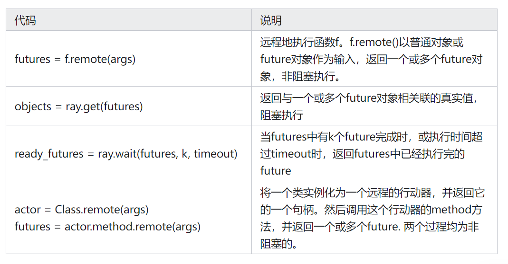
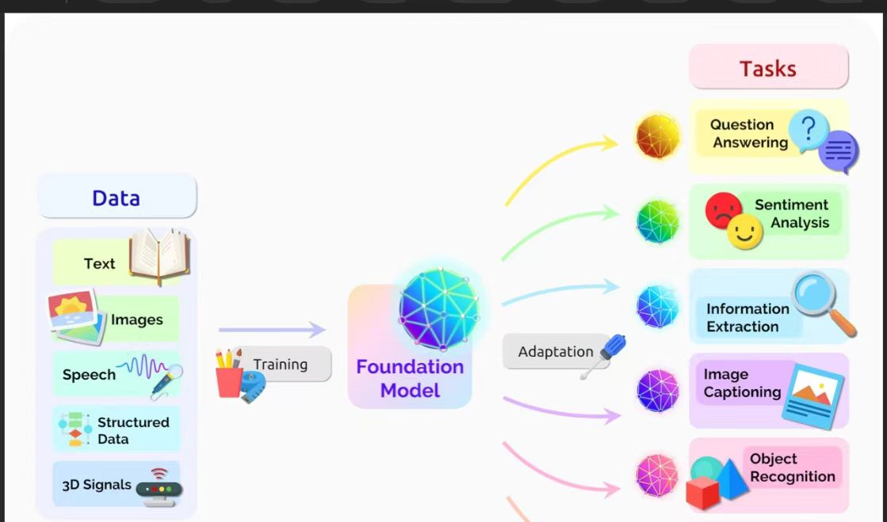
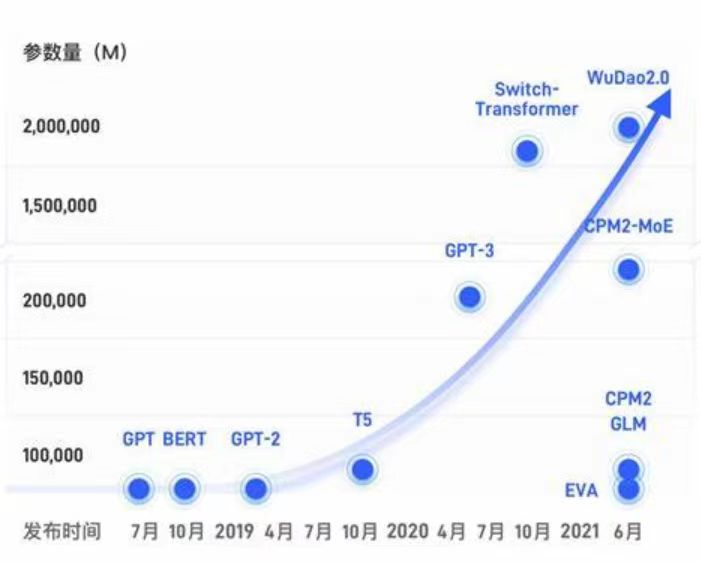
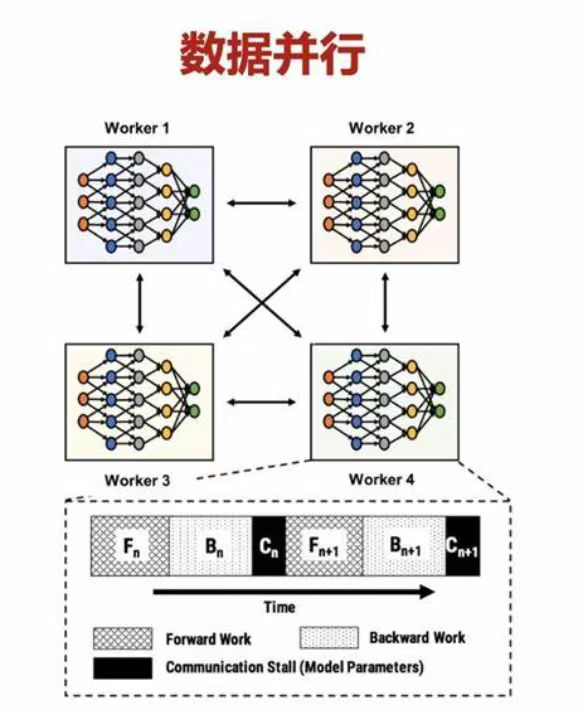
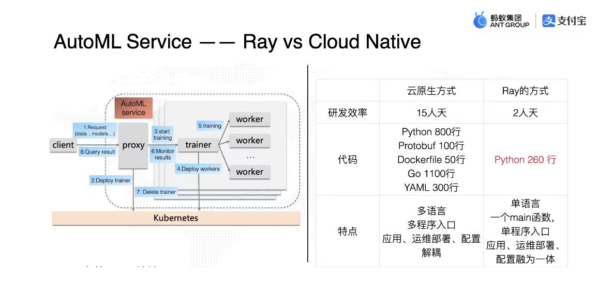
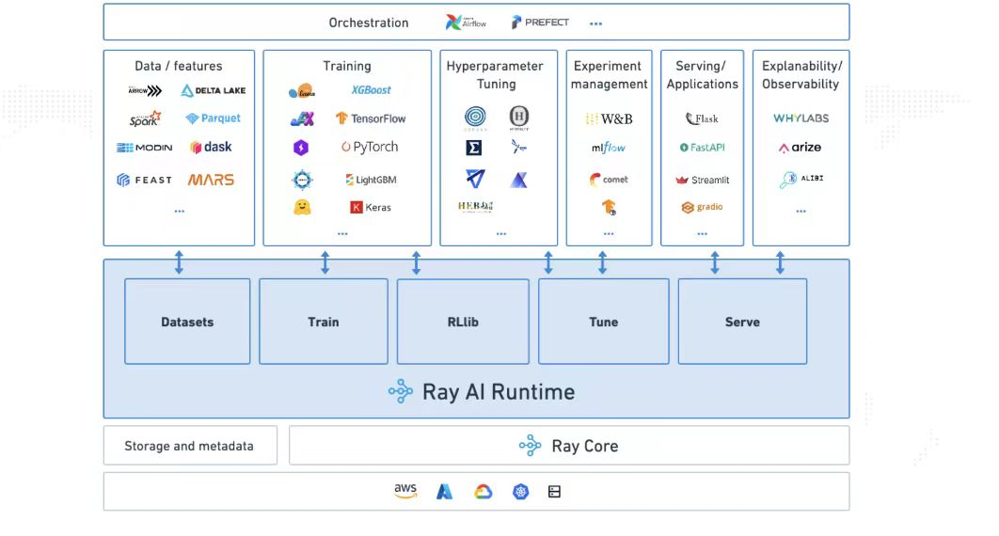

# Research report

## Ray+ large model distributed deployment optimization

- [Research report](#Research report)
- [Ray+ large model distributed deployment optimization](#Ray+ large model distributed deployment optimization)
- [Team members](#Team members)
- [Project background](#Project background)
- [Memory bottleneck of large model](#Memory bottleneck of large model)
- [Ray](#Ray)
- [What is Ray](#What is Ray)
- [Why choose Ray](#Why choose Ray)
- [Distributed challenges](#Distributed challenges)
- [Project basis/technical route](#Project basis technical route)
- [Ray](#1.Ray)
- [Ray distributed computing framework](#11-ray distributed computing framework)
- [Ray programming model](#12-ray programming model)
- [Ray computing model](#13-ray computing model)
- [Distributed scheduler](#14-distributed scheduler)
- [Distributed object storage](#15-Distributed object storage)
- [Advantages/disadvantages of the Ray framework compared to Spark](#16-Advantages and disadvantages of the ray framework compared to spark)
- [Deepspeed ZERO](#2-deepspeed-zero)
- [Three levels of ZERO](#21-Three levels of zero)
- [ZeRO-1](#211-zero-1)
- [ZeRO-2](#212-zero-2)
- [ZeRO-3](#213-zero-3)
- [Zero copy technology](#3-Zero copy technology)
- [Foresight/importance analysis](#Foresight importance analysis)
- [Future development of large models](#1-Future development of large models)
- [Ray](#2-ray)
- [Related work](#Related work)
- [Using Ray for AI training](#Using ray for ai training 1)
- [Large Model Training Using Ray](#Large Model Training Using Ray)
-[Model Training Optimization Using Ray and Other Tools](#Further Optimization of Model Training Using Ray and Other Tools)
-[References](#References)

## Team Members

**Yin Yiming**
**He Yueqiang**
**Guo Ze**
**Peng Han**

## Project Background
---
### Memory Bottleneck of Large Models

​ The scale of AI models has maintained a 10-fold growth every year in the past four years. The large models produced in 2021 have reached 1 trillion parameters. Recently, distributed training claims to support 100 trillion parameters, and it seems that this trend can continue for more than two years. Training huge models inevitably requires the support of underlying basic software and chips. However, in the past four years, the growth of GPU memory space and computing power has been at the order of 10 times, which obviously cannot keep up with the 10,000-fold growth of model scale. The parameter scale of these large models brings new challenges to the training system, such as memory bottlenecks, poor runtime efficiency, and high model development costs.

​ In recent years, the scale of ML/AI models has grown rapidly, far exceeding the growth of hardware capabilities. $Ion ~Stoica$ said: The only way to meet the demand for sufficient computing power is distribution. With the expansion of data scale and the increase of computing complexity, the computing power of a single machine can no longer meet the needs of large-scale data processing and computing, and distributed computing has gradually become an important way of data processing and computing.

​ The rise and development of distributed models

​ The origin of distributed training can be traced back to the 1990s, when large-scale data sets and complex machine learning models could not be processed due to the limitation of computer processing power. With the development of computer technology, distributed computing frameworks such as Hadoop and Spark have begun to be widely adopted, making distributed training possible. Distributed training can split large-scale data sets into multiple small data sets, store them on multiple computers, and train models simultaneously, thereby greatly shortening the training time.

​ In 2017, the RISELab laboratory of the University of Berkeley developed a general asynchronous parallel framework Ray for deep reinforcement learning. Ray's distributed iterative jobs have been reduced from the task level to the function level, effectively solving Spark's lack of support for reinforcement learning. Therefore, the RRLP platform proposed in this paper uses Ray as the main framework, which can perfectly solve the frequent data collection and redistribution during the training of reinforcement learning models. Ray can not only distribute tasks asynchronously and in parallel, but also share all storage resources, thereby obtaining excellent performance that is more suitable for parallel distributed reinforcement learning calculations.

### Ray
#### What is Ray

Ray is a distributed computing system developed by RISELab at the University of Berkeley. It is an open source system for building high-performance distributed applications. One of Ray's unique features is its main memory object storage Plasma, which uses shared memory to pass objects between processes on each machine in the Ray cluster. Ray uses Plasma to implement zero-copy transmission of NumPy arrays. In traditional parallel computing frameworks, task schedulers and metadata storage are centralized, that is, there is generally only one large task scheduler and metadata storage in the cluster, which is also intuitive. However, in order to meet performance requirements, Ray uses a distributed task scheduler and metadata storage design, thereby meeting Ray's millisecond-level concurrency requirements. Ray also provides a Lineage-based fault tolerance mechanism for tasks and actors, and a replication-based fault tolerance mechanism for metadata storage. These will be described in detail later.

#### Why choose Ray

​ MapReduce MapReduce is a programming model for processing large data sets in parallel on large computing clusters. It mainly consists of two stages: Map stage and Reduce stage, and data is exchanged through disks. However, its disk IO overhead is large: the intermediate data between the Map and Reduce stages needs to be written to the disk, resulting in a large amount of disk IO, which is one of its performance bottlenecks. For tasks that require multiple iterations (such as machine learning algorithms), each iteration needs to read and write the disk from scratch, which is inefficient and not suitable for real-time data processing.

​ Spark Apache Spark is an open source distributed computing system designed to address the shortcomings of MapReduce in iterative computing and real-time processing. However, due to its reliance on memory processing, it consumes relatively large resources, especially when processing large data sets, it may require more memory resources. Although it provides rich functions, the threshold for learning and using Spark is higher than that of MapReduce.

### Distributed Challenges

​ Distributed model reasoning is already an important technology in the field of artificial intelligence, but there are still some future development trends and challenges:

​ Optimization of task allocation strategy to improve the utilization of computing resources and system performance.

​ Innovation of data distribution method to improve data storage and access efficiency.

​ Improvement of communication mechanism to increase communication speed and reduce communication overhead.

## Project Basis/Technical Route
---
### 1. Ray
#### 1.1 Ray Distributed Computing Framework

Ray is a high-performance distributed execution framework launched by UC Berkeley RISELab. It uses a different architecture and abstraction of distributed computing from traditional distributed computing systems. It has better computing performance than Spark and is a general cluster computing framework that supports both model training and simulation of the environment or interaction with the environment.

​ According to the official documentation:

​ Ray provides a simple, universal API for building distributed applications.
​ It has the following main features:

​ Provides a simple primitives for building and running distributed applications;

​ Expands from single machine to parallel with almost no code changes;

​ Has a good ecosystem and can build complex applications on core Ray.

​ As a flexible, scalable distributed computing engine with testing, deployment and monitoring, Ray can more conveniently and efficiently support data processing, data analysis, real-time stream computing, and ML/DL/RL model services, distributed training, hyperparameter adjustment and other functions.

The Ray framework can be applied to distributed computing tasks in the fields of big data processing, machine learning, reinforcement learning, natural language processing, etc.:

+ Big data processing. The Ray framework can be integrated with other big data processing frameworks (such as Hadoop and Spark) to improve the efficiency and reliability of data processing. The Ray framework can achieve efficient storage and access of data through distributed object storage (such as Amazon S3 and Google Cloud Storage).

+ Machine learning. The Ray framework can provide efficient distributed computing and deep learning frameworks (such as TensorFlow, PyTorch) integration to accelerate model training and reasoning. The Ray framework can provide functions such as model parallelization, data parallelization, and hyperparameter search.
3) Reinforcement learning. The Ray framework can provide efficient reinforcement learning frameworks (such as RLlib) to accelerate the training and evaluation of reinforcement learning models. The Ray framework can provide efficient parallelization, distributed experience replay, and distributed optimizers.
+ Natural language processing. The Ray framework can provide efficient natural language processing frameworks (such as Hugging Face Transformers) to accelerate model training and reasoning.
In short, the Ray framework has a wide range of application scenarios and can be used for various types of distributed computing tasks, thereby accelerating the execution speed of tasks, improving computing efficiency and reliability, and reducing computing costs.
The Ray framework has the following advantages in various application scenarios:
+ Efficient distributed computing. The Ray framework supports efficient distributed computing, which can easily expand computing resources and improve the execution speed and computing efficiency of tasks.
+ Flexible task scheduling. The Ray framework provides a flexible task scheduling mechanism, which can dynamically adjust the execution order and allocation strategy of tasks according to the task type and the status of computing resources, thereby maximizing the utilization of computing resources.
3) High reliability and fault tolerance. The Ray framework provides a high reliability and fault tolerance mechanism, which can automatically handle resource computing failures and task anomalies, ensuring the correct execution of tasks and the reliability of computing results.
+ Easy-to-use programming interface. The Ray framework provides a simple and easy-to-use programming interface, supports multiple programming languages ​​(such as Python, Java,
C++, etc.), and allows developers to easily write distributed computing tasks.
+ High scalability. The Ray framework is highly scalable and can be integrated with other distributed computing frameworks (such as Hadoop, Spark, Kubernetes, etc.) to provide more complete and powerful distributed computing capabilities.
In short, the Ray framework has the advantages of high efficiency, reliability, flexibility and ease of use in various application scenarios, which can help users complete distributed computing tasks more easily and obtain better computing performance and efficiency.

#### 1.2 Ray programming model

**Ray programming model** refers to a set of APIs and programming paradigms provided to users by the Ray framework based on the two important requirements of tasks and actors. The following table shows the core APIs provided by Ray.

A task is a remote function executed in a stateless worker. When a remote function is called, it immediately returns a future object, and the actual return value can be obtained through ray.get(<future object>). **Such a programming model allows users to write parallel computing code while reminding users to pay attention to the dependencies between data. **

#### 1.3 Ray computing model

* Background of Ray: Due to the rapid development of AI and big data, higher challenges have been raised for application and hardware capabilities.

* Features of Ray: distributed asynchronous calls, memory scheduling, distributed support for Pandas/Numpy, support for Python, and outstanding overall performance

* Basic software framework

The architecture of Ray consists of an application layer and a system layer. The application layer implements Ray's API as a front-end for users, while the system layer serves as a back-end to ensure Ray's high scalability and fault tolerance. The overall framework is as follows

GCS, as a centralized server, is the link for transmitting messages between Workers. Each Server has a shared Object Store, which is memory data built with Apache Arrow/Plasma. Local Scheduler is the internal scheduling of the Server (single-machine scheduling), and communicates with Workers on other Servers through GCS. Object Stores also communicate with each other to transmit data between Workers.

Local Scheduler, namely Raylet, the core of local scheduling

**Scheduling process: After the task is created, it is first submitted to the local scheduler. In most cases,The task will be scheduled locally. If there are no resources, the local scheduler will pass the task to the global scheduler and the task information to GCS, and then the global scheduler will select the node with the shortest waiting time and sufficient resources to execute the task**

Task definition, submission, remote submission process: 0. Define remote function 1. Submit task 2. Submit task to global 3. Check object table 4. Execute global scheduling 5. Check task input 6. Query missing input 7. Object copy 8. Execute local scheduling 9. Access object storage

Get task execution result process:
1. Adjust get request
2. Register callback function
3. Task execution completed
4. Synchronize object to GCS
5. Trigger callback function
6. Execute callback function
7. Return to user program

#### 1.4 Distributed Scheduler
The task scheduler in Ray is divided into two layers, consisting of a global scheduler and a local scheduler for each node. To avoid overloading the global scheduler, the tasks created on the node are first submitted to the local scheduler. If the node is not overloaded and the node resources can meet the requirements of the task (such as the GPU requirements), the task will be scheduled locally. Otherwise, the task will be passed to the global scheduler and the task will be considered to be scheduled remotely. Since Ray first considers local scheduling and only considers remote calls if the local does not meet the requirements, this scheduling method is also called bottom-up scheduling.

The figure below shows the scheduling process of Ray, and the thickness of the arrow indicates the frequency of the process. User processes and workers submit tasks to the local scheduler. In most cases, the tasks will be scheduled locally. In a few cases, the local scheduler will submit tasks to the global scheduler and pass the relevant information of the task to GCS, storing the objects and functions involved in the task in the global object table and function table. Then the global scheduler will read the information from GCS and choose to schedule the task on other suitable nodes. More specifically, the global scheduler selects a series of nodes with sufficient resources based on the task's request, and selects the node with the shortest waiting time among these nodes.

#### 1.5 Distributed Object Storage
Ray implements a memory-based distributed storage system to store the input and output of each task. Ray implements an object store (Object Store) on each node through a memory sharing mechanism, so that tasks running on the same node can share data without copying. When a task's input is not local, its input is copied to the local object store before execution. Similarly, the task always writes its output to the local object store. Such a copy mechanism can reduce the execution time of the task, because the task will only read data from the local object store (otherwise the task will not be scheduled), and eliminates the potential bottleneck that hot data may cause.

#### 1.6 Advantages/Disadvantages of Ray Framework Compared to Spark
Advantages:
+ Minimal cluster configuration
+ Best for computationally heavy workloads. Ray has been shown to outperform Spark and Dask on certain machine learning tasks, such as NLP, text normalization, etc. Most importantly, Ray seems to work 10% faster than Python standard multiprocessing, even on a single node.
+ Unique actor-based abstraction, where multiple tasks can work on the same cluster asynchronously, thereby improving utilization (in contrast, Spark's computational model is less flexible and based on synchronous execution of parallel tasks).

Disadvantages:
+ Relatively new (first released in May 2017)
+ Not really suitable for distributed data processing. Ray has no built-in primitives for partitioning data, and if the task is data-centric and more around ETL/preprocessing, Spark is still needed. For model parallel training, accelerating Python code running, reinforcement learning, etc., Ray can be chosen. Spark can also be organized through Ray to achieve end-to-end model training.

### 2. Deepspeed ZERO

DeepSpeed ​​is an open source optimization tool for deep learning developed by Microsoft, which spans model training, inference, and model compression.
Zero Redundancy Optimizer (ZeRO) is the core of the training optimization provided by DeepSpeed. It is a set of technologies to reduce the amount of memory required for distributed model training.
Data parallelism copies the model to multiple GPU devices, but obviously this process of copying the model will generate a large amount of video memory redundancy. In order to solve this problem and effectively reduce redundancy, ZeRO-DP can be used to replace DP: ZeRO-DP solves this redundancy problem in the following ways:
+ Partitioning optimizer state
+ Partitioning gradients
+ Partitioning model parameters
deepSpeed ​​sets three stages, including a combination of the above three solutions for users to choose.

#### 2.1 Three levels of ZERO

ZeRO has three different levels, corresponding to different degrees of paritition of Model States:
- ZeRO-1: pariting Optimizer States;
- ZeRO-2: pariting Optimizer States and Gradients;
- ZeRO-3: pariting Optimizer States, Gradients and Parameters

##### 2.1.1 ZeRO-1:
Suppose we have N parallel processes, ZeRO-1 will divide the state of the complete optimizer into N parts and store them in each process. When Backward is completed, the Optimizer of each process: - Calculate and update the Optimizer States (including Momentum, Variance and FP32 Master Parameters) stored by itself. - The updated Partitioned FP32 Master Parameters will be passed back to each process through All-gather. - A complete parameter update is completed.
Through ZeRO-1's segmented storage of Optimizer States, the memory usage of the model with 7.5B parameters will be reduced from 120GB under the original data parallelism to 31.4GB.
##### 2.1.2 ZERO-2
ZeRO-1 stores Optimizer States in multiple processes in small segments, so when calculating, this small segment of Optimizer States only needs to get the corresponding small segment of Gradient required by the process. Following this principle, like Optimizer States, ZeRO-2 also slices the Gradient:
After all the gradients of a layer are calculated: - Gradient is aggregated through AllReduce. (Similar to DDP) - The aggregated gradient will only be used by a certain process to update the parameters, so this segment of Gradient on other processes is no longer needed and can be released immediately. (Retain as needed)
This achieves the segmentation of Gradient based on ZeRO-1.

Through the segmented storage of Gradient and Optimizer States in ZeRO-2, the memory usage of the model with 7.5B parameters will be further reduced from 31.4GB in ZeRO-1 to 16.6GB.

##### 2.1.3 ZERO-3
After Optimizer States and Gradient are distributed, segmented, stored and updated, what remains is Model Parameter. ZeRO-3 splits Optimizer States, Gradient and Model Parameter into three aspects, so that all processes work together and only store one complete Model State. The core idea is to refine communication and collect and release parameters according to computing needs.

### 3. Zero-copy technology
One of the unique features of Ray is its main memory object storage Plasma, which uses shared memory to pass objects between processes on each machine in the Ray cluster. Ray uses Plasma to implement zero-copy transmission of NumPy arrays. If a Ray task needs to read a NumPy array from Plasma, the task can access the array’s data directly from shared memory without copying any data to its local heap.

If we store the model’s weights as NumPy arrays on Plasma, we can access those weights directly from Plasma’s shared memory segment without making any copies.

But we still need to connect those weights to the rest of the PyTorch model, which requires wrapping them in a PyTorch Tensor object. The standard way to create a tensor involves copying the contents of the tensor, but PyTorch also has an alternative code path for initializing a Tensor without performing a copy. You can access this code path by passing a NumPy array to torch.as_tensor() instead of using Tensor.__new__().

With all this background information in mind, here’s a high-level overview of how to do zero-copy model loading from Plasma. First, you need to load your model into Plasma object storage, which is a three-step process:

Load the model from disk.
Split the original PyTorch model into weights and operation graphs, and convert the weights to NumPy arrays.
Upload the NumPy array and the model (minus the weights) to Plasma.
Once the model and its weights are in object storage, the model can be zero-copy loaded. Here are the steps to follow:

Deserialize the model from Plasma (minus the weights)
Extract the weights from Plasma (no copying of data)
Wrap the weights in a PyTorch tensor (no copying)
Install the weight tensor back into the rebuilt model (no copying)

## Foresight/Importance Analysis
---
### 1. Future Development of Large Models
#### 1.1. Increased Demand for Handling Complex Tasks
As the application scenarios of artificial intelligence continue to expand, the demand for models to handle more complex tasks will also continue to increase. These tasks may involve fields such as natural language processing, computer vision, speech recognition, etc., which require larger and more complex models to handle.

#### 1.2. Increasing demand for processing large-scale data sets
With the explosive growth of data, the demand for processing large-scale data sets will also continue to increase. For example, in the field of natural language processing, as the text data on the Internet continues to increase, training models require larger data sets to improve performance.

#### 1.3. Increasing demand for rapid iteration and deployment
With the rapid development of artificial intelligence technology, the demand for rapid iteration and deployment of models will also continue to increase. This means that technologies and platforms that can quickly train and deploy large-scale models are needed.
#### 1.4. Demand for distributed training
The demand for distributed training mainly focuses on processing large-scale data sets, accelerating model training, improving model performance, handling complex tasks, and supporting real-time training and reasoning. These demands will drive the continuous development and innovation of distributed training technologies and platforms to meet the growing application needs.

### 2. Ray
#### 2.1. From MR to Spark to Ray
(1) MR itself is a distributed computing framework that can be used to run code in a distributed manner. Different parts can be executed in different processes. In order to achieve distributed execution, it has formulated a lot of specifications and interfaces, but the writing process is different from that of normal stand-alone programs.
(2) On this basis, in addition to performance improvement, Spark's biggest advantage is that it makes program writing closer to stand-alone programs. At the same time, Spark creatively introduces Python support, allowing users to write these programs in Python and ensure that the mode is completely consistent with that of writing Scala. Therefore, Spark is the initiator of making distributed programs look more like stand-alone programs, and it also provides a lot of easy-to-use APIs, such as DataFrame, SQL, etc.
(3) Ray has absorbed many advantages of Spark. First, for Python, Ray's installation and deployment all adopt the Python ecosystem. You can directly install ray with pip, and then use the ray command to deploy a cluster running on K8s/Yarn or multiple hosts. You can also directly use python to introduce the ray API for programming. The ease of use is greatly improved again. Secondly, as a distributed application, in addition to being able to send Python functions to any N machines for execution, it also provides an Actor (class) mechanism, so that the defined class can also To be sent to any N machines for execution.
#### 2.2. Ray's positioning
So far, Ray is positioned as a new generation of AI computing framework for AI, and also a general distributed computing framework. The following is a diagram showing the difference between Ray and cloud native methods

Through the above example, we can see that Ray has strong optimization for the entire computing task, far exceeding the traditional cloud native computing method in terms of efficiency and function.
#### 2.3 Ray's open source ecology and cases

The above picture is a panoramic view of the AI ​​ecology supported by Ray, which covers almost all mainstream frameworks on the market. In other words, these frameworks can be easily integrated in Ray.
#### 2.4 Application Trends of Ray
(1) Ray has a wide range of applications in distributed machine learning and deep learning. It can distribute computing tasks to multiple machines in an efficient way, thereby accelerating the model training process. The current trend is to use Ray in combination with popular deep learning frameworks (such as TensorFlow, PyTorch, etc.) to build a distributed deep learning training system.
(2) Hyperparameter optimization is an important step in the deep learning model tuning process, and distributed hyperparameter optimization can greatly accelerate this process. Ray provides distributed task scheduling and resource management functions, making it very suitable for distributed hyperparameter optimization. The current trend is to use Ray in combination with hyperparameter optimization libraries (such as Hyperopt, Optuna, etc.) to build an efficient distributed hyperparameter optimization system.
(3) In addition to machine learning and deep learning, Ray can also be used for distributed data processing and analysis. It provides a rich data processing and communication mechanism that can efficiently process large-scale data sets. The current trend is to combine Ray with data processing and analysis tools (such as Pandas, Dask, etc.) to build efficient distributed data processing and analysis systems.
 
Currently, Ray, as a distributed framework, has been widely used in data processing and model training. In the future, as the model continues to expand, it will surely play a greater role.

## Related work
---
### Using Ray for AI training: [1]

The above picture is a panoramic view of the AI ​​ecosystem supported by Ray, which covers almost all mainstream frameworks on the market. In other words, these frameworks can be easily integrated in Ray.

Through these framework integrations, Ray can also connect the entire AI pipeline execution process into the following four major steps:

Data -> train -> tune -> serve, these four steps cover all the main functions of distributed training:

1. Data preprocessing.

2. Deep learning.

3. Deep tuning.

4. Online reasoning.

In Ray, you can complete all the above steps with just a hundred lines of code.

### Using Ray for large model training

With the popularity of large model training in recent years, Ray has naturally become the first choice for open source large model training

In terms of open source large model training, there are also many large projects using Ray:

In terms of enterprise-level applications, the most familiar one should be ChatGPT-4:

In addition to OpenAI, there are many companies from all over the world that are deeply using Ray:

### Going a step further: Using Ray and other tools to optimize model training

**Ray + ZeRO **

ChatGPT has been around for more than a year. RLHF training is an essential part of training ChatGPT. Currently, there are many RLHF training frameworks in the open source community, such as TRL, DeepSpeedChat or the recently popular LLaMA Factory. These frameworks are often based on parallel methods such as ZeRO, slicing the four models in the RLHF algorithm and putting them on the same GPU.

Combining ZeRO and Ray can provide more powerful distributed computing and resource management capabilities for training ultra-large-scale models. Specifically, they can be combined in the following ways:

1. Distributed training management: Ray is used as the manager of distributed training, responsible for task scheduling, resource allocation and monitoring. ZeRO is used to manage the distributed parallel computing and parameter updates of the model to minimize memory usage and communication overhead.
2. Resource optimization: Ray can dynamically allocate computing resources as needed and optimize resources during the training process. Combined with ZeRO technology, GPU memory and communication resources can be efficiently managed in a distributed environment, making the training process more efficient and stable.
3. Task parallelization: Ray can parallelize training tasks to multiple computing nodes for execution, and use ZeRO technology on each node to achieve model parallelism. This can speed up the training process and handle larger data sets and models.
4. Data distribution and communication optimization: Ray can help optimize the data distribution and communication process to minimize the communication overhead of data transmission and model updates. Combined with ZeRO technology, bandwidth and communication resources can be used more efficiently.

In summary, combining ZeRO and Ray can give full play to their respective advantages, provide powerful distributed computing and resource management support for training ultra-large-scale models, accelerate the training process and improve efficiency.

**Ray + vLLM solution architecture**[2]

In the [OpenRLHF](https://github.com/OpenLLMAI/OpenRLHF/tree/main) project, the author redesigned the model scheduling solution based on Ray and vLLM:

1. For small models such as 7B, the author put all models on the same GPU

2. For medium models of 13B~34B, the author put the four models in PPO on different GPUs based on Ray to achieve full fine-tuning

3. For large models of 34B+, the author used vLLM's TP parallel loading of the Actor model, and other models were still distributed on different GPUs using Ray

However, for models of 34B+, we found that even if we put the models on different cards with Ray, they could not fit

So the author thought that for the Actor reasoning module, we optimized the distributed reasoning based on vLLM's TP parallel and Dynamic Batching capabilities, and then other modules (i.e. The training module of Actor/Critic and the reasoning module of Reward/RefActor) only participate in forward or backward once, so the author uses ZeRO3 to perform parallel training. The architecture diagram is as follows:

Each time PPO training, the vLLM reasoning engine will receive the updated weights of the DeepSpeed ​​ZeRO3 training framework. The author implements this process through NVIDIA NCCL high-performance communication. Given the high-performance reasoning capabilities of vLLM, the author has achieved good performance gains. Furthermore, the author can integrate the training node and reasoning node of Actor to achieve node reuse to avoid GPU idleness, because these two modules do not work at the same time.

So far, the author has implemented a RLHF training scheme for 70B+ models through Ray and vLLM, and our scheme is seamlessly compatible with the Huggingface Transformers library, without the need to manually modify the model structure like Megatron-LM.

**Efficiently scale LLM training in large GPU clusters using Alpa and Ray**[3]

The core of Alpa and Ray is to increase developer speed and effectively scale models. The pipeline parallelization capabilities of the Alpa framework can easily parallelize the calculation of large models on multiple GPUs and reduce the cognitive burden of developers. Ray provides a distributed computing framework that simplifies resource expansion and management across multiple machines.

When Alpa and Ray are used together, they provide a scalable and efficient solution for training LLM in large GPU clusters. With this integration, benchmarks show the following benefits:

1. For LLMs with a scale of 175 billion parameters, Alpa on Ray can scale to more than 1,000 GPUs.
2. All LLM parallelization and partitioning are performed automatically through a one-line decorator.

Combining Alpa and Ray OSS frameworks, developers can efficiently scale LLM training across large clusters on JAX. Use Alpa to automatically compile your network architecture, and use Ray to coordinate and run tasks across a cluster of machines.

## References
---

[1] [Ray: AI computing infrastructure in the era of large models | Jiqizhixin (jiqizhixin.com)](https://www.jiqizhixin.com/articles/2023-08-17-6)

[2] [Starting the training journey: Building an open source RLHF full-scale training framework for 70B+ models based on Ray and vLLM - Zhihu (zhihu.com)](https://zhuanlan.zhihu.com/p/678828949)

[3] https://developer.nvidia.com/zh-cn/blog/efficiently-scale-llm-training-across-a-large-gpu-cluster-with-alpa-and-ray/ 

[4] ZeRO: Memory Optimizations Toward Training Trillion Parameter Models Samyam Rajbhandari, Jeff Rasley, Olatunji Ruwase, Yuxiong He 

[5] Systems for Parallel and Distributed Large-Model Deep Learning Training Kabir Nagrecha 

[6] [Easier Model Serving with zerocopy](https://medium.com/ibm-data-ai/easier-model-serving-with-zerocopy-3930d1d2a1af) 

[7] [How to Load PyTorch Models 340 Times Faster with Ray](https://link.zhihu.com/?target=https%3A//medium.com/ibm-data-ai/how-to-load-pytorch-models-340-times-faster-with-ray-8be751a6944c) 

[8] Ray: A Distributed Framework for Emerging AI Applications Philipp Moritz, Robert Nishihara, Stephanie Wang, Alexey Tumanov,
Richard Liaw, Eric Liang, Melih Elibol, Zongheng Yang, William Paul,
Michael I. Jordan, and Ion Stoica, UC Berkeley

[9] A Study of a Scalable Distributed Stream Processing Infrastructure Using Ray and Apache Kafka Kasumi Kato; Atsuko Takefusa; Hidemoto Nakada; Masato Oguchi

[10] Ray: A Distributed Execution Engine for the Machine Learning Ecosystem 2019 Moritz, Philipp CAdvisor(s): Jordan, Michael I;Stoica, Ion