# Final report
## Ray+ large model distributed deployment optimization

<!-- TOC -->- [Final report](#final-report)    - [Ray+ large model distributed deployment optimization](#ray-large-model-distributed-deployment-optimization)    - [Team members](#team-members)    - [Project introduction](#project-introduction)    - [Project background and research](#project-background-and-research)        - [1 Project background](#1-project-background)            - [1.1 Memory bottleneck of large models](#11-memory-bottleneck-of-large-models)            - [1.2 The rise and development of distributed deployment](#12-the-rise-and-development-of-distributed-deployment)            - [1.3 Distributed Challenges](#13-distributed-challenges)        - [2. Theoretical basis of Ray framework](#2-theoretical-basis-of-ray-framework)            - [2.1 Ray computing model](#21-ray-computing-model)            - [2.2 Ray Distributed Scheduler](#22-ray-distributed-scheduler)            - [2.3 Ray Distributed Object Storage](#23-ray-distributed-object-storage)            - [2.4 Advantages of Ray over other distributed frameworks](#24-advantages-of-ray-over-other-distributed-frameworks)                - [2.4.1 Mapreduce](#241-mapreduce)                - [2.4.2 Spark](#242-spark)        - [3. Deepspeed ZERO Theoretical Basis](#3-deepspeed-zero-theoretical-basis)            - [3.1 Three levels of ZERO optimization](#31-three-levels-of-zero-optimization)                - [3.1.1 ZeRO-1:](#311-zero-1)                - [3.1.2 ZERO-2](#312-zero-2)                - [3.1.3 ZERO-3](#313-zero-3)        - [4. Zero-copy technology](#4-zero-copy-technology)        - [5. Introduction to vLLM](#5-introduction-to-vllm)    - [Technical route](#technical-route)        - [1 Use of Ray train](#1-use-of-ray-train)        - [2 Use of deepspeed zero](#2-use-of-deepspeed-zero)        - [3 Advantages of Ray+deepspeed](#3-advantages-of-raydeepspeed)            - [1. Deep learning optimization capability](#1-deep-learning-optimization-capability)            - [2. Synergy with Ray](#2-synergy-with-ray)        - [4 Attempts on data distribution](#4-attempts-on-data-distribution)            - [Research ideas](#research-ideas)            - [Research route](#research-route)            - [Core code explanation](#core-code-explanation)            - [3. Related Work](#3-related-work)        - [5 Use of Ray Serve](#5-use-of-ray-serve)            - [1. Introduction to Ray Serve](#1-introduction-to-ray-serve)            - [2. Environment introduction and test ideas](#2-environment-introduction-and-test-ideas)        - [6. vLLM + Ray multi-card reasoning](#6-vllm--ray-multi-card-reasoning)            - [1. Environment introduction](#1-environment-introduction)            - [1. Research ideas](#1-research-ideas)    - [Optimization results and analysis](#optimization-results-and-analysis)        - [1.ray+deepspeed](#1raydeepspeed)        - [2. matic data distribution](#2-matic-data-distribution)                - [Training process](#training-process)                - [Training results](#training-results)        - [3. Ray Serve usage](#3-ray-serve-usage)        - [4. vLLM + Ray multi-card reasoning](#4-vllm--ray-multi-card-reasoning)            - [1. GPT-2](#1-gpt-2)            - [2. Llama-3-8B](#2-llama-3-8b)            - [3. Llama2-13B](#3-llama2-13b)            - [4. Llama-30B](#4-llama-30b)            - [5. Ray+vllm multi-card reasoning (Summary)](#5-rayvllm-multi-card-reasoning-summary)    - [Innovation](#innovation)    - [Insufficient and prospect](#insufficient-and-prospect)        - [1. Optimization related to communication bandwidth](#1-optimization-related-to-communication-bandwidth)        - [2. Prospect of matic data distribution](#2-prospect-of-matic-data-distribution)        - [3. Outlook of multi-machine Ray connection](#3-outlook-of-multi-machine-ray-connection)    - [References](#references)<!-- /TOC -->

## Team members

**Yin Yiming**
**He Yueqiang**
**Guo Ze**
**Peng Han**

## Project introduction
---
The direction of this team (Team_SwanGeese) is Ray+ large model distributed deployment optimization, that is, by using ray+deepspeed Zero/ray+dataset automatic allocation two solutions to achieve distributed training optimization, use ray+vllm to achieve distributed reasoning optimization of large models

## Project background and research
---
### 1 Project background
#### 1.1 Memory bottleneck of large models
The scale of AI models has maintained a 10-fold growth every year in the past 4 years. The large models produced in 2021 have reached 1 trillion parameters. Recently, distributed training is said to support 100 trillion parameters, and it seems that this trend can continue for more than two years. Training huge models must require the support of underlying basic software and chips. However, in the past 4 years, the growth of GPU memory space and computing power has been at the order of 10 times, which obviously cannot keep up with the 10,000-fold growth of model scale. The parameter scale of these large models has brought new challenges to the training system, such as memory bottlenecks, poor runtime efficiency, and high model development costs.

In recent years, the scale of ML/AI models has grown rapidly, far exceeding the growth of hardware capabilities. $Ion ~Stoica$ said: The only way to meet the demand for sufficient computing power is to distribute. With the expansion of data scale and the increase of computational complexity, the computing power of a single machine can no longer meet the needs of large-scale data processing and computing, and distributed computing has gradually become an important data processing and computing method.

#### 1.2 The rise and development of distributed deployment

The origin of distributed training can be traced back to the 1990s, when large-scale data sets and complex machine learning models could not be processed due to the limitation of computer processing power. With the development of computer technology, distributed computing frameworks such as Hadoop and Spark have begun to be widely adopted, making distributed training possible. Distributed training can split large-scale data sets into multiple small data sets, store them on multiple computers, and perform model training at the same time, thereby greatly shortening the training time.

In 2017, the RISELab laboratory of the University of Berkeley developed a general asynchronous parallel framework Ray for deep reinforcement learning. Ray's distributed iterative jobs are reduced from the task level to the function level, which effectively solves Spark's lack of support for reinforcement learning. Therefore, the RRLP platform proposed in this paper uses Ray as the main framework, which can perfectly solve the frequent data collection and redistribution during the training of reinforcement learning models. Ray can not only distribute tasks asynchronously and in parallel, but also share all storage resources, thus achieving excellent performance that is more suitable for parallel distributed reinforcement learning computing.

#### 1.3 Distributed Challenges
Distributed model reasoning is already an important technology in the field of artificial intelligence, but there are still some future development trends and challenges:

Optimization of task allocation strategy to improve the utilization of computing resources and system performance.

Innovation of data distribution methods to improve data storage and access efficiency.

Improvement of communication mechanisms to increase communication speed and reduce communication overhead.
### 2. Theoretical basis of Ray framework
Ray is a high-performance distributed execution framework launched by UC Berkeley RISELab. It uses a different architecture and abstraction of distributed computing from traditional distributed computing systems. It has better computing performance than Spark and is a general cluster computing framework that supports both model training and simulation of the environment or interaction with the environment.

​ According to the official documentation:

​ Ray provides a simple, universal API for building distributed applications.
​ It has the following main features:

​ Provides a simple primitives for building and running distributed applications;

From single machine to parallel, almost no code changes are required;

Has a good ecosystem and can build complex applications on core Ray.

As a flexible, scalable distributed computing engine with testing, deployment and monitoring, Ray can more conveniently and efficiently support data processing, data analysis, real-time stream computing, and ML/DL/RL model services, distributed training, hyperparameter adjustment and other functions.

The Ray framework has the following advantages in various application scenarios:

+ Efficient distributed computing. The Ray framework supports efficient distributed computing, which can easily expand computing resources and improve the execution speed and computing efficiency of tasks.

+ Flexible task scheduling. The Ray framework provides a flexible task scheduling mechanism, which can dynamically adjust the execution order and allocation strategy of tasks according to the task type and the status of computing resources, thereby maximizing the utilization of computing resources.

3) High reliability and fault tolerance. The Ray framework provides a high reliability and fault tolerance mechanism that can automatically handle resource computing failures and task anomalies to ensure the correct execution of tasks and the reliability of computing results.
+ Easy-to-use programming interface. The Ray framework provides a simple and easy-to-use programming interface that supports multiple programming languages ​​(such as Python, Java, C++, etc.), allowing developers to easily write distributed computing tasks.
+ High scalability. The Ray framework is highly scalable and can be integrated with other distributed computing frameworks (such as Hadoop, Spark, Kubernetes, etc.) to provide more complete and powerful distributed computing capabilities.
In short, the Ray framework has the advantages of high efficiency, reliability, flexibility and ease of use in various application scenarios, which can help users complete distributed computing tasks more easily and obtain better computing performance and efficiency.
#### 2.1 Ray computing model
The architecture of Ray consists of the application layer and the system layer. The application layer implements the Ray API as the front end for users to use, while the system layer is the back end to ensure the high scalability and fault tolerance of Ray. The overall framework is as follows


GCS, as a centralized server, is the link for transmitting messages between Workers. Each Server has a shared Object Store, which is the memory data built with Apache Arrow/Plasma. Local Scheduler is the internal scheduling of the Server (single-machine scheduling), and communicates with Workers on other Servers through GCS. Object Stores also communicate with each other to transfer data between Workers.

Local Scheduler, namely Raylet, is the core of local scheduling

**Scheduling process: After a task is created, it is first submitted to the local scheduler. In most cases, the task will be scheduled locally. If there are no resources, the local scheduler will pass the task to the global scheduler and the task information to GCS, and then the global scheduler will select the node with the shortest waiting time and sufficient resources to execute the task**


Task definition, submission, remote submission process: 0. Define remote function 1. Submit task 2. Submit task to global 3. Check object table 4. Execute global scheduling 5. Check task input 6. Query missing input 7. Object copy 8. Execute local scheduling 9. Access object storage

Get task execution result process:
1. Adjust get request
2. Register callback function
3. Task execution completed
4. Synchronize object to GCS
5. Trigger callback function
6. Execute callback function
7. Return to user program
#### 2.2 Ray Distributed Scheduler
The task scheduler in Ray is divided into two layers, consisting of a global scheduler and a local scheduler for each node. To avoid overloading the global scheduler, tasks created on a node are first submitted to the local scheduler. If the node is not overloaded and the node resources can meet the needs of the task (such as the needs of the GPU), the task will be scheduled locally. Otherwise, the task will be passed to the global scheduler to consider scheduling the task remotely. Since Ray first considers local scheduling , only when the local requirements are not met will remote calls be considered, so this scheduling method is also called bottom-up scheduling.

The figure below shows the scheduling process of Ray, and the thickness of the arrow indicates the frequency of the process. User processes and workers submit tasks to the local scheduler. In most cases, the tasks will be scheduled locally. In a few cases, the local scheduler submits tasks to the global scheduler and passes the relevant information of the task to GCS, storing the objects and functions involved in the task in the global object table and function table. Then the global scheduler reads the information from GCS and chooses to schedule the task on other suitable nodes. More specifically, the global scheduler selects a series of nodes with sufficient resources based on the task request, and selects the node with the shortest waiting time among these nodes.


#### 2.3 Ray Distributed Object Storage
Ray implements a memory-based distributed storage system to store the input and output of each task. Ray implements an object store on each node through a memory sharing mechanism, so that tasks running on the same node can share data without copying. When the input of a task is not local, its input will be copied to the local object store before execution. Similarly, the task will always write the output to the local object store. Such a copy mechanism can reduce the execution time of the task, because the task will only read data from the local object store (otherwise the task will not be scheduled), and eliminate the potential bottleneck that hot data may bring.

#### 2.4 Advantages of Ray over other distributed frameworks

##### 2.4.1 Mapreduce
MapReduce is a programming model for processing large data sets in parallel on large computing clusters. It mainly consists of two phases: Map phase and Reduce phase, with data exchanged through disk. However, its disk IO overhead is large: the intermediate data between the Map and Reduce phases needs to be written to the disk, resulting in a large amount of disk IO, which is one of its performance bottlenecks. For tasks that require multiple iterations (such as machine learning algorithms), each iteration needs to read and write the disk from the beginning, which is inefficient and not suitable for real-time data processing.
##### 2.4.2 Spark
Spark is an open source distributed computing system, which was originally designed to address the shortcomings of MapReduce in iterative computing and real-time processing. However, due to its reliance on memory processing, it consumes relatively large resources, especially when processing large data sets, it may require more memory resources. Although it provides rich functions, it has a higher threshold for learning and using Spark than MapReduce.
In contrast, Ray's advantages are:
+ Minimum cluster configuration
+ Best suited for computationally heavy workloads. Ray has been shown to outperform Spark and Dask on certain machine learning tasks, such as NLP, text normalization, etc. Most importantly, Ray seems to work 10% faster than Python standard multiprocessing, even on a single node.
+ Unique actor-based abstraction, where multiple tasks can work on the same cluster asynchronously, thereby improving utilization (in contrast, Spark's computational model is less flexible and based on synchronous execution of parallel tasks).

### 3. Deepspeed ZERO Theoretical Basis
DeepSpeed ​​is an open source optimization tool for deep learning developed by Microsoft, which spans areas such as model training, inference, and model compression.
Zero Redundancy Optimizer (ZeRO) is the core of the training optimization provided by DeepSpeed, which is a set of techniques to reduce the amount of memory required for distributed model training.
Data parallelism copies the model to multiple GPU devices, but obviously this process of copying the model will generate large video memory redundancy. In order to solve this problem and effectively reduce redundancy, ZeRO-DP can be used to replace DP: ZeRO-DP solves this redundancy problem in the following ways:
+ Partitioning optimizer state
+ Partitioning gradients
+ Partitioning model parameters
deepSpeed ​​sets three stages, including a combination of the above three solutions for users to choose.

Zero optimizes the memory usage of deep learning based on the following three key observations:

- Data parallelism has better scalability than model parallelism because model parallelism reduces the granularity of calculations and also increases communication overhead.

Data parallelism lacks memory efficiency.

- Both data and model parallelism maintain all model states required during the entire training process, but not all of the time. For example, the parameters corresponding to each layer are only required during the forward and backward propagation of a certain layer.

- Data parallelism has good communication and computational efficiency, but serious memory redundancy. Therefore, ZeRO eliminates this memory redundancy by partitioning parameters (including optimizer states, gradients, and parameters), with each GPU saving only part of the parameters and related states.

The figure above compares the memory consumption of each device for parameters, gradients, and optimization states, with various memory optimizations enabled (Baseline represents the unoptimized baseline). In the memory consumption formula, Ψ represents the model size (number of parameters), K represents the memory multiplier of the optimizer state, and Nd represents the data parallelism. In this example, we assume a model size of Ψ=7.5 billion, mixed precision training based on the Adam optimizer, data parallelism of Nd=64 (i.e. 64 GPUs), and K=12. Based on data parallelism, we optimize memory in three steps:

Pos (optimizer state optimization)
As shown in Pos in Figure 2, we save all parameters and gradients in each GPU, but only save 1/Nd optimizer variables, which will cause the total memory consumption to become 2Ψ+2Ψ+12Ψ/Nd, which is 31.4GB under the assumptions in the figure

Pos+g (gradient optimization increased relative to 1)
On the basis of 1, we increase the optimization of gradient memory, that is, each GPU only saves 1/Nd gradients, which will cause the total memory consumption to become 2Ψ+(2Ψ+12Ψ)/Nd, which is 16.6GB under the assumptions in the figure

Pos+g+p (parameter optimization increased relative to 2)
On the basis of 2, we increase the optimization of parameter memory, that is, each GPU only saves 1/Nd parameters, which will cause the total memory consumption to become (2Ψ+2Ψ+12Ψ)/Nd , 1.9GB under the assumptions in the diagram

The table above shows the maximum model that can be realized under different model parallelism and GPU (measured in parameters). The rightmost is the measured value of the author's implementation, and the left is the theoretical value. Therefore, this shows that the memory calculation proposed by the author is basically reliable. According to the assumptions in the paper, theoretically, the memory consumption of the three memory optimization modes Pos, Pos+g, and Pos+g+p is roughly equivalent to 26%, 13%, and 1.7% of the original baseline.
#### 3.1 Three levels of ZERO optimization

ZeRO has three different levels, corresponding to different degrees of partitioning of Model States:
- ZeRO-1: partitioning Optimizer States;
- ZeRO-2: partitioning Optimizer States and Gradients;
- ZeRO-3: partitioning Optimizer States, Gradients and Parameters

##### 3.1.1 ZeRO-1:
Suppose we have N parallel processes, ZeRO-1 will divide the state of the complete optimizer into N parts and store them in each process. When Backward is completed, the Optimizer of each process: - Calculates and updates the Optimizer States (including Momentum, Variance and FP32 Master Parameters) stored by itself. - The updated Partitioned FP32 Master Parameters will be passed back to each process through All-gather. - Complete a complete parameter update.
Through ZeRO-1's segmented storage of Optimizer States, the memory usage of the model with 7.5B parameters will be reduced from 120GB under original data parallelism to 31.4GB.
##### 3.1.2 ZERO-2
ZeRO-1 stores Optimizer States in small segments in multiple processes, so when calculating, this small segment of Optimizer States only needs to obtain the corresponding small segment of Gradient required by the process. Following this principle, like Optimizer States, ZeRO-2 also slices Gradient:
After all the gradients of a layer are calculated: - Gradient is aggregated through AllReduce. (Similar to DDP) - The aggregated gradient will only be used by a certain process to update the parameters, so this segment of Gradient on other processes is no longer needed and can be released immediately. (Retain as needed)
In this way, the segmentation of Gradient is realized on the basis of ZeRO-1.
Through ZeRO-2's segmented storage of Gradient and Optimizer States, the memory usage of the 7.5B parameter model will be further reduced from 31.4GB in ZeRO-1 to 16.6GB.

##### 3.1.3 ZERO-3
After Optimizer States and Gradient are distributed, segmented, stored and updated, what remains is Model Parameter. ZeRO-3 divides Optimizer States, Gradient and Model Parameter into three aspects, so that all processes can work together and only store a complete Model States. The core idea is to refine communication and collect and release parameters according to computing needs.

### 4. Zero-copy technology
One of Ray's unique features is its main memory object storage Plasma, which uses shared memory to pass objects between processes on each machine in the Ray cluster. Ray uses Plasma to implement zero-copy transmission of NumPy arrays. If a Ray task needs to read a NumPy array from Plasma, the task can access the array’s data directly from shared memory without copying any data to its local heap.

If we store the model’s weights as NumPy arrays on Plasma, we can access those weights directly from Plasma’s shared memory segment without making any copies.

But we still need to connect those weights to the rest of the PyTorch model, which requires wrapping them in a PyTorch Tensor object. The standard way to create a tensor involves copying the contents of the tensor, but PyTorch also has an alternative code path for initializing a Tensor without performing a copy. You can access this code path by passing a NumPy array to torch.as_tensor() instead of using Tensor.__new__().

With all this background information in mind, here’s a high-level overview of how to do zero-copy model loading from Plasma. First, you need to load your model into Plasma object storage, which is a three-step process:

Load the model from disk.
Split the original PyTorch model into weights and operation graphs, and convert the weights to NumPy arrays.
Upload the NumPy arrays and the model (minus the weights) to Plasma.
Once the model and its weights are in object storage, you can do a zero-copy load of the model. Here are the steps to follow:

Deserialize the model from Plasma (minus the weights)
Extract the weights from Plasma (no copy of the data)
Wrap the weights in a PyTorch tensor (no copy)
Install the weights tensor back into the rebuilt model (no copy)

Using training the BERT model as an example, these steps will load BERT in 0.004 seconds if a copy of the model is in the Plasma shared memory segment on the local machine. This is 340 times faster than loading the model using BertModel.from_pretrained().


### 5. Introduction to vLLM

​ vLLM is an open-source high-speed reasoning framework for large language models from the LMSYS organization at the University of Berkeley, which aims to greatly improve the throughput and memory efficiency of language model services in real-time scenarios. vLLM is a fast and easy-to-use library for LLM reasoning and services, which can be seamlessly integrated with HuggingFace. vLLM uses a new attention algorithm "PagedAttention" to effectively manage attention keys and values.

​ Features and advantages of vLLM:

- Using PagedAttention, you can effectively manage attention keys and values
- The throughput can reach up to 24 times that of huggingface, and the text generation inference (TGI) is 3.5 times higher, and there is no need to modify the model structure Make any changes
- Integrate with Ray to facilitate efficient distributed training and reasoning.

## Technical route
---
### 1 Use of Ray train
The overall architecture of ray train is as follows:
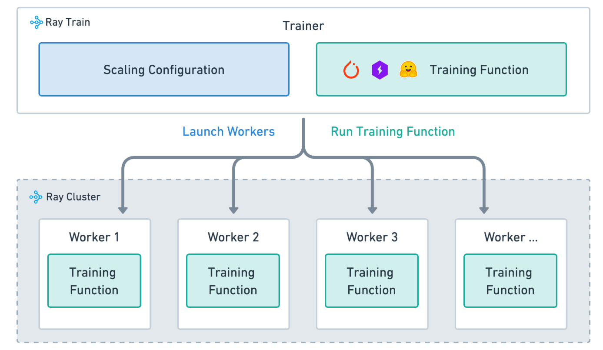
It consists of the following four parts:

+ Training function: a Python function that contains the model training logic.

+ Worker process: a process that runs the training function.

+ Extended configuration: configuration about the number of worker processes and computing resources (for example, CPU or GPU).

+ Trainer: a Python class that combines training functions, worker processes, and extended configurations to perform distributed training jobs.
The following is a simple training code using ray train provided by the official
```python
import os
import tempfile

import torch
from torch.nn import CrossEntropyLoss
from torch.optim import Adam
from torch.utils.data import DataLoader
from torchvision.models import resnet18
from torchvision.datasets import FashionMNIST
from torchvision.transforms import ToTensor, Normalize, Compose

import ray.train.torch

def train_func():
# Model, Loss, Optimizer
model = resnet18(num_classes=10)
model.conv1 = torch.nn.Conv2d(
1, 64, kernel_size=(7, 7), stride=(2, 2), padding=(3, 3), bias=False
)
# [1] Prepare model.
model = ray.train.torch.prepare_model(model)
# model.to("cuda") # This is done by `prepare_model` criterion = CrossEntropyLoss() optimizer = Adam(model.parameters(), lr=0.001) #Data transform = Compose([ToTensor(), Normalize((0.5,), (0.5,))]) data_dir = os.path.join(tempfile.gettempdir(), "data") train_data = FashionMNIST(root=data_dir, train=True, download=True, transform=transform) train_loader = DataLoader(train_data, batch_size=128, shuffle=True) # [2] Prepare dataloader. train_loader = ray.train.torch.prepare_data_loader(train_loader) #Training for epoch in range(10): if ray.train.get_context().get_world_size() > 1: train_loader.sampler.set_epoch(epoch) for images, labels in train_loader: # This is done by `prepare_data_loader`! # images, labels = images.to("cuda"), labels.to("cuda") outputs = model(images) loss = criterion(outputs, labels) optimizer.zero_grad() loss.backward() optimizer.step() # [3] Report metrics and checkpoint. metrics = {"loss": loss.item(), "epoch": epoch} with tempfile.TemporaryDirectory() as temp_checkpoint_dir: torch.save( model.module.state_dict(), os.path.join(temp_checkpoint_dir, "model.pt") ) ray.train.report( metrics, checkpoint=ray.train.Checkpoint.from_directory(temp_checkpoint_dir), ) if ray.train.get_context().get_world_rank() == 0: print(metrics) # [4] Configure scaling and resource requirements. scaling_config = ray.train.ScalingConfig(num_workers=2, use_gpu=True) # [5] Launch distributed training job. trainer = ray.train.torch.TorchTrainer( train_func, scaling_config=scaling_config, # [5a] If running in a multi-node cluster, this is where you # should configure the run's persistent storage that is accessible # across all worker nodes. # run_config=ray.train.RunConfig ) result = trainer.fit() # [6] Load the trained model. with result.checkpoint.as_directory() as checkpoint_dir: model_state_dict = torch.load(os.path.join(checkpoint_dir, "model.pt")) model= resnet18(num_classes=10)
model.conv1 = torch.nn.Conv2d(
1, 64, kernel_size=(7, 7), stride=(2, 2), padding=(3, 3), bias=False
)
model.load_state_dict(model_state_dict)

```

For ease of use, you can use the following API:
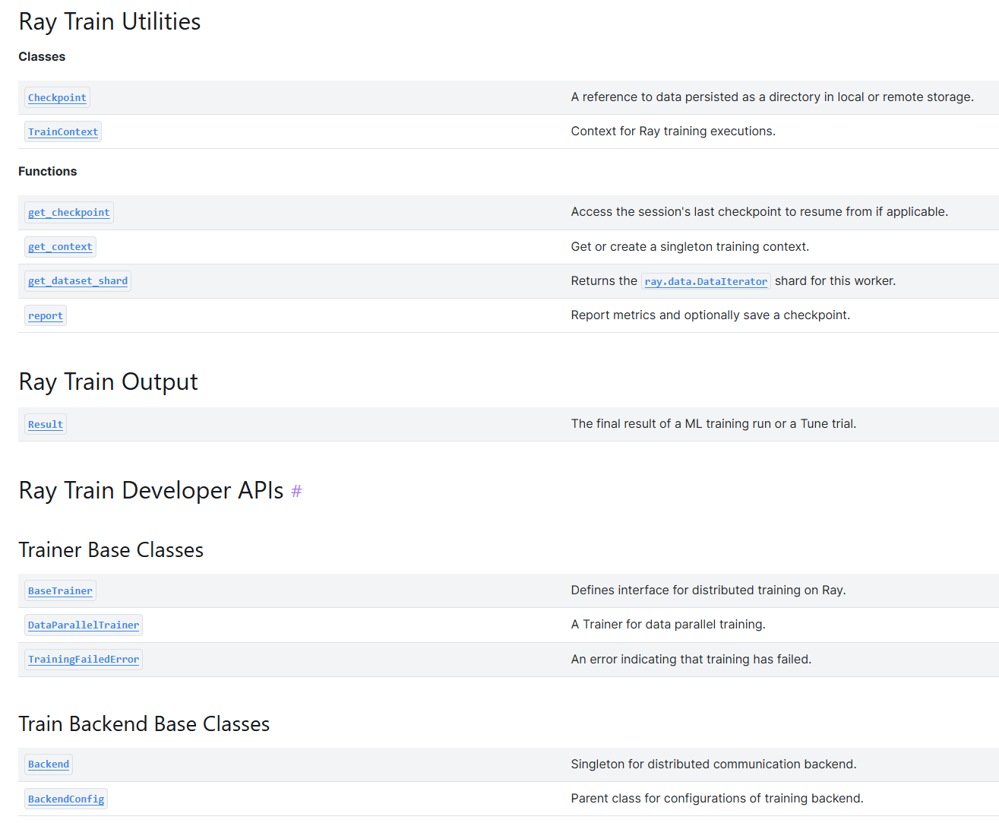
### 2 Use of deepspeed zero
Ray itself supports the use of multiple acceleration frameworks, such as Lightning, Transformers, Accelerate, Tenserflow, etc., and also has good support for deepspeed. The following is the code framework of ray+deepspeed
```python

import deepspeed
from deepspeed.accelerator import get_accelerator

def train_func():
model = ...
train_dataset = ...
eval_dataset = ...
deepspeed_config = {...} # Deepspeed config Files/Code

# Prepare the components for distributed training
model, optimizer, train_dataloader, lr_scheduler = deepspeed.initialize(
model=model,
model_parameters=model.parameters(),
training_data=tokenized_datasets["train"],
collate_fn=collate_fn,
config=deepspeed_config,
)

# Define the GPU device for the current worker
device = get_accelerator().device_name(model.local_rank)

# Start training
...

from ray.train.torch import TorchTrainer
from ray.train import ScalingConfig

trainer = TorchTrainer(
train_func,
scaling_config=ScalingConfig(...),
# This part is the same as the ray introduced earlier
...
)
result = trainer.fit()
```
The following is an example code for Ray+deepspeed and using ZERO 3
```python
from tempfile import TemporaryDirectory import deepspeed import torch from datasets import load_dataset from deepspeed.accelerator import get_accelerator from torchmetrics.classification import BinaryAccuracy, BinaryF1Score from transformers import AutoModelForSequenceClassification, AutoTokenizer, set_seed import ray importray.train from ray.train import Checkpoint, DataConfig, ScalingConfig from ray.train.torch import TorchTrainer def train_func(config): """Your training function that will be launched on each worker.""" # Unpack training configs set_seed(config["seed"])
num_epochs = config["num_epochs"]
train_batch_size = config["train_batch_size"]
eval_batch_size = config["eval_batch_size"]

# Instantiate the Model
model = AutoModelForSequenceClassification.from_pretrained(
"bert-base-cased", return_dict=True
)

# Prepare Ray Data Loaders
# ====================================================
train_ds = ray.train.get_dataset_shard("train")
eval_ds = ray.train.get_dataset_shard("validation")

tokenizer = AutoTokenizer.from_pretrained("bert-base-cased")

def collate_fn(batch):
outputs = tokenizer(
list(batch["sentence1"]),
list(batch["sentence2"]),
truncation=True,
padding="longest",
return_tensors="pt",
)
outputs["labels"] = torch.LongTensor(batch["label"])
return outputs

train_dataloader = train_ds.iter_torch_batches(
batch_size=train_batch_size, collate_fn=collate_fn
)
eval_dataloader = eval_ds.iter_torch_batches(
batch_size=eval_batch_size, collate_fn=collate_fn
)
# ====================================================

# Initialize DeepSpeed Engine
model, optimizer, _, lr_scheduler = deepspeed.initialize(
model=model,
model_parameters=model.parameters(),
config=deepspeed_config,
)
device = get_accelerator().device_name(model.local_rank)

# Initialize Evaluation Metrics
f1 = BinaryF1Score().to(device)
accuracy = BinaryAccuracy().to(device)

for epoch in range(num_epochs):
# Training
model.train()
for batch in train_dataloader:
batch = {k: v.to(device) for k, v in batch.items()}
outputs = model(**batch)
loss = outputs.loss
model.backward(loss)
optimizer.step()
lr_scheduler.step()
optimizer.zero_grad()

# Evaluation
model.eval()
for batch in eval_dataloader:
batch = {k: v.to(device) for k, v in batch.items()}
with torch.no_grad():
outputs = model(**batch)
predictions = outputs.logits.argmax(dim=-1)

f1.update(predictions, batch["labels"])
accuracy.update(predictions, batch["labels"])

# torchmetrics will aggregate the metrics across all workers
eval_metric = {
"f1": f1.compute().item(),
"accuracy": accuracy.compute().item(),
}
f1.reset()
accuracy.reset()

if model.global_rank == 0:
print(f"epoch {epoch}:", eval_metric)

# Report checkpoint and metrics to Ray Train
# ==============================================================
with TemporaryDirectory() as tmpdir:
# Each worker saves its own checkpoint shard
model.save_checkpoint(tmpdir)

# Ensure all workers finished saving their checkpoint shard
torch.distributed.barrier()

# Report checkpoint shards from each worker in parallel
ray.train.report(
metrics=eval_metric, checkpoint=Checkpoint.from_directory(tmpdir)
)
# ==============================================================


if __name__ == "__main__":
deepspeed_config = {
"optimizer": {
"type": "AdamW",
"params": {
"lr": 2e-5,
},
},
"scheduler": {"type": "WarmupLR", "params": {"warmup_num_steps": 100}},
"fp16": {"enabled": True},
"bf16": {"enabled": False},  # Turn this on if using AMPERE GPUs.
"zero_optimization": {
"stage": 3,
"offload_optimizer": {
"device": "none",
},
"offload_param": {
"device": "none",
},
},
"gradient_accumulation_steps": 1,
"gradient_clipping": True,
"steps_per_print": 10,
"train_micro_batch_size_per_gpu": 16,
"wall_clock_breakdown": False,
}

training_config = {
"seed": 42,
"num_epochs": 3,
"train_batch_size": 16,
"eval_batch_size": 32,
"deepspeed_config": deepspeed_config,
}

# Prepare Ray Datasets
hf_datasets = load_dataset("glue", "mrpc")
ray_datasets = {
"train": ray.data.from_huggingface(hf_datasets["train"]),
"validation": ray.data.from_huggingface(hf_datasets["validation"]),
}

trainer = TorchTrainer(
train_func,
train_loop_config=training_config,
scaling_config=ScalingConfig(num_workers=4, use_gpu=True),
datasets=ray_datasets,
dataset_config=DataConfig(datasets_to_split=["train", "validation"]),
# If running in a multi-node cluster, this is where you
# should configure the run's persistent storage that is accessible
# across all worker nodes.
# run_config=ray.train.RunConfig(storage_path="s3://..."),
)

result = trainer.fit()

# Retrieve the best checkponints from results
result.best_checkpoints
```
### 3 Advantages of Ray+deepspeed
#### 1. Deep learning optimization capability
Advantages of DeepSpeed:

Extreme training speed and efficiency: DeepSpeed ​​aims to provide extreme model training speed and efficiency. It uses innovative algorithms and technologies, such as the ZeRO (Zero Redundancy Optimizer) algorithm, to split the optimizer's state, gradients, and parameters in a distributed environment, reducing memory usage and enabling larger model training. In addition, by splitting the model in ZERO1-2, it reduces the communication overhead caused by the synchronization state to a certain extent, improving throughput

Mixed precision training: DeepSpeed ​​supports mixed calculations of half-precision (FP16) and single-precision (FP32), sacrificing less precision in exchange for a significant performance improvement.

Efficient model parallelism: DeepSpeed ​​provides flexible model parallel strategies such as data parallelism, model parallelism, and pipeline parallelism, which are suitable for GPU clusters of various sizes.

Rapid migration of pre-trained models: DeepSpeed ​​is optimized for multiple pre-trained models (such as BERT, GPT, etc.), and these models can be easily migrated to the DeepSpeed ​​framework without a lot of code modification.
#### 2. Synergy with Ray
Advantages of combining Ray with DeepSpeed:

Seamless integration and ease of use: Both Ray and DeepSpeed ​​provide seamless integration with deep learning frameworks such as PyTorch, allowing developers to easily apply them to their own projects. When used in combination, the deployment and management of distributed deep learning training can be further simplified.

Resource optimization and scheduling: Ray's distributed computing framework can intelligently schedule and manage computing resources to achieve asynchronous scheduling optimization during distributed training, while DeepSpeed ​​can reduce resource (video memory) consumption through its optimization algorithms and technologies. The combination of the two can more efficiently utilize computing resources and improve training efficiency.

### 4 Attempts on data distribution

#### Research ideas

Ray's distributed computing framework and other acceleration frameworks mainly cut the model and deploy it to each graphics card. We chose a new direction, that is, the distributed deployment of the training data set, so as to achieve the acceleration of distributed training.

#### Research route

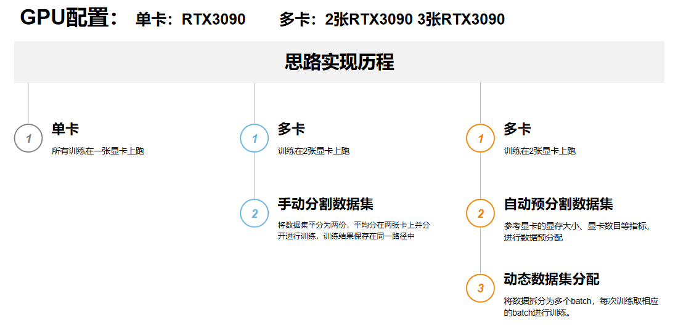

From single-card training to manual segmentation of data sets to automatic distribution of data sets. The distributed deployment of data sets has been achieved, which reduces the workload of the graphics card, thereby reducing the demand for graphics card memory and accelerating the training process, which has a deeper meaning for the popularization of training in the future.

#### Core code explanation 
```python #Define data distribution Actor @ray.remote class DataDistributor: def __init__(self, dataset, num_splits, batch_size): self.tokenizer = AutoTokenizer.from_pretrained('/root/autodl-tmp/LLM-Research/Meta-Llama-3-8B-Instruct', use_fast=False, trust_remote_code=True) self.tokenizer.pad_token = self.tokenizer.eos_token self.dataset = dataset.map(lambda x: process_func(x, self.tokenizer), remove_columns=dataset.column_names) self.num_splits = num_splits self.batch_size = batch_size self.current_index = [0] * num_splits self.split_size = len(self.dataset) // num_splits def get_batch_for_gpu(self, gpu_id): if self.current_index[gpu_id] >= self.split_size: return None start_idx = self.current_index[gpu_id] end_idx = min(start_idx + self.batch_size, self.split_size) self.current_index[gpu_id] = end_idx return self.dataset.select(range(gpu_id * self.split_size + start_idx, gpu_id * self.split_size + end_idx)) def get_progress(self, gpu_id): return self.current_index[gpu_id], self.split_size # Start data distribution Actor data_distributor = DataDistributor.remote(dataset, 3, batch_size=20)
```

We implemented a DataDistributor using Ray's Actor model to dynamically distribute batches of data to different GPUs.

We have the following innovations:

**Dynamic distribution**: The DataDistributor class dynamically distributes batches of data based on the current GPU index. Each time the get_batch_for_gpu(gpu_id) method is called, it returns a batch of data for that GPU and updates the current index.

**Multi-GPU support**: The num_splits parameter is used to split the dataset into multiple parts, and each GPU processes a part of the data. This ensures that each GPU can get evenly distributed data.

**Progress tracking**: The get_progress(gpu_id) method can track the processing progress of each GPU and print progress information during training.

#### 3. Related Work
Take the OpenRLHF framework as an example. This framework was proposed and open-sourced by a joint team of OpenLLMAI, ByteDance, NetEase Fuxi AI Lab, and Alibaba. It uses Ray, vLLM, and DeepSpeed ​​to redesign model scheduling and can support RLHF training of models with more than 70 billion parameters. This design enables OpenRLHF to easily implement large-scale RLHF training and provides advantages such as high performance, ease of use, and distributed training. It achieves nearly 2 times performance optimization compared to Deepspeedchat when training the llama-7b model. We also reviewed some of its ray+deepspeed optimizations in our own projects.
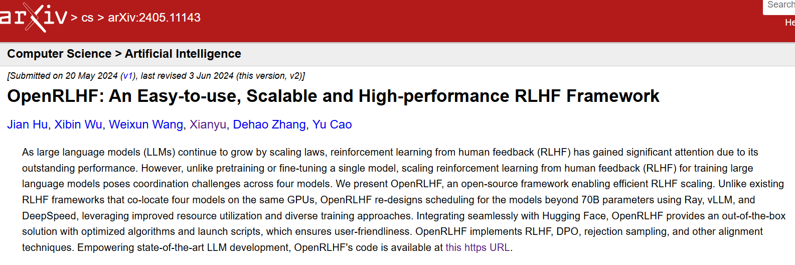

### 5 Use of Ray Serve
#### 1. Introduction to Ray Serve
Ray Serve is an online inference service framework for models based on the Ray framework
It has the following advantages:
1. Distributed deployment of models
2. Distributed elastic expansion and contraction
3. Inference graph composed of multiple models
4. Multiple models reuse a small amount of hardware

Its basic structure is shown in the figure below:
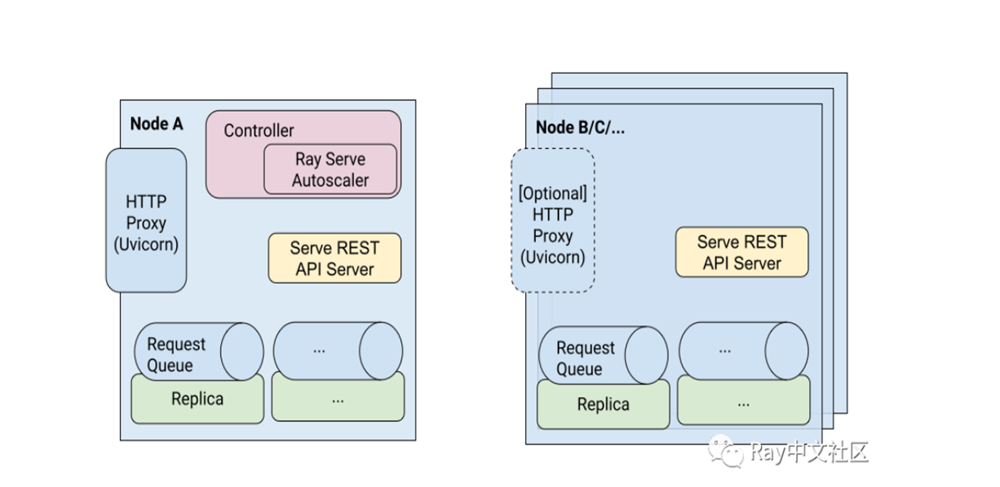
The main function is to use Ray's distributed scheduling to distribute single or multiple models to multiple nodes
For inference, it also has an HTTP interface that can process network requests

#### 2. Environment introduction and test ideas
Our experimental platform is as follows:

Deployment platform: Ucloud GPU cloud server
System: Ubuntu
Configuration:
Memory 96G
CPU 32 cores
GPU Nvidia GeForce RTX 4090 * 2

Ideas:
For GPT-2 (model parameters 0.15G), use Ray Serve to deploy it on the network, and then use Request in Python to request access to test, and observe the optimization results by modifying the parameters

The figure below is the deployment instruction of Ray Serve, num_replica represents the number of replicas of the deployed model
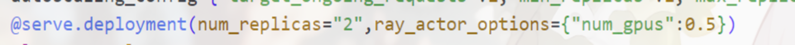
We modify the number of replicas and hope to use Python to test 1000 requests to get the results

### 6. vLLM + Ray multi-card reasoning

#### 1. Environment introduction

Our experimental platform is as follows:

```
Deployment platform: Ucloud GPU cloud server
System: Ubuntu
Configuration:
Memory 96G
CPU 32 cores
GPU Nvidia GeForce RTX 4090 * 4
```

#### 1. Research ideas

Use the integration of vLLM and Ray to achieve

- 2 cards to deploy GPT2 small model and Llama-3-8B is a medium model, comparing its efficiency improvement over a single card.
- Split and deploy the Llama-3-13B model on 2 cards, and distribute and use the video memory for large model deployment
- Split and deploy the Llama-30B model on 4 cards, and make full use of the video memory of each card for large model deployment

## Optimization results and analysis
### 1.ray+deepspeed
The following is the result of training llama2-7b with ray alone:

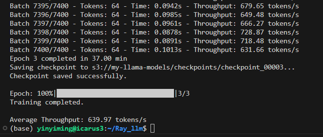

The result of training llama2-7b with ray+deepspeed (zero-2):

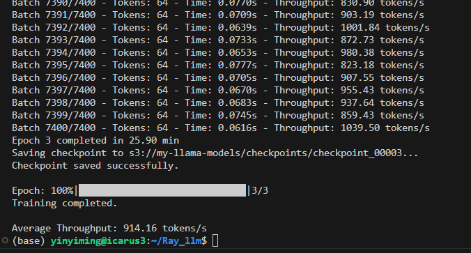

It can be seen that by using ray+deepspeed to train large models, the throughput rate is increased by 42.8%

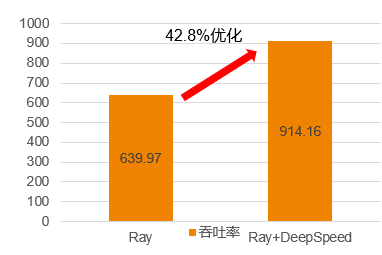

### 2. Automatic data distribution

##### Training process


It can be seen that during the training process, the training volume of the manually pre-segmented data sets of single and multi-cards is large. In the process of automatic data distribution, the amount of training is small, and the data distribution can be achieved by adjusting parameters based on the actual situation such as video memory.

##### Training results

<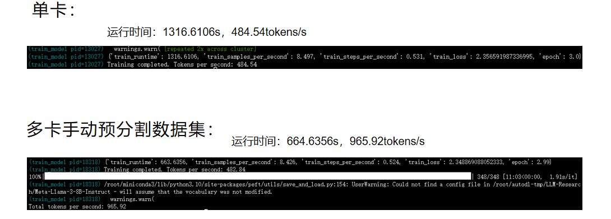


When made into a table chart, it can be seen that the training speed (tokens/s) of automatic data segmentation is proportional to the number of graphics cards, and the training time is inversely proportional to the number of graphics cards, with obvious acceleration.

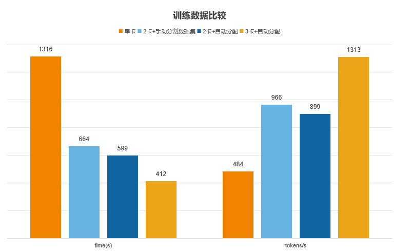

### 3. Ray Serve usage
We use the above test ideas to get the changes in response time and GPU utilization as follows:

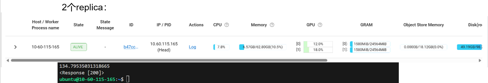

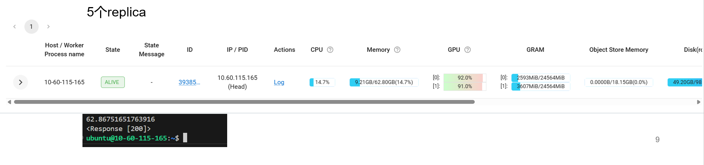

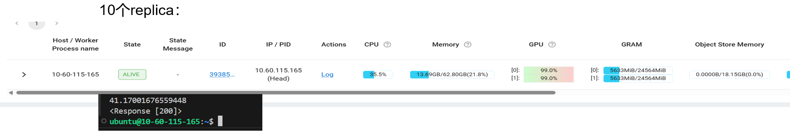

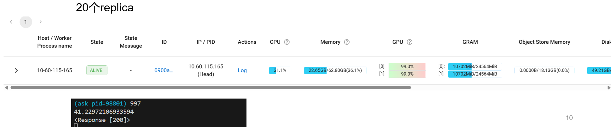

When the number of replicas is larger, exceeding 20, the response time becomes longer. The final response time changes with the number of replicas as shown below:

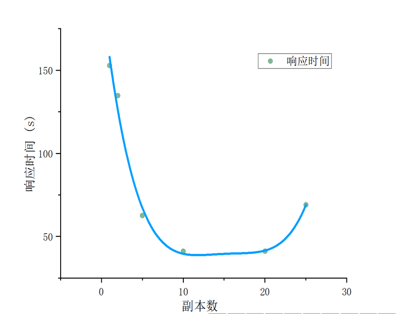

After analysis, the reason for the longer response time is that when the number of replicas exceeds 20, the GPU memory occupancy rate is too high

### 4. vLLM + Ray multi-card reasoning

#### 1. GPT-2

​Results of running on a single card:

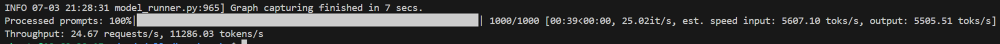

​ 24.67 requests/s,11286.03 tokens/s

​ Results of running on multiple cards:

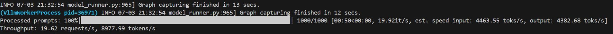

​ 19.62 requests/s, 8977.99 tokens/s

#### 2. Llama-3-8B

​ Results of running on a single card:

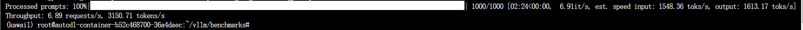

​ 6.89 requests/s,3150.71 tokens/s

​Running results under multiple GPUs:

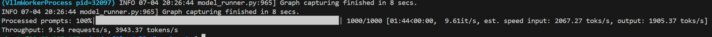

​ 9.54 requests/s,3943.37 tokens/s

#### 3. Llama2-13B

​ When running under a single GPU, a warning appears: CUDAOUT OF MEMORY 4090 with 24G video memory cannot run Llama2 with 13 billion parameters

​ Resource usage under multiple cards, the running result is about 2000 tokens/s

#### 4. Llama-30B

​ Single card and dual card OOM (out of memory).

​ Multi-card running results

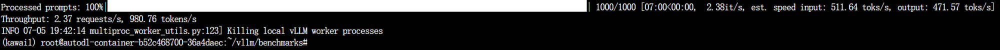

​ 2.37 requests/s 980.76tokens

#### 5. Ray+vllm multi-card reasoning (Summary)

- For small models such as gpt2, the running speed of two 4090 graphics cards is not as fast as that of one graphics card. We speculate that this is because the gpt2 model itself has a small weight and its calculation/communication is relatively low, so the communication loss between graphics cards is relatively large, resulting in lower running efficiency.
- On larger models such as Llama-3-8B, we achieved higher efficiency by deploying with two graphics cards. We speculate that this efficiency increase will be more obvious on larger models
- For very large models, we distribute the model on multiple Ray workers, allowing each worker to occupy a graphics card and fully utilize the video memory for deployment. This breaks the problem of insufficient video memory for deploying very large models on a single card, and Ray's Autoscaling can achieve objective performance.

## Innovation
- 1. By integrating Ray and other technologies, and making interface calls and parameter adjustments, data deployment and throughput are optimized to achieve data throughput optimization during large model training.

- 2. By investigating acceleration frameworks such as ZeRO, vllm, and Adam Offload, try to integrate with Ray. And explore the degree of optimization.

- 3. By applying ZERO-3, the three aspects of Optimizer States, Gradient, and Model Parameter are divided to optimize data exchange and scheduling during ray+ large model deployment.

- 4. Through the automatic data distribution technology, reasonable video memory allocation is achieved, and the time cost and energy cost of data scheduling are also reduced.

## Insufficient and prospect
### 1. Optimization related to communication bandwidth
In this big assignment, due to the limitation of communication bandwidth, the use of Ray in some cases has caused negative optimization. When we visited Huawei Hangzhou Research Institute, we learned that its MindSpore framework not only uses model parallelism and data parallelism, but also uses automatic parallelism, multi-pipeline interleaving parallelism, automatic parallelism and other means to achieve the effect of "hiding communication", that is, in the training process, overlap calculation and communication as much as possible to make full use of GPU resources. For example, while forward propagation and back propagation are performed on one GPU, gradient communication can be performed on other GPUs to reduce waiting time and communication overhead. This can be used as the direction of future efforts of this project.

### 2. Prospect of automatic data distribution
In this big assignment, batch_size is adjusted to adapt to video memory. In the future direction, we can use it for model training and distributed training on computers with smaller video memory. In a foreseeable way, we can design a framework to achieve reasonable allocation of video memory by adjusting the parameters of the configuration file, thereby popularizing model training and reducing the cost of graphics card rental. At the same time, automatic data distribution technology can be combined with model slicing technology to better promote the optimization and configuration of graphics card memory.

### 3. Outlook of multi-machine Ray connection
In the middle of the project, we spent a long time trying to connect two computers with Ray to run large models. The main idea was that the video memory of each computer was limited, and it was impossible to train and reason for models with large parameters such as Llama-3. So we hoped to use our existing computers with graphics cards to complete this work. In the experiment, we used WSL virtual machines on both computers and used mobile hotspots to connect to the model for training and reasoning. However, to our surprise, even for models with only 0.15G parameters such as GPT-2, when each of our computers ran separately, the video memory usage rate did not exceed 30% and the time was very short. When we connected the two computers together, the program was stuck, and the final test of the reasoning throughput was only 1 token/s. After our inquiry, it should be that the bandwidth of our mobile hotspot was too small, which caused problems with parameter transmission. Due to time constraints, we did not find a place with wifi for our experiment, so we had to give up this solution. If possible, we still hope to connect multiple hosts together through Ray and test the optimization effect in a place with faster Internet speed.

## References
[1] [OpenRLHF github repository](https://github.com/OpenLLMAI/OpenRLHF/tree/main)
[2] [Starting the training journey: Building an open source RLHF full-scale training framework for 70B+ models based on Ray and vLLM - Zhihu (zhihu.com)](https://zhuanlan.zhihu.com/p/678828949)

[3] https://developer.nvidia.com/zh-cn/blog/efficiently-scale-llm-training-across-a-large-gpu-cluster-with-alpa-and-ray/

[4] ZeRO: Memory Optimizations Toward Training Trillion Parameter Models
Samyam Rajbhandari, Jeff Rasley, Olatunji Ruwase, Yuxiong He

[5] Systems for Parallel and Distributed Large-Model Deep Learning Training
Kabir Nagrecha

[6] [Easier Model Serving with zerocopy](https://medium.com/ibm-data-ai/easier-model-serving-with-zerocopy-3930d1d2a1af) [7] [How to Load PyTorch Models 340 Times Faster with Ray](https://link.zhihu.com/?target=https%3A//medium.com/ibm-data-ai/how-to-load-pytorch-models-340-times-faster-with-ray-8be751a6944c) [8] Ray: A Distributed Framework for Emerging AI Applications Philipp Moritz, Robert Nishihara, Stephanie Wang, Alexey Tumanov, Richard Liaw, Eric Liang, Melih Elibol, Zongheng Yang, William Paul, Michael I. Jordan, and Ion Stoica, UC Berkeley [9] A Study of a Scalable Distributed Stream Processing Infrastructure Using Ray and Apache Kafka Kasumi Kato; Atsuko Takefusa; Hidemoto Nakada; Masato Oguchi [10] Ray: A Distributed Execution Engine for the Machine Learning Ecosystem 2019 Moritz, Philipp CAdvisor(s): Jordan, Michael I;Stoica, Ion