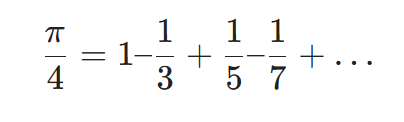
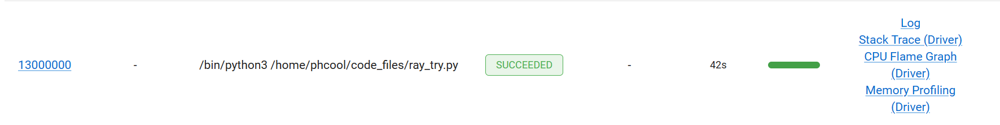

在本次实验中，我们选择使用Ray进行计算类任务的部署和测试，实验报告已发布在知乎：https://zhuanlan.zhihu.com/p/705187137

#### 1.性能指标列表
经过调研，我们得到计算类任务的性能指标有如下几种：

资源使用率：包括内存占用率，CPU占用率等
吞吐率：单位时间内处理的任务数量
效率：在分布式计算资源中，表示加速比与结点数量的比值
响应时间：任务从提交到完成的时间
任务提交延迟

由于响应时间能最好的反映出计算任务从调度到Ray结点到结点运算完返回的总时间，
CPU使用率能反映出计算任务是否最大程度的利用了计算资源
在测试任务中，我们选择对响应时间和CPU使用率进行测试和优化


#### 2.计算任务的选定
我们采用莱布尼兹级数估计Π的算法来进行性能的估计,算式如下：



#### Ray的单机版部署、性能测试、优化

以下是不使用Ray情况下的代码

    import ray
    import time
    def estimate_pi(num_terms):
        pi_estimate = 0.0
        sign = 1
        for i in range(num_terms):
            term = 1.0 / (2 * i + 1)
            pi_estimate += sign * term
            sign *= -1    
        return 4.0 * pi_estimate
    begin=time.time()
    result=estimate_pi(1000000000)
    print(result)
    print("\n\n")
    end=time.time()
    duration=end-begin
    print(duration) 

通过将展开式展开到1000000000项并记下计算时间，结果的时间如下：


用时140s

现在再将原程序在Ray下部署，代码如下：

    import ray
    ray.init()

    part_num=1

    @ray.remote
    def estimate_pia(num_terms_1,num_terms_2):
        pi_estimate = 0.0
        sign = 1
        for i in range(num_terms_1,num_terms_2):
            term = 1.0 / (2 * i + 1)
            pi_estimate += sign * term
            sign *= -1    
        return 4.0 * pi_estimate
        

    def get_result(data_nums):
        part=int(data_nums/(part_num))
        result=0
        a=[]
        for i in range(0,part_num):
            a.append(estimate_pia.remote(i*part,(i+1)*part))
        for i in range(0,part_num):
            mid=ray.get(a[i])
            result+=mid
        return result
            

    result=get_result(1000000000)
    print(result)
    print("\n\n")

现在只是将原计算函数放在ray结点中运行，得到的运算结果如下

运行时常149s，比之前多了9s，为数据传输的用时，资源使用情况如下：

可以发现目前只是将程序放到远程进行运算，并没有完全利用CPU核心的资源

现在考虑利用Ray对程序进行优化，将循环的次数分割成part_num个部分，每个部分都放入Ray结点中进行运算，本机的CPU核心数量为16，得到的结果如下：

part_num=2:


用时79s，CPU占用率14.9%

part_num=4:



用时42s,CPU占用率27.9%

part_num=8:


用时26s，CPU占用率52.9%

part_num=16:


用时19s，CPU占用率94.7%

part_num=24:


用时20s，CPU占用率100%
在此之后的CPU占用率峰值都达到了100%  

part_num=32:

用时19s

part_num=128:

用时18s

part_num=2000:

用时19s

part_num=100000:

用时47s

part_num=1000000:

用时275s

可见当分块数量到达24的时候，计算速度达到了较大值，为19s左右，CPU利用率也达到了100%，这是因为将任务分块后，能更大程度的利用多个CPU核心，当分块数量到达100000及以上的时候，用时反而会随数量增多而增加，这是因为每个分块创建远程任务ray.remote增大了开销

因此较好的一个任务分块数量为24到2000左右，这时候的计算用时在18到19s左右，
任务所用时间与单个任务的149s相比，变为了原来的12%左右，CPU占用率也达到了100%

综上优化结果如下表：


#### Ray分布式部署

通过Ray搭建三机集群，注意：所有机器需在同一局域网下。同时，在实验中发现部署后子节点会自动被kill掉的情况，需在添加wsl防火墙配置:
```
[experimental]
autoMemoryReclaim=gradual  
networkingMode=mirrored
dnsTunneling=true
firewall=true
autoProxy=true
```

同时，将宿主机防火墙中的高级设置中添加wsl对应的入站规则，即可完成部署。

搭建方法：

1、打开所有端口（在所有机器上都运⾏）
```
sudo iptables -P INPUT ACCEPT 
sudo iptables -P FORWARD ACCEPT 
sudo iptables -P OUTPUT ACCEPT 
sudo iptables -F 
sudo iptables-save
```
官⽅步骤⾥只需要打开6379端口，但实际测试过程中需要将所有端⼜都打开才有效。
2、先运⾏头结点，即在XXXA的机器上执⾏：
```
ray start --head --port=6379
```
这时候会出现⼀⼤段提⽰，⼤致说的是如果想在改节点上继续搭建集群，可以运⾏啥啥 啥，如果要停⽌，运⾏ ray stop 之类的。

3、依次打开⼯作节点，在XXXB上运⾏：
```
ray start --address='XXXA:6379'
```
随后也会弹出开启成功的⼀些提⽰

4、在程序中，init部分写为：
```
ray.init(address="XXXA:6379")
```
即可运⾏。
多机分布式部署测试程序如下
```
import ray


ray.init()
cpu_num=48
part_num=128


@ray.remote(num_cpus=cpu_num)
class calculate():
    def __init__(self,num,part_num) -> None:
        self.result=0
        self.num=num
        self.part_num=part_num

    @ray.remote(num_cpus=1)
    def estimate_pi(num_terms_1,num_terms_2):
        pi_estimate = 0.0
        sign = 1
        for i in range(num_terms_1,num_terms_2):
            term = 1.0 / (2 * i + 1)
            pi_estimate += sign * term
            sign *= -1    
        return 4.0 * pi_estimate
    
    def get_result(self,data_nums):
        part=int(data_nums/(self.part_num))
        i=0.0
        a=[]
        for i in range(0,self.num):
            a.append(self.estimate_pi.remote(i*part,(i+1)*part))
        for i in range(0,self.num):
            mid=ray.get(a[i])
            self.result+=mid
        return self.result
        

Actor=calculate.remote(cpu_num,part_num)
result=Actor.get_result.remote(10000000000)
b=ray.get(result)
print(b)
print("\n\n")
```
partnum为128，核数为48，为使结果明显，测试数据量增加10倍，结果如下：

响应时间为82s，考虑到数据量增加10倍，与单机相比，三机性能约增加2.2倍，没有呈线性增加的原因可能为Ray集群间的通信延迟。

CPU利用率几乎为100%：

#### 参考资料
Ray官方文档： https://docs.ray.io/en/latest/r
一朵小脑花：python-ray集群搭建过程（踩坑经历）
深度强化学习专栏 —— 4. 使用ray做分布式计算 - 古月居 (guyuehome.com)
高性能分布式执行框架——Ray - Florian - 博客园 (cnblogs.com)


