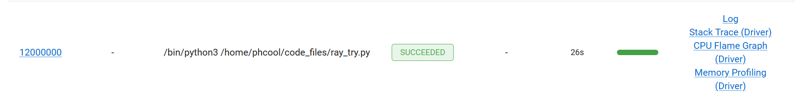
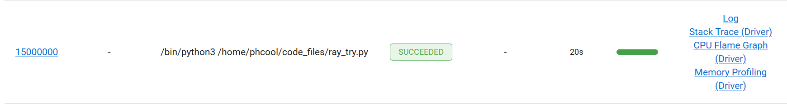
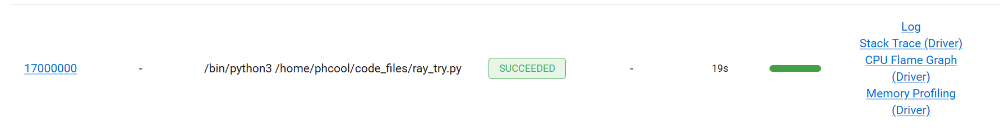
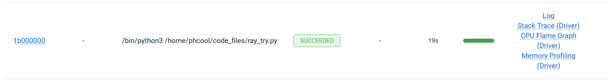

在本次实验中，我们选择使用Ray进行计算类任务的部署和测试

#### 1.性能指标列表
经过调研，我们得到计算类任务的性能指标有如下几种：

资源使用率：包括内存占用率，CPU占用率等
吞吐率：单位时间内处理的任务数量
效率：在分布式计算资源中，表示加速比与结点数量的比值
响应时间：任务从提交到完成的时间
任务提交延迟

由于响应时间能最好的反映出计算任务从调度到Ray结点到结点运算完返回的总时间，
CPU使用率能反映出计算任务是否最大程度的利用了计算资源
在测试任务中，我们选择对响应时间和CPU使用率进行测试和优化

#### 2.计算任务的选定
我们采用莱布尼兹级数估计Π的算法来进行性能的估计,算式如下：

#### Ray的单机版部署、性能测试、优化

以下是不使用Ray情况下的代码

    import ray
    import time
    def estimate_pi(num_terms):
        pi_estimate = 0.0
        sign = 1
        for i in range(num_terms):
            term = 1.0 / (2 * i + 1)
            pi_estimate += sign * term
            sign *= -1    
        return 4.0 * pi_estimate
    begin=time.time()
    result=estimate_pi(1000000000)
    print(result)
    print("\n\n")
    end=time.time()
    duration=end-begin
    print(duration) 

通过将展开式展开到1000000000项并记下计算时间，结果的时间如下：

用时140s

现在再将原程序在Ray下部署，代码如下：

    import ray
    ray.init()

    part_num=1

    @ray.remote
    def estimate_pia(num_terms_1,num_terms_2):
        pi_estimate = 0.0
        sign = 1
        for i in range(num_terms_1,num_terms_2):
            term = 1.0 / (2 * i + 1)
            pi_estimate += sign * term
            sign *= -1    
        return 4.0 * pi_estimate
        

    def get_result(data_nums):
        part=int(data_nums/(part_num))
        result=0
        a=[]
        for i in range(0,part_num):
            a.append(estimate_pia.remote(i*part,(i+1)*part))
        for i in range(0,part_num):
            mid=ray.get(a[i])
            result+=mid
        return result
            

    result=get_result(1000000000)
    print(result)
    print("\n\n")

现在只是将原计算函数放在ray结点中运行，得到的运算结果如下

运行时常149s，比之前多了9s，为数据传输的用时，资源使用情况如下：

可以发现目前只是将程序放到远程进行运算，并没有完全利用CPU核心的资源

现在考虑利用Ray对程序进行优化，将循环的次数分割成part_num个部分，每个部分都放入Ray结点中进行运算，本机的CPU核心数量为16，得到的结果如下：

part_num=2:

用时79s，CPU占用率14.9%

part_num=4:

用时42s,CPU占用率27.9%

part_num=8:

用时26s，CPU占用率52.9%

part_num=16:

用时19s，CPU占用率94.7%

part_num=24:

用时20s，CPU占用率100%
在此之后的CPU占用率峰值都达到了100%  

part_num=32:

用时19s

part_num=128:

用时18s

part_num=2000:

用时19s

part_num=100000:

用时47s

part_num=1000000:

用时275s

可见当分块数量到达24的时候，计算速度达到了较大值，为19s左右，CPU利用率也达到了100%，这是因为将任务分块后，能更大程度的利用多个CPU核心，当分块数量到达100000及以上的时候，用时反而会随数量增多而增加，这是因为每个分块创建远程任务ray.remote增大了开销

因此较好的一个任务分块数量为24到2000左右，这时候的计算用时在18到19s左右，
任务所用时间与单个任务的149s相比，变为了原来的12%左右，CPU占用率也达到了100%

