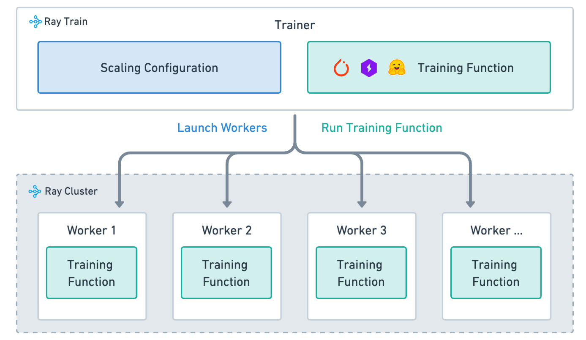
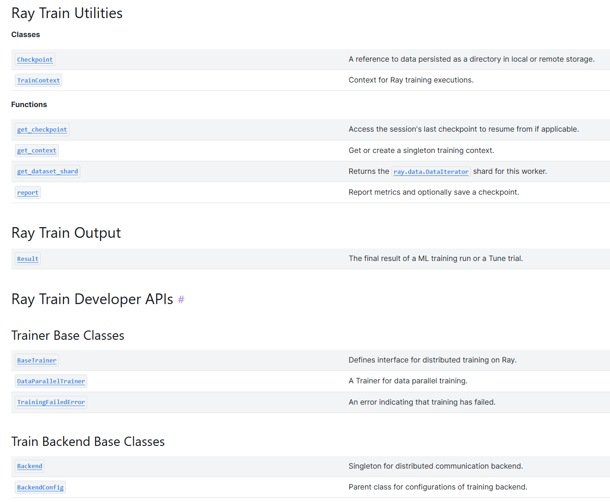
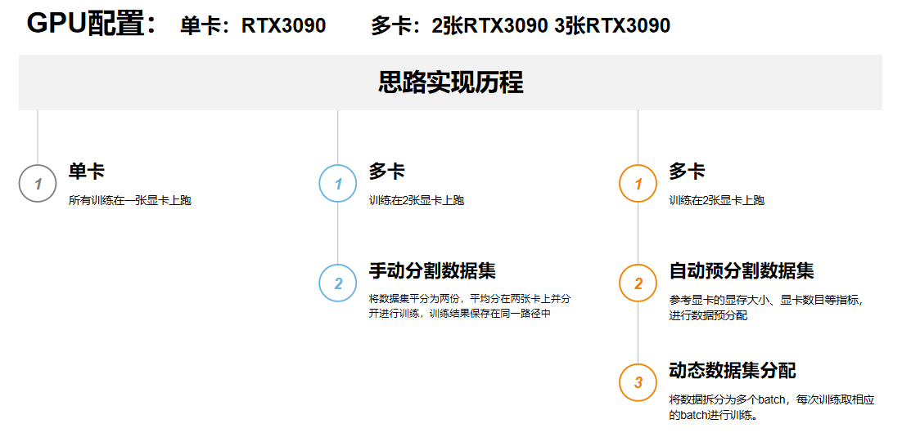
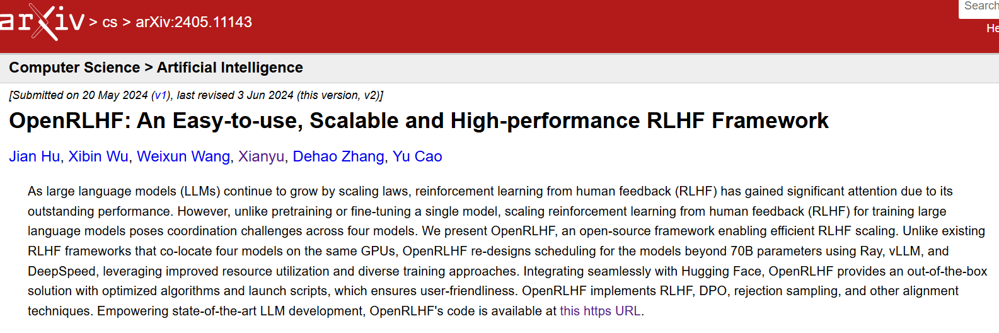
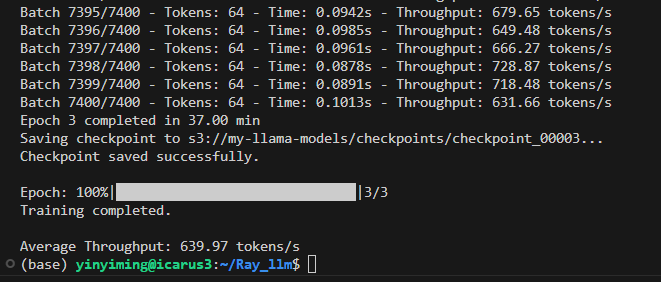
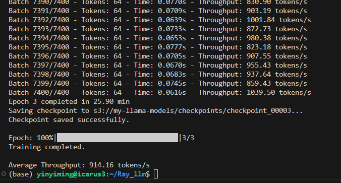
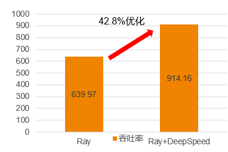
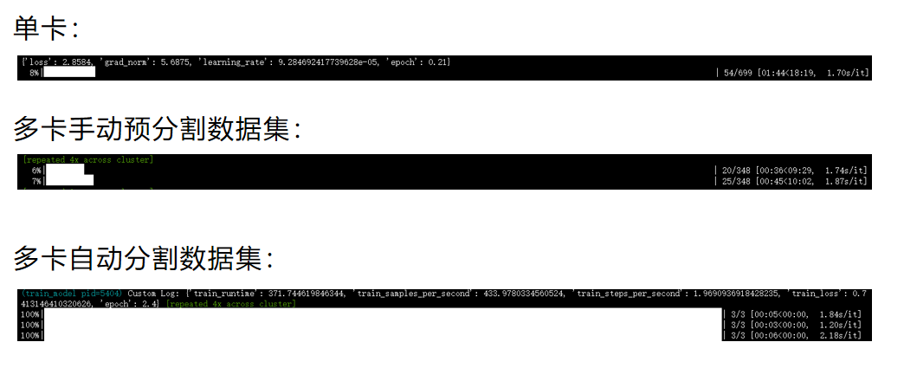
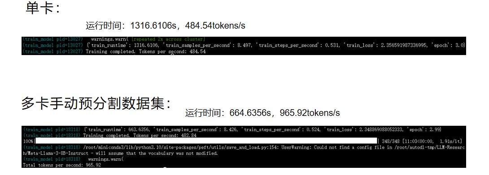
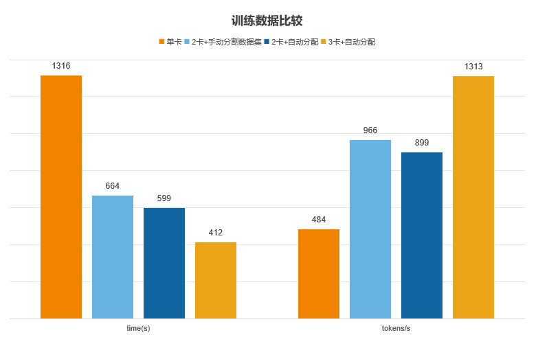

# 结题报告
## Ray+大模型分布式部署优化

- [结题报告](#结题报告)
  - [Ray+大模型分布式部署优化](#Ray+大模型分布式部署优化)
    - [组员](#组员)
    - [项目简介](#项目简介)
    - [项目背景和调研](#项目背景和调研)
      - [项目背景](#项目背景)
        - [大模型的内存瓶颈](#11-大模型的内存瓶颈)
        - [分布式部署的兴起与发展](#12-分布式部署的兴起与发展)
        - [分布式的挑战](#13-分布式的挑战)
      - [Ray框架的理论基础](#1ray框架的理论基础)
        - [Ray计算模型](#11-ray计算模型)
        - [Ray分布式调度器](#12-ray分布式调度器)
        - [Ray分布式对象存储器](#13-ray分布式对象存储器)
        - [Ray相对其他分布式框架的优势](#14-ray相对其他分布式框架的优势)
          - [Mapreduce](#141-mapreduce)
          - [Spark](#143-spark)
      - [Deepspeed ZERO 理论基础](#deepspeed-zero-理论基础)
        - [ZERO优化的三个级别](#21-zero优化的三个级别)
          - [ZeRO-1](#211-zero-1)
          - [ZeRO-2](#212-zero-2)
          - [ZeRO-3](#213-zero-3)    
      - [零拷贝技术](#3-零拷贝技术)  
    - [技术路线](#技术路线)
      - [ray train的使用](#raytrain的使用)
      - [deepspeed zero的使用](#deepspeedzero的使用)
      - [ray+deepspeed进行分布式训练的优势](#ray+deepspeed进行分布式训练的优势)
      - [关于数据分发的尝试](#关于数据分发的尝试)
        - [研究思路](#研究思路)
        - [研究路线](#研究路线)
        - [核心代码讲解](#核心代码讲解)
    - [优化结果分析](#优化结果与分析)
      - [ray+deepspeed](#1.ray+deepspeed)
      - [数据分发](#2.自动数据分发)
    - [创新点](#创新点)
    - [不足和展望](#不足和展望)
    - [参考文献](#参考文献)


## 组员

**殷一鸣**
**何跃强**
**郭泽**
**彭晗**

## 项目简介
---
本小组（Team_SwanGeese）的方向是Ray+大模型分布式部署优化，即通过使用ray+deepspeed zero/ray+数据集自动分配两种方案实现分布式训练优化，使用ray+vllm实现大模型的分布式推理优化

## 项目背景和调研
---
### 1 项目背景
#### 1.1 大模型的内存瓶颈
​ AI模型的规模在过去4年维持了每年10倍的增长。2021年的产生的大模型已经达到1 trillion parameters。而最近分布式训练号称可以支撑100trillion parameters，似乎这个趋势还能继续维持两年以上。练巨大的模型必然需要底层基础软件和芯片的支撑。然而GPU在过去4年中，无论是显存空间，或者是算力的增长，都在10倍这个数量级，显然跟不上10000倍的模型规模增长。这些大模型的参数规模给训练系统带来了新的挑战，例如内存瓶颈，糟糕的运行时效率，较高的模型开发成本。

​ 近年来，ML/AI模型的规模增长迅速，远超过了硬件能力的增长。$Ion ~Stoica$ 说过：满足足够的计算能力需求的唯一方法是分布式。随着数据规模的扩大和计算复杂度的增加，单机计算能力已经无法满足大规模数据处理和计算的需 求，分布式计算逐渐成为一种重要的数据处理和计算方式。

#### 1.2 分布式部署的兴起与发展

​ 分布式训练的起源可以追溯到20世纪90年代，当时由于计算机处理能力的限制，无法处理大规模的数据集和复杂的机器学习模型。随着计算机技术的发展，分布式计算框架如Hadoop和Spark开始被广泛采用，使得分布式训练成为可能。分布式训练能够将大规模数据集拆分成多个小数据集，分别存储在多台计算机上，并同时进行模型训练，从而大大缩短训练时间。

​ 2017 年伯克利大学 RISELab 实验室开 发出了一个针对深度强化学习通用异步并行框架 Ray, Ray 的分布式迭代作业从任务级别降到了函数级别,有 效地解决了 Spark 对强化学习的不支持。故本文提出的 RRLP 平台采用 Ray 作为主体框架,可以完美地解决强 化学习模型训练过程中频繁的数据收集和再分发。Ray 不仅可以异步并行的分发任务,还可以共享所有的存储 资源,从而获得了更加适宜并行分布式强化学习计算的优异性能。


#### 1.3 分布式的挑战
​ 分布式模型推理已经是人工智能领域的一个重要技术，但仍然存在一些未来发展趋势与挑战：

​ 任务分配策略的优化，以提高计算资源的利用率和系统性能。

​ 数据分布方式的创新，以提高数据的存储和访问效率。

​ 通信机制的改进，以提高通信速度和减少通信开销。
### 1.Ray框架的理论基础
Ray是UC Berkeley RISELab推出的高性能分布式执行框架，它使用了和传统分布式计算系统不一样的架构和对分布式计算的抽象方式，具有比Spark更优异的计算性能，是一种通用的集群计算框架，既支持模型的训练，又支持对环境的仿真或与环境的交互。

​	按照官方文档的说法：

​		Ray provides a simple, universal API for building distributed applications.	
​	它主要有以下的特点：

​	提供一种能够构建、运行分布式应用程序的simple primitives；
​	从单机扩展到平行，几乎不需要改代码；
​	拥有良好的生态，能够在core Ray上构建复杂的应用程序。

​Ray作为一个灵活的，可伸缩的，并带有用于测试、部署和监视的分布式计算引擎，可以更方便、更高效的支撑数据处理、数据分析、实时流计算以及ML/DL/RL的模型服务，分布式训练，超参数调整等等功能。

Ray 框架在各种应用场景中具有以下优势：
+ 高效的分布式计算。Ray框架支持高效的分布式计算，可以轻松地扩展计算资源，提高任务的执
行速度和计算效率。
+ 灵活的任务调度。Ray框架提供灵活的任务调度机制，可以根据任务类型和计算资源的状态动态调整任务的执行顺序和分配策略，从而实现计算资源利用率的最大化。
3）高可靠性和容错性。Ray框架提供高可靠性和容错性机制，可以自动处理资源计算故障和任务异
常，保证任务的正确执行和计算结果的可靠性。
+ 易用的编程接口。Ray框架提供简单易用的编程接口，支持多种编程语言（如Python、Java、
C++等），可以使开发人员轻松编写分布式计算任务。
+ 高度可扩展性。Ray框架具有高度可扩展性，可以与其他分布式计算框架（如Hadoop、Spark、Kubernetes 等）集成，提供更加完整和强大的分布式计算能力。
总之，Ray框架在各种应用场景中都具有高效、可靠、灵活和易用的优势，可以帮助用户更加轻松地完成分布式计算任务，获得更好的计算性能和效率
#### 1.1 Ray计算模型
 Ray的架构由应用层和系统层组成，其中应用层实现了Ray的API,作为前端供用户使用，而系统层则作为后端来保障Ray的高扩展性和容错性，整体框架如下


GCS 作为集中的服务端，是 Worker 之间传递消息的纽带。每个 Server 都有一个共用的 Object Store，也就是用 Apache Arrow/Plasma 构建的内存数据。 Local Scheduler 是 Server 内部的调度（单机调度），同时通过 GCS 来和其他 Server 上的 Worker 通信。Object Store 之间也有通信，作用是传递 Worker 之间的数据。

Local Scheduler，即Raylet，本地调度核心

**调度过程：任务创建后，首先向本地调度器提交任务，大多数情况下任务将在本地被调度。若没有资源，局部调度器会向全局调度器传递任务，向GCS传递任务信息，然后全局调度器会选择等待时间最短的、有足够资源的节点来执行任务**


任务定义、提交、远程提交过程:0.定义远程函数1.提交任务2.提交任务到全局3.检查对象表4.执行全局调度5.检查任务输入6.查询缺失输入7.对象复制8.执行局部调度9.访问对象存储器

获取任务执行结果过程:
1.调教get请求
2.注册回调函数
3.任务执行完毕
4.将对象同步到GCS
5.出发回调函数
6.执行回调函数
7.返回用户程序
#### 1.2 Ray分布式调度器
Ray中的任务调度器被分为两层，由一个全局调度器和每个节点各自的局部调度器组成。为了避免全局调度器负载过重，在节点创建的任务首先被提交到局部调度器，如果该节点没有过载且节点资源能够满足任务的需求（如GPU的需求），则任务将在本地被调度，否则任务才会被传递到全局调度器，考虑将任务调度到远端。由于Ray首先考虑在本地调度，本地不满足要求才考虑在远端调用，因此这样的调度方式也被称为自底向上的调度。

下图展示了Ray的调度过程，箭头的粗细表示过程发生频率的高低。用户进程和工作器向本地调度器提交任务，大多数情况下，任务将在本地被调度。少数情况下，局部调度器会向全局调度器提交任务，并向GCS传递任务的相关信息，将任务涉及的对象和函数存入全局的对象表和函数表中，然后全局调度器会从GCS中读取到信息，并选择在其他合适的节点上调度这一任务。更具体地来说，全局调度器会根据任务的请求选出具有足够资源的一系列节点，并在这些节点中选出等待时间最短的一个节点。


#### 1.3 Ray分布式对象存储器
Ray实现了一个内存式的分布式存储系统来存储每个任务的输入和输出。Ray通过内存共享机制在每个节点上实现了一个对象存储器 (Object Store)，从而使在同一个节点运行的任务之间不需要拷贝就可以共享数据。当一个任务的输入不在本地时，则会在执行之前将它的输入复制到本地的对象存储器中。同样地，任务总会将输出写入到本地的对象存储器中。这样的复制机制可以减少任务的执行时间，因为任务永远只会从本地对象存储器中读取数据（否则任务不会被调度），并且消除了热数据可能带来的潜在的瓶颈。

#### 1.4 Ray相对其他分布式框架的优势

##### 1.4.1 Mapreduce
MapReduce是一种编程模型，用于在大型计算集群上并行处理大数据集。它主要由两个阶段组成：Map阶段和Reduce阶段，之间通过磁盘进行数据交换。但其磁盘IO开销大：Map和Reduce阶段之间的中间数据需要写入磁盘，造成大量的磁盘IO，这是其性能瓶颈之一，对于需要多次迭代的任务（如机器学习算法），每次迭代都需要从头开始读写磁盘，效率低下，不适合实时数据处理。
##### 1.4.3 Spark 
Spark是一个开源的分布式计算系统，设计初衷是为了解决MapReduce在迭代计算和实时处理方面的不足。但其由于依赖内存处理，对资源的消耗相对较大，尤其是处理大数据集时可能需要较多的内存资源，虽然提供了丰富的功能，但相对于MapReduce，学习和使用Spark的门槛较高.
与之相对，Ray的优势有：
+ 最小集群配置
+ 最适合计算繁重的工作负载。已经表明Ray 优于 Spark 和 Dask在某些机器学习任务上，如 NLP、文本规范化等。最重要的是，Ray 的工作速度似乎比 Python 标准多处理快 10%，即使在单个节点上也是如此。
+ 独特的基于参与者的抽象，其中多个任务可以异步地在同一个集群上工作，从而提高利用率（相比之下，Spark 的计算模型不太灵活，基于并行任务的同步执行）。

### Deepspeed ZERO 理论基础
DeepSpeed 是一个由 Microsoft 开发的深度学习开源优化工具，它横跨模型训练、推理和模型压缩等领域。
零冗余优化器 Zero Redundancy Optimizer (ZeRO) 是 DeepSpeed 提供的训练优化的核心，它是一套减少分布式模型训练所需内存量的技术。
数据并行将模型复制多份至各个 GPU 设备上，但显然这个复制模型的过程将产生较大的显存冗余，为了解决这个问题，有效地降低冗余，可以采用 ZeRO-DP 来取代 DP：ZeRO-DP 通过以下方式解决这种冗余问题：
+ Partitioning optimizer state  （分割优化器状态）
+ Partitioning gradients （划分梯度）
+ Partitioning model parameters （分割模型参数）
deepSpeed 设置了三种 stage，包括以上三种解决方案的组合供用户选择。

Zero基于以下三个关键的观察，对深度学习的内存使用进行了优化：

- 数据并行比模型并行具有更好的伸缩效率，因为模型并行减少了计算的粒度，同时也增加了通信开销。
数据并行缺乏内存效率。
- 数据和模型并行都保持了整个训练过程中所需的所有模型状态，但并不是所有的时间都是必需的。例如，仅在某个层的正向传播和反向传播期间才需要与每个层对应的参数。
- 数据并行具有较好的通信和计算效率，但内存冗余严重。因此，ZeRO通过对参数（包括优化器状态、梯度和参数）进行分区来消除这种内存冗余，每个GPU仅保存部分参数及相关状态。

上图比较了参数、梯度和优化状态的每台设备的内存消耗，并启用各种内存优化(Baseline表示未优化的基线)。在内存消耗公式中，Ψ表示模型大小（参数个数），K表示优化器状态的内存乘数，Nd表示数据并行度。在这个例子中，我们假设模型大小为Ψ=75亿，基于Adam优化器的混合精度训练，数据并行度为Nd=64（即64个GPU），K=12。我们在数据并行的基础上，分三步对内存进行优化：

Pos（优化器状态优化）
如图二中的Pos所示，我们在每个gpu中保存全部的参数和梯度，但是只保存1/Nd的优化器变量，这将导致总的内存消耗变为2Ψ+2Ψ+12Ψ/Nd ,在图示假设下为31.4GB

Pos+g（相对1增加梯度优化）
在1的基础上增加对梯度内存的优化，即每个gpu中只保存1/Nd的梯度，这将导致总的内存消耗变为2Ψ+（2Ψ+12Ψ）/Nd ,在图示假设下为16.6GB

Pos+g+p（相对2增加参数优化）
在2的基础上增加对参数内存的优化，即每个gpu中只保存1/Nd的参数，这将导致总的内存消耗变为（2Ψ+2Ψ+12Ψ）/Nd ,在图示假设下为1.9GB


上表是不同模型并行度和gpu下可实现的最大模型（以参数计量），最右边是作者的实现的测量值，左边是理论值。因此，这说明作者提出的内存计算是基本可靠的。按照论文中的假设，理论上Pos，Pos+g，Pos+g+p这三种内存优化模式，相对基线baseline，其内存消耗大致相当于原来的26%，13%，1.7%。
#### 2.1 ZERO优化的三个级别

ZeRO 有三个不同级别，分别对应对 Model States 不同程度的分割 (Paritition)：
- ZeRO-1：分割Optimizer States；
- ZeRO-2：分割Optimizer States与Gradients；
- ZeRO-3：分割Optimizer States、Gradients与Parameters

##### 2.1.1 ZeRO-1：
假设我们有N个并行的进程，ZeRO-1 会将完整优化器的状态等分成N份并储存在各个进程中。当Backward完成之后，每个进程的Optimizer: - 对自己储存的Optimizer States（包括Momentum、Variance 与 FP32 Master Parameters）进行计算与更新。 - 更新过后的Partitioned FP32 Master Parameters会通过All-gather传回到各个进程中。 - 完成一次完整的参数更新。
通过 ZeRO-1 对Optimizer States的分段化储存，7.5B 参数量的模型内存占用将由原始数据并行下的 120GB 缩减到 31.4GB。
##### 2.1.2 ZERO-2
ZeRO-1将Optimizer States分小段储存在了多个进程中，所以在计算时，这一小段的Optimizer States也只需要得到进程所需的对应一小段Gradient就可以。遵循这种原理，和Optimizer States一样，ZeRO-2也将Gradient进行了切片：
在一个Layer的Gradient都被计算出来后： - Gradient通过AllReduce进行聚合。 （类似于DDP） - 聚合后的梯度只会被某一个进程用来更新参数，因此其它进程上的这段Gradient不再被需要，可以立马释放掉。（按需保留）
这样就在ZeRO-1的基础上实现了对Gradient的切分。
通过 ZeRO-2 对Gradient和Optimizer States的分段化储存，7.5B 参数量的模型内存占用将由 ZeRO-1 中 31.4GB 进一步下降到 16.6GB。

##### 2.1.3 ZERO-3
当Optimizer States，Gradient都被分布式切割分段储存和更新之后，剩下的就是Model Parameter了。 ZeRO-3 通过对Optimizer States，Gradient和Model Parameter三方面的分割，从而使所有进程共同协作，只储存一份完整 Model States。其核心思路就是精细化通讯，按照计算需求做到参数的收集和释放。

### 3. 零拷贝技术
Ray 的独特功能之一是它的主内存对象存储 Plasma，它使用共享内存在 Ray 集群中每台机器上的进程之间传递对象。Ray 使用 Plasma 来实现 NumPy 数组的零拷贝传输。如果 Ray 任务需要从 Plasma 读取 NumPy 数组，则该任务可以直接从共享内存中访问该数组的数据，而无需将任何数据复制到其本地堆中。

如果我们将模型的权重作为 NumPy 数组存储在 Plasma 上，我们可以直接从 Plasma 的共享内存段中访问这些权重，而无需进行任何复制。

但是我们仍然需要将这些权重连接到 PyTorch 模型的其余部分，这需要将它们包装在 PyTorch Tensor 对象中。创建张量的标准方法包括复制张量的内容，但 PyTorch 也有一个替代代码路径，用于在不执行复制的情况下初始化Tensor。您可以通过将 NumPy 数组传递给 torch.as_tensor() 而不是使用 Tensor.__new__() 来访问此代码路径。

考虑到所有这些背景信息，这里是如何从 Plasma 进行零拷贝模型加载的高级概述。首先，您需要将模型加载到 Plasma 对象存储中，这是一个三步过程：

从磁盘加载模型。
将原始 PyTorch 模型分为权重和操作图，并将权重转换为 NumPy 数组。
将 NumPy 数组和模型（减去权重）上传到 Plasma。
一旦模型及其权重在对象存储中，就可以对模型进行零拷贝加载。以下是要遵循的步骤：

从 Plasma 反序列化模型（减去权重）
从 Plasma 中提取权重（不复制数据）
将权重包裹在 PyTorch 张量中（无需复制）
将权重张量安装回重建的模型中（无需复制）

以训练Bert模型为例，如果模型的副本在本地机器的 Plasma 共享内存段中，这些步骤将在 0.004 秒内加载加载 BERT。这比使用 BertModel.from_pretrained() 加载模型快 340 倍。

## 技术路线
---
### 1 Ray train的使用
ray train 的总体架构如下：

由以下四个部分组成：
+ 训练函数：一个包含模型训练逻辑的 Python 函数。

+ 工作进程：运行训练函数的进程。

+ 扩展配置：有关工作进程数量和计算资源（例如，CPU 或 GPU）的配置。

+ 训练器：一个将训练函数、工作进程和扩展配置结合起来以执行分布式训练作业的 Python 类。
以下是一段官方提供的简单使用ray train的训练代码
```python
import os
import tempfile

import torch
from torch.nn import CrossEntropyLoss
from torch.optim import Adam
from torch.utils.data import DataLoader
from torchvision.models import resnet18
from torchvision.datasets import FashionMNIST
from torchvision.transforms import ToTensor, Normalize, Compose

import ray.train.torch

def train_func():
    # Model, Loss, Optimizer
    model = resnet18(num_classes=10)
    model.conv1 = torch.nn.Conv2d(
        1, 64, kernel_size=(7, 7), stride=(2, 2), padding=(3, 3), bias=False
    )
    # [1] Prepare model.
    model = ray.train.torch.prepare_model(model)
    # model.to("cuda")  # This is done by `prepare_model`
    criterion = CrossEntropyLoss()
    optimizer = Adam(model.parameters(), lr=0.001)

    # Data
    transform = Compose([ToTensor(), Normalize((0.5,), (0.5,))])
    data_dir = os.path.join(tempfile.gettempdir(), "data")
    train_data = FashionMNIST(root=data_dir, train=True, download=True, transform=transform)
    train_loader = DataLoader(train_data, batch_size=128, shuffle=True)
    # [2] Prepare dataloader.
    train_loader = ray.train.torch.prepare_data_loader(train_loader)

    # Training
    for epoch in range(10):
        if ray.train.get_context().get_world_size() > 1:
            train_loader.sampler.set_epoch(epoch)

        for images, labels in train_loader:
            # This is done by `prepare_data_loader`!
            # images, labels = images.to("cuda"), labels.to("cuda")
            outputs = model(images)
            loss = criterion(outputs, labels)
            optimizer.zero_grad()
            loss.backward()
            optimizer.step()

        # [3] Report metrics and checkpoint.
        metrics = {"loss": loss.item(), "epoch": epoch}
        with tempfile.TemporaryDirectory() as temp_checkpoint_dir:
            torch.save(
                model.module.state_dict(),
                os.path.join(temp_checkpoint_dir, "model.pt")
            )
            ray.train.report(
                metrics,
                checkpoint=ray.train.Checkpoint.from_directory(temp_checkpoint_dir),
            )
        if ray.train.get_context().get_world_rank() == 0:
            print(metrics)

# [4] Configure scaling and resource requirements.
scaling_config = ray.train.ScalingConfig(num_workers=2, use_gpu=True)

# [5] Launch distributed training job.
trainer = ray.train.torch.TorchTrainer(
    train_func,
    scaling_config=scaling_config,
    # [5a] If running in a multi-node cluster, this is where you
    # should configure the run's persistent storage that is accessible
    # across all worker nodes.
    # run_config=ray.train.RunConfig
)
result = trainer.fit()

# [6] Load the trained model.
with result.checkpoint.as_directory() as checkpoint_dir:
    model_state_dict = torch.load(os.path.join(checkpoint_dir, "model.pt"))
    model = resnet18(num_classes=10)
    model.conv1 = torch.nn.Conv2d(
        1, 64, kernel_size=(7, 7), stride=(2, 2), padding=(3, 3), bias=False
    )
    model.load_state_dict(model_state_dict)

```

为方便使用，可以利用以下API：

### 2 deepspeed zero的使用
Ray本身支持和多种加速框架联合使用，如 Lightning，Transformers, Accelerate，Tenserflow等等，对deepspeed也有很好的支持性，以下为ray+deepspeed的代码框架
```python

import deepspeed
from deepspeed.accelerator import get_accelerator

def train_func():
    model = ...
    train_dataset = ...
    eval_dataset = ...
    deepspeed_config = {...} # Deepspeed config 文件/代码

    # 准备分布式训练的各个组件
    model, optimizer, train_dataloader, lr_scheduler = deepspeed.initialize(
        model=model,
        model_parameters=model.parameters(),
        training_data=tokenized_datasets["train"],
        collate_fn=collate_fn,
        config=deepspeed_config,
    )

    # Define the GPU device for the current worker
    device = get_accelerator().device_name(model.local_rank)

    # Start training
    ...

from ray.train.torch import TorchTrainer
from ray.train import ScalingConfig

trainer = TorchTrainer(
    train_func,
    scaling_config=ScalingConfig(...),
    #该部分同之前介绍的ray
    ...
)
result = trainer.fit()
```
以下为Ray+deepspeed并使用ZERO 3的示例代码
```python
from tempfile import TemporaryDirectory

import deepspeed
import torch
from datasets import load_dataset
from deepspeed.accelerator import get_accelerator
from torchmetrics.classification import BinaryAccuracy, BinaryF1Score
from transformers import AutoModelForSequenceClassification, AutoTokenizer, set_seed

import ray
import ray.train
from ray.train import Checkpoint, DataConfig, ScalingConfig
from ray.train.torch import TorchTrainer


def train_func(config):
    """Your training function that will be launched on each worker."""

    # Unpack training configs
    set_seed(config["seed"])
    num_epochs = config["num_epochs"]
    train_batch_size = config["train_batch_size"]
    eval_batch_size = config["eval_batch_size"]

    # Instantiate the Model
    model = AutoModelForSequenceClassification.from_pretrained(
        "bert-base-cased", return_dict=True
    )

    # Prepare Ray Data Loaders
    # ====================================================
    train_ds = ray.train.get_dataset_shard("train")
    eval_ds = ray.train.get_dataset_shard("validation")

    tokenizer = AutoTokenizer.from_pretrained("bert-base-cased")

    def collate_fn(batch):
        outputs = tokenizer(
            list(batch["sentence1"]),
            list(batch["sentence2"]),
            truncation=True,
            padding="longest",
            return_tensors="pt",
        )
        outputs["labels"] = torch.LongTensor(batch["label"])
        return outputs

    train_dataloader = train_ds.iter_torch_batches(
        batch_size=train_batch_size, collate_fn=collate_fn
    )
    eval_dataloader = eval_ds.iter_torch_batches(
        batch_size=eval_batch_size, collate_fn=collate_fn
    )
    # ====================================================

    # Initialize DeepSpeed Engine
    model, optimizer, _, lr_scheduler = deepspeed.initialize(
        model=model,
        model_parameters=model.parameters(),
        config=deepspeed_config,
    )
    device = get_accelerator().device_name(model.local_rank)

    # Initialize Evaluation Metrics
    f1 = BinaryF1Score().to(device)
    accuracy = BinaryAccuracy().to(device)

    for epoch in range(num_epochs):
        # Training
        model.train()
        for batch in train_dataloader:
            batch = {k: v.to(device) for k, v in batch.items()}
            outputs = model(**batch)
            loss = outputs.loss
            model.backward(loss)
            optimizer.step()
            lr_scheduler.step()
            optimizer.zero_grad()

        # Evaluation
        model.eval()
        for batch in eval_dataloader:
            batch = {k: v.to(device) for k, v in batch.items()}
            with torch.no_grad():
                outputs = model(**batch)
            predictions = outputs.logits.argmax(dim=-1)

            f1.update(predictions, batch["labels"])
            accuracy.update(predictions, batch["labels"])

        # torchmetrics will aggregate the metrics across all workers
        eval_metric = {
            "f1": f1.compute().item(),
            "accuracy": accuracy.compute().item(),
        }
        f1.reset()
        accuracy.reset()

        if model.global_rank == 0:
            print(f"epoch {epoch}:", eval_metric)

        # Report checkpoint and metrics to Ray Train
        # ==============================================================
        with TemporaryDirectory() as tmpdir:
            # Each worker saves its own checkpoint shard
            model.save_checkpoint(tmpdir)

            # Ensure all workers finished saving their checkpoint shard
            torch.distributed.barrier()

            # Report checkpoint shards from each worker in parallel
            ray.train.report(
                metrics=eval_metric, checkpoint=Checkpoint.from_directory(tmpdir)
            )
        # ==============================================================


if __name__ == "__main__":
    deepspeed_config = {
        "optimizer": {
            "type": "AdamW",
            "params": {
                "lr": 2e-5,
            },
        },
        "scheduler": {"type": "WarmupLR", "params": {"warmup_num_steps": 100}},
        "fp16": {"enabled": True},
        "bf16": {"enabled": False},  # Turn this on if using AMPERE GPUs.
        "zero_optimization": {
            "stage": 3,
            "offload_optimizer": {
                "device": "none",
            },
            "offload_param": {
                "device": "none",
            },
        },
        "gradient_accumulation_steps": 1,
        "gradient_clipping": True,
        "steps_per_print": 10,
        "train_micro_batch_size_per_gpu": 16,
        "wall_clock_breakdown": False,
    }

    training_config = {
        "seed": 42,
        "num_epochs": 3,
        "train_batch_size": 16,
        "eval_batch_size": 32,
        "deepspeed_config": deepspeed_config,
    }

    # Prepare Ray Datasets
    hf_datasets = load_dataset("glue", "mrpc")
    ray_datasets = {
        "train": ray.data.from_huggingface(hf_datasets["train"]),
        "validation": ray.data.from_huggingface(hf_datasets["validation"]),
    }

    trainer = TorchTrainer(
        train_func,
        train_loop_config=training_config,
        scaling_config=ScalingConfig(num_workers=4, use_gpu=True),
        datasets=ray_datasets,
        dataset_config=DataConfig(datasets_to_split=["train", "validation"]),
        # If running in a multi-node cluster, this is where you
        # should configure the run's persistent storage that is accessible
        # across all worker nodes.
        # run_config=ray.train.RunConfig(storage_path="s3://..."),
    )

    result = trainer.fit()

    # Retrieve the best checkponints from results
    result.best_checkpoints
```
### 3 Ray+deepspeed的优势
#### 1. 深度学习优化能力
DeepSpeed的优势：

极致的训练速度和效率：DeepSpeed旨在提供极致的模型训练速度和效率。它通过创新的算法和技术，如ZeRO（Zero Redundancy Optimizer）算法，将优化器的状态、梯度和参数在分布式环境中分割，减少了内存占用，实现了更大的模型训练，且通过在ZERO1-2对模型的切分，一定程度上减少了同步状态带来的通信开销，提高了吞吐量

混合精度训练：DeepSpeed支持半精度（FP16）和单精度（FP32）混合计算，以牺牲较小的精度换取大幅度的性能提升。

高效的模型并行：DeepSpeed提供灵活的模型并行策略，如数据并行、模型并行和管道并行，适用于各种规模的GPU集群。

预训练模型的快速迁移：DeepSpeed针对多个预训练模型（如BERT, GPT等）进行了优化，可以轻松地将这些模型迁移到DeepSpeed框架中，无需大量代码修改。
#### 2. 与Ray的协同作用
Ray与DeepSpeed结合的优势：

无缝集成与易用性：Ray和DeepSpeed都提供了与PyTorch等深度学习框架的无缝集成，使得开发者可以轻松地将其应用于自己的项目中。结合使用时，可以进一步简化分布式深度学习训练的部署和管理。

资源优化与调度：Ray的分布式计算框架能够智能地调度和管理计算资源，实现分布式训练时异步调度优化，而DeepSpeed则能够通过其优化算法和技术减少资源（显存）消耗。两者结合可以更加高效地利用计算资源，提高训练效率。

### 关于数据分发的尝试

#### 研究思路

Ray的分布式计算框架和其他加速框架主要是对模型进行切割并部署到各个显卡上，我们选择了新的一个方向，即对训练数据集的分布部署，从而实现分布训练的加速。

#### 研究路线



从单卡训练到手动分割数据集再到数据集的自动分发。实现了数据集的分布部署，减少了显卡的任务量，从而减少对显卡显存的需求，也加速了训练过程，为以后的训练普及有更加深层次的意义。


#### 核心代码讲解

```python
# 定义数据分发Actor
@ray.remote
class DataDistributor:
    def __init__(self, dataset, num_splits, batch_size):
        self.tokenizer = AutoTokenizer.from_pretrained('/root/autodl-tmp/LLM-Research/Meta-Llama-3-8B-Instruct', use_fast=False, trust_remote_code=True)
        self.tokenizer.pad_token = self.tokenizer.eos_token
        self.dataset = dataset.map(lambda x: process_func(x, self.tokenizer), remove_columns=dataset.column_names)
        self.num_splits = num_splits
        self.batch_size = batch_size
        self.current_index = [0] * num_splits
        self.split_size = len(self.dataset) // num_splits

    def get_batch_for_gpu(self, gpu_id):
        if self.current_index[gpu_id] >= self.split_size:
            return None
        start_idx = self.current_index[gpu_id]
        end_idx = min(start_idx + self.batch_size, self.split_size)
        self.current_index[gpu_id] = end_idx
        return self.dataset.select(range(gpu_id * self.split_size + start_idx, gpu_id * self.split_size + end_idx))

    def get_progress(self, gpu_id):
        return self.current_index[gpu_id], self.split_size

# 启动数据分发Actor
data_distributor = DataDistributor.remote(dataset, 3, batch_size=20)
```


我们实现了使用Ray的Actor模型创建了一个数据分发器（DataDistributor），可以动态地将数据批次分发到不同的GPU上。

我们有以下几个创新点：

**动态分发**：DataDistributor类会根据当前的GPU索引动态地分发数据批次。每次调用get_batch_for_gpu(gpu_id)方法时，它会返回该GPU的一个数据批次，并更新当前的索引。

**多GPU支持**：通过num_splits参数将数据集分割成多个部分，每个GPU处理一部分数据。这确保了各个GPU能获得均匀分布的数据。

**进度跟踪**：get_progress(gpu_id)方法可以跟踪每个GPU的处理进度，用于训练过程中打印进度信息。

#### 3. 相关工作
以OpenRLHF框架为例，该框架是OpenLLMAI、字节跳动、网易伏羲AI Lab、阿里巴巴的一个联合团队提出并开源的，它使用了Ray、vLLM和DeepSpeed对模型调度进行了重新设计，可支持超700亿参数的模型的RLHF训练。这种设计使得OpenRLHF能够轻松实现大规模RLHF训练，并提供了高性能、简单易用和分布式训练等优势。实现了在训练llama-7b模型时相比Deepspeedchat接近2倍的性能优化，我们也在自己的项目中复习了其部分ray+deepspeed的优化。

## 优化结果与分析
### 1.ray+deepspeed
以下是单独使用ray训练llama2-7b的结果:


ray+deepspeed联合使用（zero-2）训练llama2-7b的结果:


可以看到，通过使用ray+deepspeed训练大模型，吞吐率提高了42.8%



### 2.自动数据分发

##### 训练过程



可见训练过程中，单卡和多卡的手动预分割数据集的训练量较大。而数据的自动分发过程中，训练量较小，而且可以通过显存等现实情况进行调参从而实现数据分配。

##### 训练结果

<


制作成表格图，可以看到自动数据分割的训练速度(tokens/s)与显卡数量成正比关系，训练时间与显卡数量成反比关系，加速明显。



## 创新点
- 1. 通过集成Ray以及其他各项技术，并进行接口调用与调参，从而优化数据部署与吞吐量，实现大模型训练时数据吞吐量的优化。

- 2. 通过调研ZeRO，vllm，Adam Offload等加速框架，尝试与Ray集成。并探究优化程度。

- 3. 通过应用ZERO-3，对Optimizer States，Gradient和Model Parameter三方面进行分割，优化ray+大模型部署时的数据交换与调度。

- 4. 通过数据自动分发技术，实现合理的显存分配，同时也减少了数据的调度产生的时间成本与能源成本。

## 不足与展望
### 1.通信带宽相关的优化
本次大作业中，由于通信带宽的限制，在一些情况下使用Ray反而造成了负优化。我们在华为杭州研究所参观时得知其MindSpore框架除了采用模型并行与数据并行，还采用了自动并行、多流水交织并行、自动并行等手段达到了“藏通信”的效果，即在训练过程中，尽量重叠计算和通信，以充分利用 GPU 资源。例如，在一个 GPU 上进行前向传播和反向传播的同时，可以在其他 GPU 上进行梯度通信，减少等待时间和通信开销。这可以作为本项目未来努力的方向。

### 2.数据自动分发的展望
本次大作业中，通过调整batch_size来适配显存，在未来的方向中，我们可以用于显存较小的电脑的模型训练以及分布式训练。在可预想的方式中，我们可以设计一个框架，通过调整配置文件的参数实现显存的合理分配，从而实现模型训练的大众化，减少显卡租馈的成本。同时数据自动分发技术可以和模型切片技术结合，对显卡显存的优化与配置有更好的促进作用。

## 参考资料
[1] [OpenRLHF github仓库](https://github.com/OpenLLMAI/OpenRLHF/tree/main)
[2] [开启训练之旅: 基于Ray和vLLM构建70B+模型的开源RLHF全量训练框架 - 知乎 (zhihu.com)](https://zhuanlan.zhihu.com/p/678828949)

[3] https://developer.nvidia.com/zh-cn/blog/efficiently-scale-llm-training-across-a-large-gpu-cluster-with-alpa-and-ray/

[4] ZeRO: Memory Optimizations Toward Training Trillion Parameter Models
Samyam Rajbhandari, Jeff Rasley, Olatunji Ruwase, Yuxiong He

[5] Systems for Parallel and Distributed Large-Model Deep Learning Training
Kabir Nagrecha

[6] [Easier Model Serving with zerocopy](https://medium.com/ibm-data-ai/easier-model-serving-with-zerocopy-3930d1d2a1af)

[7] [How to Load PyTorch Models 340 Times Faster with Ray](https://link.zhihu.com/?target=https%3A//medium.com/ibm-data-ai/how-to-load-pytorch-models-340-times-faster-with-ray-8be751a6944c)

[8] Ray: A Distributed Framework for Emerging AI Applications
 Philipp Moritz, Robert Nishihara, Stephanie Wang, Alexey Tumanov,  
Richard Liaw, Eric Liang, Melih Elibol, Zongheng Yang, William Paul,  
Michael I. Jordan, and Ion Stoica, UC Berkeley

[9] A Study of a Scalable Distributed Stream Processing Infrastructure Using Ray and Apache Kafka Kasumi Kato; Atsuko Takefusa; Hidemoto Nakada; Masato Oguchi

[10] Ray: A Distributed Execution Engine for the Machine Learning Ecosystem 2019 Moritz, Philipp CAdvisor(s): Jordan, Michael I;Stoica, Ion
