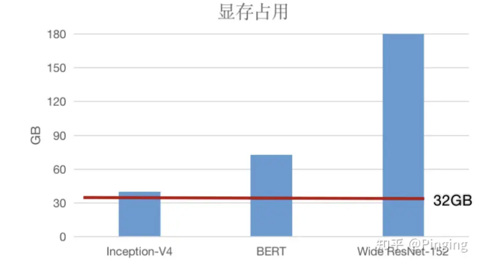
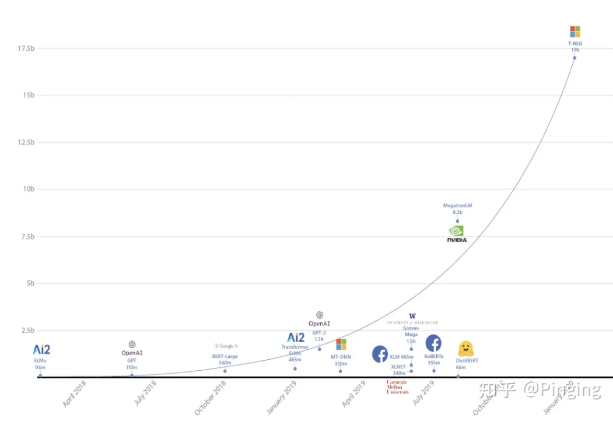
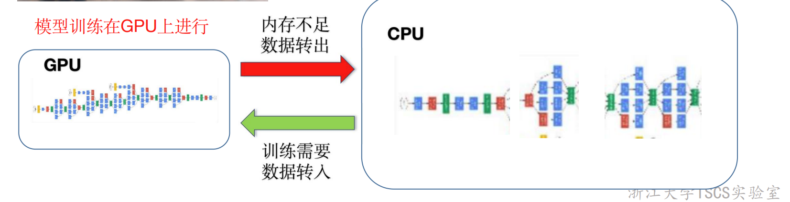
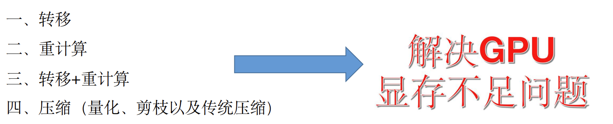
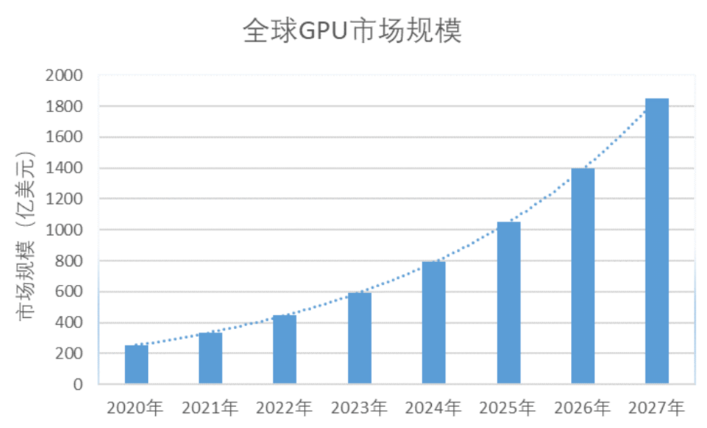
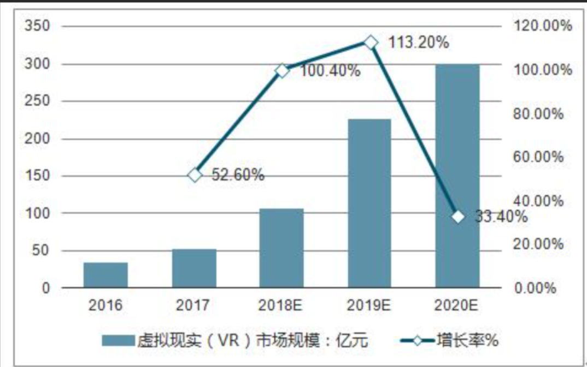
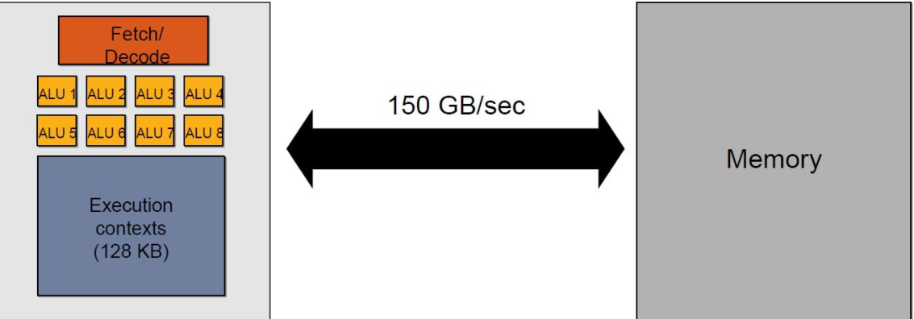
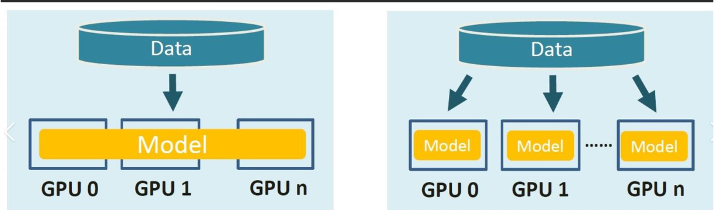
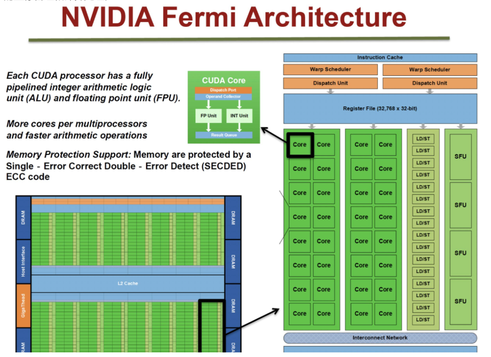

# 调研报告

## AI-GPU显存优化

- [调研报告](#调研报告)
  - [AI-GPU显存优化](#AI-GPU显存优化)
    - [组员](#组员)
    - [项目背景](#项目背景)
    - [立项依据/技术路线](#立项依据技术路线)
    - [前瞻性/重要性分析](#前瞻性重要性分析)
    - [相关工作](#相关工作)
    - [参考文献](#参考文献)


### 组员

**殷一鸣**
**何跃强**
**郭泽**
**彭晗**


### 项目背景
---

**时代背景：**  随着深度学习模型的发展和应用场景的增多，模型变得越来越大，对计算资源的需求也越来越高，特别是对显存的需求。虽然GPU的性能在不断提升，但显存的发展速度却相对较慢，导致在处理大型模型时出现了显存不足的情况。

 

​	InceptionV4设置batch size为32训练 ImageNet需要 40GB显存空间； 

​	BERT拥有768个隐藏层，在Batch size设 置为64时需要73GB的显存空间；

​	使用ImageNet训练Wide ResNet-152，并 设置Batch size为64需要显存180GB

 

​	有数据表明深度学习模型（例如GPT-3）这种模型动不动就上百GB，而一个最好的GPU（A100）目前也才80GB的显存容量。解决显存不足已经是人工智能领域的一个重要挑战。一开始，我们可能会尝试让现有的GPU能够训练更大的模型，这可以通过优化算法、减少模型大小等方式来实现。随着技术的进步，我们还可以探索如何更好地利用有限的资源，例如通过更有效的内存管理、数据压缩等技术来提高训练速度和效率。

**现状与前景：** 

​	从2016年发表在MICRO16（体系结构A会）上的vDNN，借助大得多的CPU内存，把训练当前阶段不需要的数据转移到CPU上，借助CPU上的大内存暂存数据，从而减少对显存的需求。



​	到后来重计算和压缩、量化、剪枝技术的不断发展， GPU显存的优化不断深化发展，有了长足进步。



​	到如今，这个领域已经白热化了，随着工作越做越细致，再提出新的解决思路已经比较困难了。然而，随着人工智能模型的发展，目前的GPU显存需求仍然迫切，针对显存优化，AI+System的未来还是有很长的路要走。


### 立项依据/技术路线
---
#### 1. 后向重计算

**后向重计算的工作原理**
后向重计算是一种在反向传播过程中节省显存的技术。在传统的反向传播算法中，我们需要存储每一层的中间结果（梯度），以便在后续层中计算梯度。然而，这些中间结果会占用大量的显存。后向重计算通过重新计算这些中间结果来避免存储它们，从而降低了显存占用。

具体来说，在后向重计算中，我们在反向传播过程中不直接存储中间结果，而是在需要时重新计算它们。这样，我们只需要存储当前层的梯度，而不需要存储所有层的梯度。因此，后向重计算可以以时间换空间的方式降低显存占用。

在OneFlow中实现后向重计算
OneFlow是一个开源的深度学习框架，它提供了丰富的显存优化技术，包括后向重计算。下面，我们将通过一个简单的示例来展示如何在OneFlow中实现后向重计算。

在训练过程中，我们需要使用flow.enable_grad()和flow.enable_recompute()来启用梯度计算和后向重计算。例如，在一个训练循环中：
```
for epoch in range(num_epochs):
    for data, target in dataloader:
        optimizer.zero_grad()
        with flow.enable_grad(), flow.enable_recompute():
            output = model(data)
            loss = criterion(output, target)
        loss.backward()
        optimizer.step()
```
在这个例子中，flow.enable_recompute()告诉OneFlow在反向传播过程中使用后向重计算。这样，我们就可以在保持计算效率的同时，大幅降低显存占用。

总结
后向重计算是一种有效的显存优化技术，它通过重新计算中间结果来避免存储它们，从而降低了显存占用。在OneFlow框架中，我们可以使用flow.enable_recompute()来启用后向重计算。通过以时间换空间的方式，我们可以在处理大规模数据和复杂模型时，显著提高显存利用率，提升计算效率。

#### 2. ZeRO-Offload策略
   ZeRO-Offload并不希望为了最小化显存占用而让系统的计算效率下降，但是将部分GPU的计算和存储下放到CPU和内存，必然涉及CPU和GPU之间的通信增加，使通信成为瓶颈，此外GPU的计算效率相比于CPU也是数量级上的优势，也不能让CPU参与过多计算，避免成为系统瓶颈，只有前两条满足的前提下，再考虑最小化显存的占用。

为了找到最优的offload策略，可将模型训练过程看作数据流图（data-flow graph）：


圆形节点表示模型状态，比如参数、梯度和优化器状态
矩形节点表示计算操作，比如前向计算、后向计算和参数更新
边表示数据流向
下图是某一层的一次迭代过程（iteration/step），使用了混合精读训练，前向计算（FWD）需要用到上一次的激活值（activation）和本层的参数（parameter），反向传播（BWD）也需要用到激活值和参数计算梯度，


如果用Adam优化器进行参数更新（Param update），流程如下：


下面为边添加权重，物理含义是数据量大小（单位是字节），假设模型参数量是 
 ，在混合精度训练的前提下，边的权重要么是2M（fp16），要么是4M（fp32），


现在要做的就是沿着边把数据流图切分为两部分，分布对应GPU和CPU，计算节点（矩形节点）落在哪个设备，哪个设备就执行计算，数据节点（圆形）落在哪个设备，哪个设备就负责存储，将被切分的边权重加起来，就是CPU和GPU的通信数据量。


ZeRO-Offload的切分思路是：

图中有四个计算类节点：FWD、BWD、Param update和float2half。为了不降低计算效率，将前两个节点放在GPU，后两个节点不但计算量小还需要和Adam状态打交道，所以放在CPU上，Adam状态自然也放在内存中，为了简化数据图，将前两个节点融合成一个节点FWD-BWD Super Node，将后两个节点融合成一个节点Update Super Node。如下图右边所示，沿着gradient 16和parameter 16两条边切分。


现在的计算流程是，在GPU上面进行前向和后向计算，将梯度传给CPU，进行参数更新，再将更新后的参数传给GPU。为了提高效率，可以将计算和通信并行起来，GPU在反向传播阶段，可以待梯度值填满bucket后，一遍计算新的梯度一遍将bucket传输给CPU，当反向传播结束，CPU基本上已经有最新的梯度值了，同样的，CPU在参数更新时也同步将已经计算好的参数传给GPU，如下图所示。


以下为采用ZeRO-offload后的优化效果：


### 前瞻性/重要性分析
---


#### 1.增长的计算需求
随着人工智能、大数据分析、科学计算等领域的发展，对计算资源的需求不断增长。未来 GPU 需要处理更大规模、更复杂的计算任务，这将对显存的需求提出更高的要求。
 
具体有以下表现：
##### （1） 更大规模的数据处理
随着数据量的不断增加，特别是在大数据分析、机器学习、深度学习等领域，未来 GPU 需要处理更大规模的数据，需要更大容量的显存来存储数据和中间计算结果。
##### （2） 更复杂的计算任务：
未来 GPU 需要处理更加复杂和多样化的计算任务，包括模型训练、推理、图像处理、语音识别等各种计算任务。这些任务可能需要更多的显存来存储模型参数、中间计算结果等数据。
##### （3）更高的性能需求：
随着计算任务的不断增加和复杂化，未来 GPU 需要提供更高的性能来满足用户的需求。这包括更快的计算速度、更高的吞吐量、更低的延迟等方面。
##### （4）多任务并行处理：
未来 GPU 需要支持更多的并行计算任务，包括多个任务同时进行、多个任务之间的数据共享等。需要更有效地管理显存资源以支持多任务并行处理。

#### 2.新型应用场景：
随着人工智能、虚拟现实、增强现实等新型应用场景的不断涌现，对显存的需求也在不断变化。未来 GPU 需要适应更多样化的应用需求，需要在显存管理方面进行更多的优化，以下为几个例子。

##### （1）人工智能：
人工智能涵盖了机器学习、深度学习、自然语言处理、计算机视觉等各个方面。在这些领域中，GPU 被广泛应用于训练和推理深度神经网络模型。新的模型和算法不断涌现，需要更大规模、更复杂的计算和数据处理。例如大语言模型ChatGPT，需要大量的显存来存储模型参数和中间计算结果。
 

##### （2）虚拟现实：
虚拟现实技术通过模拟人类的感官体验，让用户沉浸在虚拟的三维环境中。在虚拟现实中，GPU 负责渲染图形、处理交互事件等任务。随着虚拟现实技术的不断进步，新的 VR 应用场景不断涌现，如虚拟会议、虚拟旅游、虚拟培训等。需要更快的图形渲染速度和更大的显存容量。
 

##### （3）增强现实：
增强现实技术通过将虚拟元素叠加到现实世界中，扩展人类的感知和交互能力。在增强现实中，GPU 负责识别现实世界中的场景、跟踪物体的位置、渲染虚拟元素等任务。随着增强现实技术的不断发展，新的 AR 应用场景不断涌现，如增强现实导航、增强现实游戏、增强现实演艺等。需要更复杂的算法和更高效的显存使用方式。

#### 3.智能化显存管理：
未来显存管理可能更加智能化，包括动态分配、内存压缩、数据重用等技术的应用。通过智能化显存管理，可以更好地适应不同的计算任务和应用场景，提高显存的利用率和性能。
 

##### （1）动态分配：
智能化显存管理可以根据系统的实时需求，动态分配显存资源给不同的计算任务。通过监测系统的负载情况和内存使用情况，智能化管理系统可以调整显存分配策略，确保每个任务都能获得适当的显存资源，从而最大程度地提高系统的整体性能。

##### （2）内存压缩：
智能化显存管理可以利用数据压缩技术来减少显存的占用量。通过识别和压缩内存中的重复数据、冗余数据或低频数据，可以显著减少显存的使用量，从而提高显存利用率并节省系统资源。例如，利用压缩算法对图像、模型参数等数据进行压缩，可以降低显存的空间占用，并提高系统的性能和效率。

##### （3）数据重用：
智能化显存管理可以通过数据重用技术来减少数据在内存和设备之间的传输量。通过识别和缓存经常使用的数据块或中间计算结果，可以减少数据的重复加载和传输，从而降低内存带宽消耗，提高系统的效率和性能。例如，在深度学习任务中，可以利用数据重用技术来减少模型参数的加载次数，加速模型训练和推理过程。

##### （4） 智能调度：
智能化显存管理可以通过智能调度算法来优化计算任务的执行顺序和并发度。通过分析任务之间的依赖关系和计算特性，智能化管理系统可以动态调整任务的执行顺序和并发度，以最大程度地提高系统的整体效率。例如，在多任务并行计算中，可以利用智能调度算法来平衡不同任务之间的资源竞争，避免资源浪费和性能下降。

#### 4.分布式显存系统：
未来可能会出现更多基于分布式显存系统的 GPU 架构，允许多个 GPU 之间共享显存资源。这种架构可以提高整个系统的显存利用率，并支持更大规模的计算任务。
 

##### （1）架构特点：
分布式显存系统通常由多个 GPU 节点组成，每个节点都包含一个或多个 GPU 设备以及相关的处理器和存储资源。这些节点通过高速网络连接在一起，形成一个统一的计算集群。每个节点上的 GPU 设备可以通过网络访问其他节点上的显存资源，实现数据共享和协同计算。

##### （2）数据共享：
分布式显存系统通过共享显存资源来实现数据共享和协同计算。在这种系统中，数据可以存储在任何一个节点的显存中，并且可以通过网络访问到其他节点上的 GPU 设备。这种数据共享方式可以极大地扩展系统的存储容量和计算能力，从而支持更大规模、更复杂的计算任务。

##### （3）任务调度：
在分布式显存系统中，任务调度是一个关键问题。由于多个 GPU 设备共享同一份数据，因此需要合理地调度计算任务，以最大程度地利用系统资源并确保任务的正确执行顺序。通常采用分布式调度算法来实现任务的分配和调度，以确保任务的负载均衡和系统的整体性能。

##### （4）应用场景：
分布式显存系统适用于需要大规模数据处理和并行计算的应用场景，如深度学习训练、大规模数据分析、科学计算等。这些应用通常需要大量的计算资源和存储资源，分布式显存系统可以提供更大的计算和存储能力，并且支持更复杂的计算任务和算法。

#### 5.软硬件协同优化
未来的显存优化将更多地涉及到软硬件协同设计。硬件厂商和软件开发者将密切合作，通过优化算法、编译器、驱动程序等多个层面来提高显存利用率和性能。软硬件协同优化可以充分发挥硬件的潜力，实现更高效的显存管理和计算处理。
 有以下几个方面

##### （1）内存访问模式优化：
软件开发人员可以通过优化算法和数据结构来改进内存访问模式，以最大程度地利用 GPU 的内存层次结构和并行计算能力。例如，通过数据局部性原则，合理地组织数据访问模式，以减少内存访问延迟和提高数据缓存命中率。

##### （2）内存分配与释放策略：
软件开发人员可以根据应用特点和系统需求，设计合适的内存分配与释放策略，以最小化内存碎片化、减少内存泄漏，并提高内存利用率。同时，需要考虑到 GPU 内存管理器的特点和限制，以避免因不当的内存操作而导致性能下降或系统崩溃。

##### （3）内存数据压缩算法优化：
硬件设计者可以设计专门的压缩引擎或硬件模块，以提供显存数据的压缩和解压功能。软件开发人员可以针对不同的应用场景和数据特点，选择合适的压缩算法，并对其进行优化，以降低数据传输带宽、减少显存占用，并提高系统的性能和效率。

##### （4）内存访问控制与并发管理：
软件开发人员可以通过合理的并发管理和内存访问控制策略，最大化利用 GPU 的并行计算能力，并避免因数据竞争而导致的性能下降或系统错误。硬件工程师可以设计支持并发访问和多线程操作的硬件结构，以提高系统的并行度和吞吐量。

### 相关工作
---

当今，随着深度学习的发展，模型变得越来越大，对显存的需求也越来越多，GPU的显存急需优化方案。优化GPU显存的主要目标是最大程度地减少显存的使用量，以提高程序的性能和效率。以下我将介绍GPU优化方案的发展历程与GPU优化的优秀成果。

**2016年：** 

​		发表在MICRO16（体系结构A会）上的vDNN[1]提出了一种方案，即在训练时，把训练当前阶段不需要的数据转移到CPU上，借助CPU上的大内存暂存数据。因为DNN模型是按照层进行排列的，每一个时刻GPU其实只训练某个层，势必会有一些层的数据我们暂时不需要访问，所以这些数据便可以转移出去。在文章中，作者对CV模型进行测试，发现Feature map类型的数据占空间是最大的，所以重点是面向Feature map的数据进行优化。进一步，作者发现CV主要包括两个比较重要的层，卷积以及FC全连接。而这两个层中，卷积层的输入占用空间特别多，于是作者就把卷积层的Tensor在前传的时候转出到CPU里面，等到反传需要的时候再提起转回来。但是这种方案有缺点，即由于同步的影响，导致了严重的性能开销，且比较死板，先入为主的就对卷积做策略，随着未来模型的发展，这种方案势必不智能；

​		之后，Tianqi Chen另辟蹊径，提出了DNN模型层的重计算思想[2]。将暂时用不到的显存释放掉，然后反传用到时再通过前传得到。虽然能释放大量显存，但是计算开销是串行的，特别大。

**2018-2019年：**

​		其中一部分工作主要在vDNN的方向上进行优化，代表性的工作有DATE18的MoDNN[3]、IPDPS19的vDNN++[4]。一部分工作将转移、重计算结合到一起，例如SuperNeurons[5]，它提出了一个系统级的优化框架。还有一部分工作另辟蹊径，将压缩引入DNN的显存优化，从而开辟了新的领域，如-Gist[6]、cDMA[7]。

​		MoDNN是2018年发表在DATE（CCF-B）上的一篇基于转移的显存优化工作。他的核心发现是DNN框架中，卷积函数包括很多不同的类别，有的卷积函数空间使用多，但是性能较快（FFT、Winograd algorithm），有的不占用太多内存，但是性能相对较差（GEMM）。所以moDNN能够只能的选择卷积函数，并调整mini-batchsize来最优化系统的执行性能，并智能选择转移策略。vDNN++对GPU碎片问题，转移后的数据压缩问题进行了进一步优化。

​		SuperNeurons是2018年比较有影响力的文章，其核心思想可以归结为下面三点，从而针对不同类别的层进行不同的策略，最终一步一步释放显存。


然而，作为早期文章，该方案同样先入为主的对当时比较主流的几个模型进行了分析，并有使用固定思维对某些层做某些事情，不够灵活。

​		Gist[6]针对ReLU的输出进行有损+无损的压缩，释放了许多ReLU层相关的显存，节省了空间。cDMA[7]利用了ReLU输出层的稀疏特性，并在GPU中做了一个硬件core来压缩这些数据，以减少转移的数据量，最终提升性能。但是这种硬件的文章其实都是基于模拟器做，也无法为我们所用。并且压缩算法定制到硬件上，也比较单一，所以弊端还是很多的。

**2020年：**

​		在ASPLOS'20这一会议中，涌出了一批相对比较优秀的GPU显存解决工作。

​		首先是SwapAdvisor[8]。这篇工作的想法比较简单，作者认为之前的基于人工判断的转移方法并不高效（例如vDNN的只对卷积转移）。所以他认为系统可以使用传统的启发式搜索方案来进行转移策略的搜索，这里选择的是遗传算法。虽然想法简单，但是作者还是经过了大量的实验测试以及对比，最终选择了遗传算法，并且针对遗传算法的流程以及DNN的流程，将转移这个操作建模出来，并且也对非线性网络的支持比较好。

​		AutoTM[9]是ASPLOS'20的另一篇文章，这个文章的大背景就是使用暴力搜索（线性整数规划）来搜索出来合适的转移策略。他是第一个使用CPU的DRAM+NVM（非易失性内存）进行策略搜索的工作，并且开源了代码。不过对于搜索范围较大的或是异步运行的时候表现性能较差。

​		除了上述几篇转移的工作外，本年的ASPLOS会议上还有一篇GPU显存优化的工作-Capuchin[10]，而该工作就是在SuperNeurons的基础上，做的更深更好（转移+重计算）。这篇文章解决了很多GPU显存的问题。简单来说，该工作有如下三点Motivation：


不能先入为主的对各种层做特定操作（例如就对卷积的Tensor做转移，对Pool做重计算等等），这样势必不能达到比较高效（也不能是最高效），于是这个文章先详尽一切办法把能并行的转移并行进来，然后迭代调出最优的重计算方案，直到内存容量足够为止。本文引入公式，对不同Tensor按照下面的公式计算，从而排序进行优化：


而这个公式将Tensor按照内存保存量以及重计算的时间需要进行了权重计算，简单来说，Tensor中重计算时间越少，内存保存量越大的数据，越值得我们首先考虑。

相比于之前的SuperNeurons，这个工作就无关什么层的类型，我一视同仁，只要你能并行，我就并行起来，并且选择最优的重计算方案。对比其他的仅转移方案的文章，本文引入了重计算，从而在某些情况下重计算的开销会比转移低，从而提升模型训练的性能。

**2021年：**

​		2021年在显存优化上出现了颇多更有意思的点，例如FlashNeuron[11]。这个论文一反常态，认为上述一堆文章都是把数据转移到CPU的DRAM上，但是那些文章都没有考虑过内存、CPU正在执行数据预处理操作，从而使得内存总线始终在忙碌，从而使得转移性能极差，转移性能随着CPU忙碌而变差。于是这个文章破天荒的将数据转移到SSD上，并利用了比较简单的转移方法，引入压缩从而进一步降低转移数据量。

​		该年还有一篇显存优化的文章：Sentinel来自HPCA21[12]，他算是第二篇将NVM与DRAM结合的文章，但是他的点比较微观，抓住的是转移页的时候，生命周期不同的的数据被分配到了同一个页中，造成了大量不必要的转移。所以这个文章把这个问题解决了。并且实验对比了当前最好的一系列文章。

​		再者就是ATC21的ZeRO-Offload文章[13]。这个文章发现，NLP里面有许多参数其实是为优化器所用的。与CV不同，CV是Feature map特别大，而NLP偏向parameter，而优化器内部其实是和weight的量成正比的。加上momentum以及variance大概能有3倍。所以这个文章把优化器所有参数卸载到CPU上，包括计算在内，并设计了更快的CPU优化器运算，从而做到了完美的GPU显存优化。

​		然后是2021年CLUSTER21的关于DNN+压缩的优化文章-CSWAP。这个文章利用了ReLU输出数据的稀疏特性、稀疏可变特性（随着训练的进行不同层的稀疏程度是可变的），提出了选择性压缩的架构，在转移的过程中，如果数据压缩+转移性能好，那我们就压缩，否则就不压缩。为了达成这个目的，本文利用了2个机器学习模型对一些指标进行预测，从而比较准确的挑选出合适的层进行压缩+转移，其余只转移，从而在优化显存的同时，最优化训练性能。

​		最后是《DeepCuts: A Deep Learning Optimization Framework for Versatile GPU Workloads》[14],目前绝大多数深度学习框架都是使用cuDNN原生高性能库对在GPU上进行的计算做加速优化。然而随着深度学习领域的快速发展，基于cuDNN的框架在GPU优化上并不总能给出最优解。因此论文作者提出了DeepCuts，一个专为解决深度学习应用中越来越多样的workloads而设计的深度学习框架。其不同于上述其他框架的两个重要创新点：1、直接使用GPU硬件参数；2、不实际评估每个参数组合的性能，而是通过估计性能上界去筛除理论计算结果较差的参数组合，缩小范围。

对于一个给定的深度学习模型中的计算操作，DeepCuts会搜索产生最优性能GPU kernel的参数组合，并在搜索过程中尝试算子融合，并使用具有后端架构感知的性能估计模型对“definitely-low”的参数组合进行剪枝。基于选中的参数组合，生成数据流图并进一步生成GPU kernel。最后执行这些kernel并为每个算子或融合算子选出使其性能最优的。

**总结来看，GPU显存优化的历史便在下面的表格：**

| 年份 | 会议    | 题目         | 方案        | 备注                                     |
| ---- | ------- | ------------ | ----------- | ---------------------------------------- |
| 2016 | MICRO   | VDNN         | 转移        | 第一篇转移                               |
| 2016 | arXiv   | Checkpoint   | 重计算      | 第一篇重计算                             |
| 2018 | DATE    | moDNN        | 转移        | 考虑不同卷积函数的性能                   |
| 2018 | PPoPP   | SuperNeurons | 转移+重计算 | 第一篇转移+重计算                        |
| 2018 | HPCA    | cDMA         | 转移+压缩   | 硬件对ReLU输出层压缩                     |
| 2019 | IPDPS   | vDNN++       | 转移+压缩   | 针对vDNN的性能问题进行解决               |
| 2020 | ASPLOS  | AutoTM       | 转移        | NVM+DRAM的暴力搜索                       |
| 2020 | ASPLOS  | SwapAdvisor  | 转移        | 启发式搜索+GPU碎片问题                   |
| 2020 | ASPLOS  | Capuchin     | 转移+重计算 | 转移+重计算的较为优秀的方案              |
| 2021 | FAST    | FlashNeuron  | 转移        | 引入SSD转移                              |
| 2021 | ATC     | ZeRO-Offload | 转移        | 利用CPU的计算能力                        |
| 2021 | CLUSTER | CSWAP        | 转移+压缩   | 对稀疏数据进行选择性压缩，最优化性能     |
| 2021 | HPCA    | Sentinel     | 转移        | NVM+DRAM场景，考虑细粒度Page上的数据情况 |

### 参考文献
---

[1]M. Rhu, N. Gimelshein, J. Clemons, A. Zulfiqar, and S. W. Keckler, “VDNN: Virtualized deep neural networks for scalable, memory-efficient neural network design,” in *Proceedings of the Annual International Symposium on Microarchitecture, MICRO*, 2016, vol. 2016-Decem.

[2] T. Chen, B. Xu, C. Zhang, and C. Guestrin, “Training Deep Nets with Sublinear Memory Cost,” pp. 1–12, 2016.

[3] X. Chen, D. Z. Chen, and X. S. Hu, “MoDNN: Memory optimal DNN training on GPUs,” *Proc. 2018 Des. Autom. Test Eur. Conf. Exhib. DATE 2018*, vol. 2018-Janua, pp. 13–18, 2018.

[4] S. B. Shriram, A. Garg, and P. Kulkarni, “Dynamic memory management for GPU-based training of deep neural networks,” *Proc. - 2019 IEEE 33rd Int. Parallel Distrib. Process. Symp. IPDPS 2019*, pp. 200–209, 2019.

[5] L. Wang *et al.*, “SuperNeurons: Dynamic GPU memory management for training deep neural networks,” in *Proceedings of the ACM SIGPLAN Symposium on Principles and Practice of Parallel Programming, PPOPP*, 2018, pp. 41–53.

[6] A. Jain, A. Phanishayee, J. Mars, L. Tang, and G. Pekhimenko, “GIST: Efficient data encoding for deep neural network training,” *Proc. - Int. Symp. Comput. Archit.*, pp. 776–789, 2018.

[7] M. Rhu, M. O’Connor, N. Chatterjee, J. Pool, Y. Kwon, and S. W. Keckler, “Compressing DMA Engine: Leveraging Activation Sparsity for Training Deep Neural Networks,” *Proc. - Int. Symp. High-Performance Comput. Archit.*, vol. 2018-Febru, pp. 78–91, 2018.

[8] C. C. Huang, G. Jin, and J. Li, “SwapAdvisor: Pushing deep learning beyond the GPU memory limit via smart swapping,” in *International Conference on Architectural Support for Programming Languages and Operating Systems - ASPLOS*, 2020, pp. 1341–1355.

[9]M. Hildebrand, J. Khan, S. Trika, J. Lowe-Power, and V. Akella, “AutOTM: Automatic tensor movement in heterogeneous memory systems using integer linear programming,” in *International Conference on Architectural Support for Programming Languages and Operating Systems - ASPLOS*, 2020, pp. 875–890.

[10] X. Peng *et al.*, “Capuchin: Tensor-based GPU memory management for deep learning,” in *International Conference on Architectural Support for Programming Languages and Operating Systems - ASPLOS*, 2020, pp. 891–905.

[11] J. Bae *et al.*, “FlashNeuron : SSD-Enabled Large-Batch Training of Very Deep Neural Networks This paper is included in the Proceedings of the 19th USENIX Conference on File and Storage Technologies .,” 2021.

[12] J. Ren, J. Luo, K. Wu, M. Zhang, H. Jeon, and D. Li, “Sentinel : Efficient Tensor Migration and Allocation on Heterogeneous Memory Systems for Deep Learning,” pp. 598–611, 2021.

[13] J. Ren *et al.*, “ZeRO-Offload : Democratizing Billion-Scale Model Training This paper is included in the Proceedings of the,” 2021.

[14]Wookeun Jung, Thanh Tuan Dao, Jaejin Lee,"DeepCuts: A Deep Learning Optimization Framework for Versatile GPU Workloads,"PLDI, 2021.

[AI-GPU显存优化领域前沿工作发展史（读博两年里程碑） - 知乎 (zhihu.com)](https://zhuanlan.zhihu.com/p/419019170)

[DeepSpeed之ZeRO系列：将显存优化进行到底 - 知乎 (zhihu.com)](https://zhuanlan.zhihu.com/p/513571706)

[后向重计算在OneFlow中的实现：优化显存占用，提升计算效率)](https://cloud.baidu.com/article/3275282)