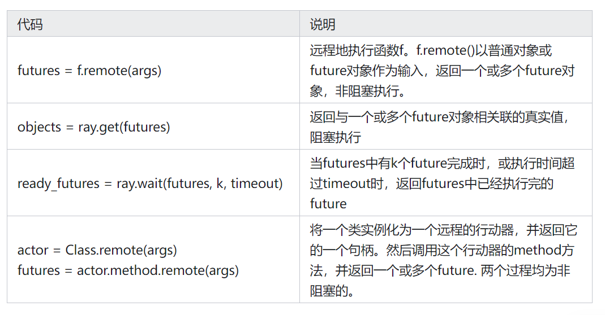
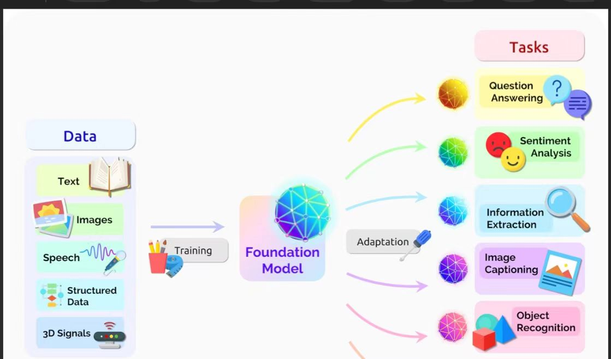
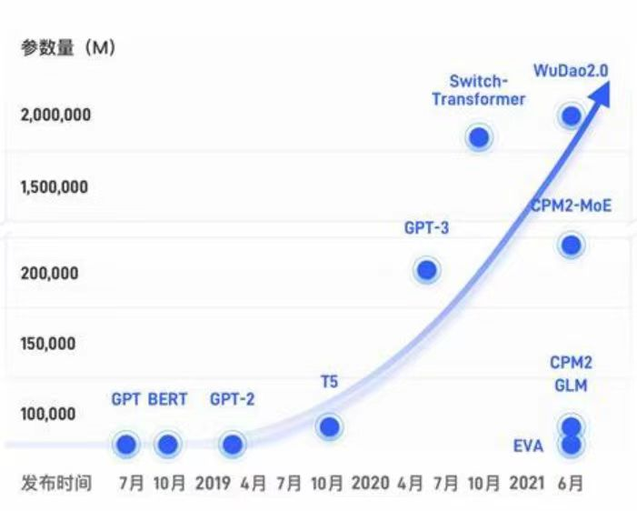
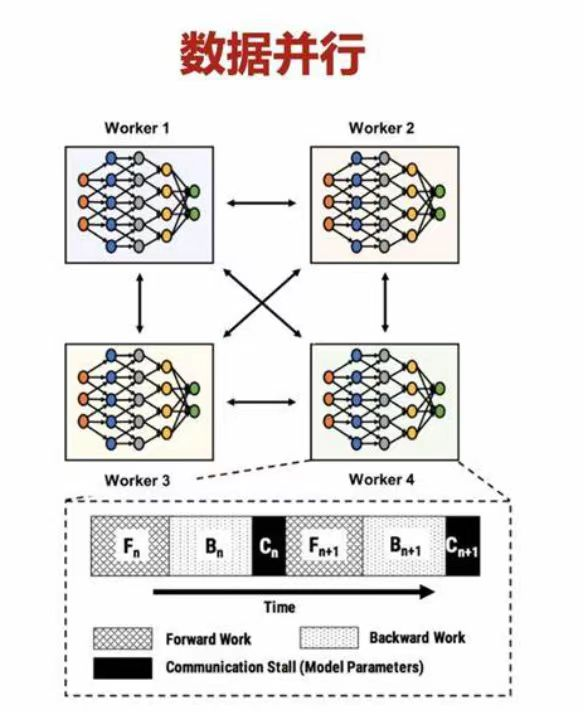
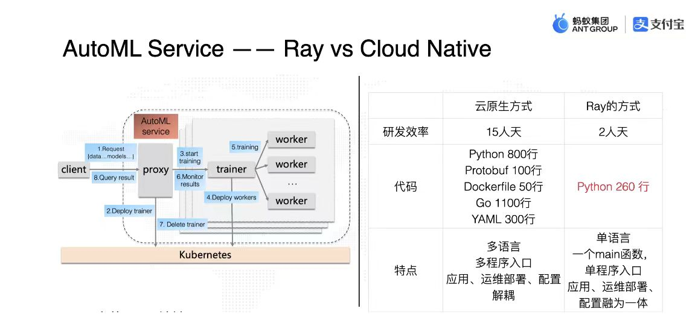
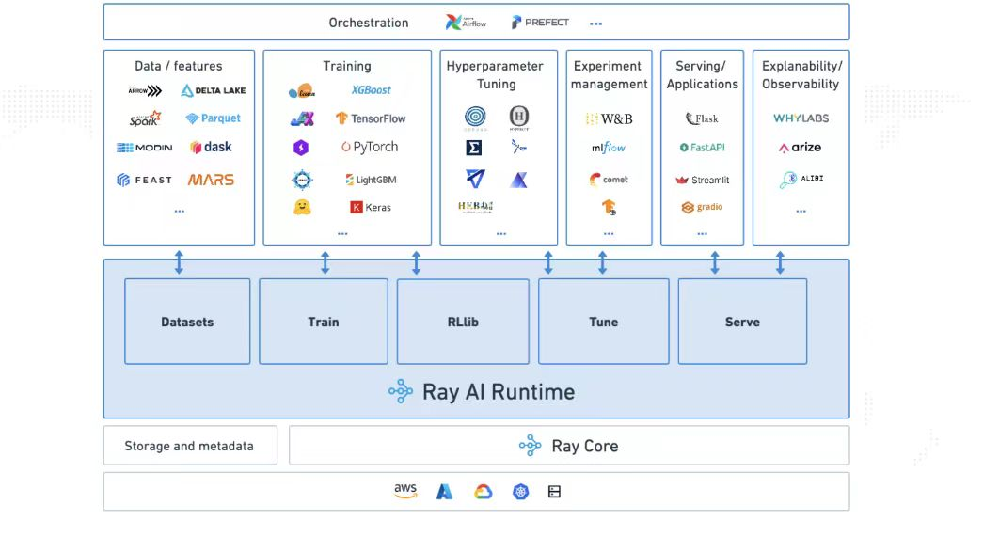

# 调研报告

## Ray+大模型分布式部署优化

- [调研报告](#调研报告)
  - [Ray+大模型分布式部署优化](#Ray+大模型分布式部署优化)
    - [组员](#组员)
    - [项目背景](#项目背景)
      - [大模型的内存瓶颈](#大模型的内存瓶颈)
      - [Ray](#Ray)
        - [什么是Ray](#什么是Ray)
        - [为何选择Ray](#为何选择Ray)
        - [分布式的挑战](#分布式的挑战)
    - [立项依据/技术路线](#立项依据技术路线)
      - [Ray](#1.Ray)
        - [Ray分布式计算框架](#11-ray分布式计算框架)
        - [Ray编程模型](#12-ray编程模型)
        - [Ray计算模型](#13-ray计算模型)
        - [分布式调度器](#14-分布式调度器)
        - [分布式对象存储器](#15-分布式对象存储器)
        - [Ray框架相比Spark的优/缺点](#16-ray框架相比spark的优缺点)
      - [Deepspeed ZERO](#2-deepspeed-zero)
        - [ZERO的三个级别](#21-zero的三个级别)
          - [ZeRO-1](#211-zero-1)
          - [ZeRO-2](#212-zero-2)
          - [ZeRO-3](#213-zero-3)    
      - [零拷贝技术](#3-零拷贝技术)      
    - [前瞻性/重要性分析](#前瞻性重要性分析)
      - [大模型的未来发展](#1-大模型的未来发展)
      - [Ray](#2-ray)
    - [相关工作](#相关工作)
      - [利用Ray进行AI训练](#利用ray进行ai训练1)
      - [利用Ray进行大模型训练](#利用ray进行大模型训练)
      - [利用Ray和其他工具实现模型训练优化](#更深一步利用ray和其他工具实现模型训练优化)
    - [参考文献](#参考文献)

## 组员

**殷一鸣**
**何跃强**
**郭泽**
**彭晗**

## 项目背景
---
### 大模型的内存瓶颈

​	AI模型的规模在过去4年维持了每年10倍的增长。2021年的产生的大模型已经达到1 trillion parameters。而最近分布式训练号称可以支撑100trillion parameters，似乎这个趋势还能继续维持两年以上。练巨大的模型必然需要底层基础软件和芯片的支撑。然而GPU在过去4年中，无论是显存空间，或者是算力的增长，都在10倍这个数量级，显然跟不上10000倍的模型规模增长。这些大模型的参数规模给训练系统带来了新的挑战，例如内存瓶颈，糟糕的运行时效率，较高的模型开发成本。

​	近年来，ML/AI模型的规模增长迅速，远超过了硬件能力的增长。$Ion ~Stoica$ 说过：满足足够的计算能力需求的唯一方法是分布式。随着数据规模的扩大和计算复杂度的增加，单机计算能力已经无法满足大规模数据处理和计算的需 求，分布式计算逐渐成为一种重要的数据处理和计算方式。	

​	分布式模型的兴起与发展

​	分布式训练的起源可以追溯到20世纪90年代，当时由于计算机处理能力的限制，无法处理大规模的数据集和复杂的机器学习模型。随着计算机技术的发展，分布式计算框架如Hadoop和Spark开始被广泛采用，使得分布式训练成为可能。分布式训练能够将大规模数据集拆分成多个小数据集，分别存储在多台计算机上，并同时进行模型训练，从而大大缩短训练时间。

​	2017 年伯克利大学 RISELab 实验室开 发出了一个针对深度强化学习通用异步并行框架 Ray, Ray 的分布式迭代作业从任务级别降到了函数级别,有 效地解决了 Spark 对强化学习的不支持。故本文提出的 RRLP 平台采用 Ray 作为主体框架,可以完美地解决强 化学习模型训练过程中频繁的数据收集和再分发。Ray 不仅可以异步并行的分发任务,还可以共享所有的存储 资源,从而获得了更加适宜并行分布式强化学习计算的优异性能。

### Ray
#### 什么是 Ray

​	Ray是伯克利大学RISELab研发的分布式计算系统，是一个用于构建高性能分布式应用程序的开源系统。Ray 的独特功能之一是它的主内存对象存储 Plasma，它使用共享内存在 Ray 集群中每台机器上的进程之间传递对象。Ray 使用 Plasma 来实现 NumPy 数组的零拷贝传输。在传统的并行计算框架中，任务调度器和元数据存储器是集中式的，即集群中一般只有一个大的任务调度器和元数据存储器，这一设计也是符合直觉的。然而为了满足性能需求，Ray使用了分布式的任务调度器和元数据存储器设计，从而满足了Ray的毫秒百万级并发量的需求。Ray还为任务和行动器提供了基于Lineage的容错机制，同时为元数据存储提供了基于复制的容错机制。这些将在后文详细介绍。

#### ​为何选择 Ray

​		MapReduce	MapReduce是一种编程模型，用于在大型计算集群上并行处理大数据集。它主要由两个阶段组成：Map阶段和Reduce阶段，之间通过磁盘进行数据交换。但其磁盘IO开销大：Map和Reduce阶段之间的中间数据需要写入磁盘，造成大量的磁盘IO，这是其性能瓶颈之一，对于需要多次迭代的任务（如机器学习算法），每次迭代都需要从头开始读写磁盘，效率低下，不适合实时数据处理。

​		Spark	Apache Spark是一个开源的分布式计算系统，设计初衷是为了解决MapReduce在迭代计算和实时处理方面的不足。但其由于依赖内存处理，对资源的消耗相对较大，尤其是处理大数据集时可能需要较多的内存资源，虽然提供了丰富的功能，但相对于MapReduce，学习和使用Spark的门槛较高.

### 	分布式的挑战

​	分布式模型推理已经是人工智能领域的一个重要技术，但仍然存在一些未来发展趋势与挑战：

​		任务分配策略的优化，以提高计算资源的利用率和系统性能。

​		数据分布方式的创新，以提高数据的存储和访问效率。

​		通信机制的改进，以提高通信速度和减少通信开销。

## 立项依据/技术路线
---
### 1. Ray
#### 1.1 Ray分布式计算框架

Ray是UC Berkeley RISELab推出的高性能分布式执行框架，它使用了和传统分布式计算系统不一样的架构和对分布式计算的抽象方式，具有比Spark更优异的计算性能，是一种通用的集群计算框架，既支持模型的训练，又支持对环境的仿真或与环境的交互。

​	按照官方文档的说法：

​		Ray provides a simple, universal API for building distributed applications.	
​	它主要有以下的特点：

​	提供一种能够构建、运行分布式应用程序的simple primitives；
​	从单机扩展到平行，几乎不需要改代码；
​	拥有良好的生态，能够在core Ray上构建复杂的应用程序。

​Ray作为一个灵活的，可伸缩的，并带有用于测试、部署和监视的分布式计算引擎，可以更方便、更高效的支撑数据处理、数据分析、实时流计算以及ML/DL/RL的模型服务，分布式训练，超参数调整等等功能。

Ray 框架可以应用于大数据处理、机器学习、强化学习、自然语言处理等领域的分布式计算任务：
+ 大数据处理。Ray框架可以与其他大数据处理框架（如Hadoop、Spark）集成，提高数据处理的效率和可靠性。Ray框架可以通过分布式对象存储（如Amazon S3、Google Cloud Storage）实现数据的高效存储和访问。
+ 机器学习。Ray框架可以提供高效的分布式计算与深度学习框架（如TensorFlow、PyTorch）的集成，从而加速模型训练和推理。Ray框架可以提供模型并行化、数据并行化和超参数搜索等功能。
3）强化学习。Ray框架可以提供高效的强化学习框架（如RLlib），从而加快强化学习模型的训练和评估。Ray框架可以提供高效的并行化、分布式经验回放和分布式优化器等功能。
+ 自然语言处理。Ray框架可以提供高效的自然语言处理框架（如Hugging Face Transformers），从而加快模型的训练和推理。
总之，Ray框架具有广泛的应用场景，可以用于各种类型的分布式计算任务，从而加速任务的执行速度，提高计算效率和可靠性，降低计算成本。

Ray 框架在各种应用场景中具有以下优势：
+ 高效的分布式计算。Ray框架支持高效的分布式计算，可以轻松地扩展计算资源，提高任务的执
行速度和计算效率。
+ 灵活的任务调度。Ray框架提供灵活的任务调度机制，可以根据任务类型和计算资源的状态动态调整任务的执行顺序和分配策略，从而实现计算资源利用率的最大化。
3）高可靠性和容错性。Ray框架提供高可靠性和容错性机制，可以自动处理资源计算故障和任务异
常，保证任务的正确执行和计算结果的可靠性。
+ 易用的编程接口。Ray框架提供简单易用的编程接口，支持多种编程语言（如Python、Java、
C++等），可以使开发人员轻松编写分布式计算任务。
+ 高度可扩展性。Ray框架具有高度可扩展性，可以与其他分布式计算框架（如Hadoop、Spark、Kubernetes 等）集成，提供更加完整和强大的分布式计算能力。
总之，Ray框架在各种应用场景中都具有高效、可靠、灵活和易用的优势，可以帮助用户更加轻松地完成分布式计算任务，获得更好的计算性能和效率

#### 1.2 Ray编程模型

**Ray编程模型**是指Ray框架基于任务和行动器这两个重要需求所向用户提供的一套API及其编程范式。下表展示了Ray提供的核心API。

任务是指在无状态的工作器中执行的远程函数。远程函数被调用时会立即返回一个future对象，而真正的返回值可以通过ray.get(<future对象>)的方式来获取。**这样的编程模型既允许用户编写并行计算代码，同时又提醒用户要关注数据之间的依赖性。**

#### 1.3 Ray计算模型

* Ray产生的背景:由于AI和大数据的快速发展，对于应用和硬件能力的要求提出了更高的挑战。

* Ray的特点:分布式异步调用,内存调度,Pandas/Numpy的分布式支持,支持python,整体性能出众

* 基本的软件框架

  Ray的架构由应用层和系统层组成，其中应用层实现了Ray的API,作为前端供用户使用，而系统层则作为后端来保障Ray的高扩展性和容错性，整体框架如下

GCS 作为集中的服务端，是 Worker 之间传递消息的纽带。每个 Server 都有一个共用的 Object Store，也就是用 Apache Arrow/Plasma 构建的内存数据。 Local Scheduler 是 Server 内部的调度（单机调度），同时通过 GCS 来和其他 Server 上的 Worker 通信。Object Store 之间也有通信，作用是传递 Worker 之间的数据。

Local Scheduler，即Raylet，本地调度核心

**调度过程：任务创建后，首先向本地调度器提交任务，大多数情况下任务将在本地被调度。若没有资源，局部调度器会向全局调度器传递任务，向GCS传递任务信息，然后全局调度器会选择等待时间最短的、有足够资源的节点来执行任务**

任务定义、提交、远程提交过程:0.定义远程函数1.提交任务2.提交任务到全局3.检查对象表4.执行全局调度5.检查任务输入6.查询缺失输入7.对象复制8.执行局部调度9.访问对象存储器

获取任务执行结果过程:
1.调教get请求
2.注册回调函数
3.任务执行完毕
4.将对象同步到GCS
5.出发回调函数
6.执行回调函数
7.返回用户程序

#### 1.4 分布式调度器
Ray中的任务调度器被分为两层，由一个全局调度器和每个节点各自的局部调度器组成。为了避免全局调度器负载过重，在节点创建的任务首先被提交到局部调度器，如果该节点没有过载且节点资源能够满足任务的需求（如GPU的需求），则任务将在本地被调度，否则任务才会被传递到全局调度器，考虑将任务调度到远端。由于Ray首先考虑在本地调度，本地不满足要求才考虑在远端调用，因此这样的调度方式也被称为自底向上的调度。

下图展示了Ray的调度过程，箭头的粗细表示过程发生频率的高低。用户进程和工作器向本地调度器提交任务，大多数情况下，任务将在本地被调度。少数情况下，局部调度器会向全局调度器提交任务，并向GCS传递任务的相关信息，将任务涉及的对象和函数存入全局的对象表和函数表中，然后全局调度器会从GCS中读取到信息，并选择在其他合适的节点上调度这一任务。更具体地来说，全局调度器会根据任务的请求选出具有足够资源的一系列节点，并在这些节点中选出等待时间最短的一个节点。

#### 1.5 分布式对象存储器
Ray实现了一个内存式的分布式存储系统来存储每个任务的输入和输出。Ray通过内存共享机制在每个节点上实现了一个对象存储器 (Object Store)，从而使在同一个节点运行的任务之间不需要拷贝就可以共享数据。当一个任务的输入不在本地时，则会在执行之前将它的输入复制到本地的对象存储器中。同样地，任务总会将输出写入到本地的对象存储器中。这样的复制机制可以减少任务的执行时间，因为任务永远只会从本地对象存储器中读取数据（否则任务不会被调度），并且消除了热数据可能带来的潜在的瓶颈。

#### 1.6 Ray框架相比Spark的优/缺点
优势：
+ 最小集群配置
+ 最适合计算繁重的工作负载。已经表明Ray 优于 Spark 和 Dask在某些机器学习任务上，如 NLP、文本规范化等。最重要的是，Ray 的工作速度似乎比 Python 标准多处理快 10%，即使在单个节点上也是如此。
+ 独特的基于参与者的抽象，其中多个任务可以异步地在同一个集群上工作，从而提高利用率（相比之下，Spark 的计算模型不太灵活，基于并行任务的同步执行）。

缺点：
+ 相对较新（2017 年 5 月首次发布）
+ 并不是真正适合分布式数据处理。Ray 没有用于分区数据的内置原语，如果任务以数据为中心并且更多地围绕 ETL/预处理，还是需要 Spark的。对于模型并行训练，加速 Python 代码运行，强化学习等，可以选择Ray，通过Ray也可以将Spark组织起来，实现端到端的模型训练。

### 2. Deepspeed ZERO

DeepSpeed 是一个由 Microsoft 开发的深度学习开源优化工具，它横跨模型训练、推理和模型压缩等领域。
零冗余优化器 Zero Redundancy Optimizer (ZeRO) 是 DeepSpeed 提供的训练优化的核心，它是一套减少分布式模型训练所需内存量的技术。
数据并行将模型复制多份至各个 GPU 设备上，但显然这个复制模型的过程将产生较大的显存冗余，为了解决这个问题，有效地降低冗余，可以采用 ZeRO-DP 来取代 DP：ZeRO-DP 通过以下方式解决这种冗余问题：
+ Partitioning optimizer state  （分割优化器状态）
+ Partitioning gradients （划分梯度）
+ Partitioning model parameters （分割模型参数）
deepSpeed 设置了三种 stage，包括以上三种解决方案的组合供用户选择。

#### 2.1 ZERO的三个级别

ZeRO 有三个不同级别，分别对应对 Model States 不同程度的分割 (Paritition)：
- ZeRO-1：分割Optimizer States；
- ZeRO-2：分割Optimizer States与Gradients；
- ZeRO-3：分割Optimizer States、Gradients与Parameters

##### 2.1.1 ZeRO-1：
假设我们有N个并行的进程，ZeRO-1 会将完整优化器的状态等分成N份并储存在各个进程中。当Backward完成之后，每个进程的Optimizer: - 对自己储存的Optimizer States（包括Momentum、Variance 与 FP32 Master Parameters）进行计算与更新。 - 更新过后的Partitioned FP32 Master Parameters会通过All-gather传回到各个进程中。 - 完成一次完整的参数更新。
通过 ZeRO-1 对Optimizer States的分段化储存，7.5B 参数量的模型内存占用将由原始数据并行下的 120GB 缩减到 31.4GB。
##### 2.1.2 ZERO-2
ZeRO-1将Optimizer States分小段储存在了多个进程中，所以在计算时，这一小段的Optimizer States也只需要得到进程所需的对应一小段Gradient就可以。遵循这种原理，和Optimizer States一样，ZeRO-2也将Gradient进行了切片：
在一个Layer的Gradient都被计算出来后： - Gradient通过AllReduce进行聚合。 （类似于DDP） - 聚合后的梯度只会被某一个进程用来更新参数，因此其它进程上的这段Gradient不再被需要，可以立马释放掉。（按需保留）
这样就在ZeRO-1的基础上实现了对Gradient的切分。
通过 ZeRO-2 对Gradient和Optimizer States的分段化储存，7.5B 参数量的模型内存占用将由 ZeRO-1 中 31.4GB 进一步下降到 16.6GB。

##### 2.1.3 ZERO-3
当Optimizer States，Gradient都被分布式切割分段储存和更新之后，剩下的就是Model Parameter了。 ZeRO-3 通过对Optimizer States，Gradient和Model Parameter三方面的分割，从而使所有进程共同协作，只储存一份完整 Model States。其核心思路就是精细化通讯，按照计算需求做到参数的收集和释放。

### 3. 零拷贝技术
Ray 的独特功能之一是它的主内存对象存储 Plasma，它使用共享内存在 Ray 集群中每台机器上的进程之间传递对象。Ray 使用 Plasma 来实现 NumPy 数组的零拷贝传输。如果 Ray 任务需要从 Plasma 读取 NumPy 数组，则该任务可以直接从共享内存中访问该数组的数据，而无需将任何数据复制到其本地堆中。

如果我们将模型的权重作为 NumPy 数组存储在 Plasma 上，我们可以直接从 Plasma 的共享内存段中访问这些权重，而无需进行任何复制。

但是我们仍然需要将这些权重连接到 PyTorch 模型的其余部分，这需要将它们包装在 PyTorch Tensor 对象中。创建张量的标准方法包括复制张量的内容，但 PyTorch 也有一个替代代码路径，用于在不执行复制的情况下初始化Tensor。您可以通过将 NumPy 数组传递给 torch.as_tensor() 而不是使用 Tensor.__new__() 来访问此代码路径。

考虑到所有这些背景信息，这里是如何从 Plasma 进行零拷贝模型加载的高级概述。首先，您需要将模型加载到 Plasma 对象存储中，这是一个三步过程：

从磁盘加载模型。
将原始 PyTorch 模型分为权重和操作图，并将权重转换为 NumPy 数组。
将 NumPy 数组和模型（减去权重）上传到 Plasma。
一旦模型及其权重在对象存储中，就可以对模型进行零拷贝加载。以下是要遵循的步骤：

从 Plasma 反序列化模型（减去权重）
从 Plasma 中提取权重（不复制数据）
将权重包裹在 PyTorch 张量中（无需复制）
将权重张量安装回重建的模型中（无需复制）

## 前瞻性/重要性分析
---
### 1. 大模型的未来发展
#### 1.1. 处理复杂任务的需求增加
随着人工智能应用场景的不断扩展，对模型处理更复杂任务的需求也将不断增加。这些任务可能涉及自然语言处理、计算机视觉、语音识别等领域，需要更大规模、更复杂的模型来处理。

#### 1.2. 处理大规模数据集的需求增加
随着数据的爆炸式增长，处理大规模数据集的需求也将不断增加。例如，在自然语言处理领域，随着互联网上的文本数据不断增加，训练模型需要更大规模的数据集来提高性能。 

#### 1.3. 快速迭代和部署的需求增加
随着人工智能技术的快速发展，快速迭代和部署模型的需求也将不断增加。这意味着需要能够快速训练和部署大规模模型的技术和平台。
#### 1.4. 对分布式训练的需求
分布式训练的需求主要集中在处理大规模数据集、加速模型训练、提高模型性能、处理复杂任务、支持实时训练和推理等方面。这些需求将推动分布式训练技术和平台的不断发展和创新，以满足不断增长的应用需求。

### 2. Ray
#### 2.1. 从MR到Spark到Ray
（1） MR自身是一个分布式计算框架，可以依附于它把代码分布式跑起来。不同部分可以分布在不同的进程中执行。为了能够分布式执行，他制定了非常多的规范和接口，但是编写时不同于正常的单机程序。
（2） Spark在此基础上，除了性能提升以外，最大的优势是，让程序的编写更接近于单机程序，同时，Spark创造性的引入Python的支持，能让用户用Python去写这些程序，并且保证和写scala的模式完全一致，所以，Spark是使得分布式程序看起来更像单机程序的始作俑者，而且还提供了非常多的好用的API，比如DataFrame,SQL等等。
（3） Ray吸取了Spark的诸多优点，首先，对于Python，Ray的安装部署全部采用Python生态。可以直接用pip 安装ray,接着就可以用ray这个命令部署集群跑在K8s/Yarn或者多个主机上，也可以直接使用python引入ray API进行编程。易用性再次提高一大截。其次，作为分布式应用，他除了能够把python函数发到任意N台机器上执行，还提供了Actor(类)的机制，让定义的类也可以发到任意N台机器上执行。
#### 2.2. Ray的定位
到目前为止，Ray 的定位就是一款面向 AI 的新一代 AI 计算框架，同时也是一款通用分布式计算框架。以下是Ray和云原生方式的差别图

通过上面的例子，可以看出 Ray 对于整个计算任务有很强的优化，无论是从效率还是功能上，都远远超过传统的云原生计算方式。
#### 2.3 Ray 的开源生态与案例

上图就是 Ray 支持的 AI 生态的全景图，几乎涵盖了市面上所有主流框架，也就是说，在 Ray 里面可以很方便的上面这些框架做集成。
#### 2.4 Ray的应用趋势
（1）Ray 在分布式机器学习和深度学习方面具有广泛的应用。它能够以高效的方式将计算任务分布到多台机器上，从而加速模型训练过程。当前趋势是将 Ray 与流行的深度学习框架（如 TensorFlow、PyTorch 等）结合使用，以构建分布式的深度学习训练系统。
（2）超参数优化是深度学习模型调优过程中的重要步骤，而分布式超参数优化可以大大加速这一过程。Ray 提供了分布式任务调度和资源管理功能，使其非常适合用于分布式超参数优化。当前趋势是将 Ray 与超参数优化库（如 Hyperopt、Optuna 等）结合使用，以构建高效的分布式超参数优化系统。
（3）除了机器学习和深度学习之外，Ray 也可以用于分布式数据处理和分析。它提供了丰富的数据处理和通信机制，可以高效地处理大规模数据集。当前趋势是将 Ray 与数据处理和分析工具（如 Pandas、Dask 等）结合使用，以构建高效的分布式数据处理和分析系统。
 
当前，Ray作为分布式框架已经在数据处理和模型训练中有了非常广泛的应用，未来，随着模型的不断扩大，它也一定能起到更大的作用

## 相关工作
---
### 利用Ray进行AI训练：[1]

上图就是 Ray 支持的 AI 生态的全景图，几乎涵盖了市面上所有主流框架，也就是说，在 Ray 里面可以很方便的上面这些框架做集成。

通过这些框架集成，Ray 也可以将整个AI pipeline执行过程串联成以下四个大步骤：

Data -> train -> tune -> serve，这四步涵盖了所有分布式训练的主要功能：

1. 数据预处理。
2. 深度学习。
3. 深度调优。
4. 在线推理。

在 Ray 中，你可以通过短短百行代码完成以上所有步骤。

### 利用Ray进行大模型训练

近年来随着大模型训练的流行，Ray也理所应当的称为了开源大模型训练首要选择

在开源大模型训练方面，也有许多大型项目在使用 Ray：

在企业级应用方面，大家最耳熟能详的应该就是 ChatGPT-4了：

除了 OpenAI 之外，还有许多来自全球各地的公司在深度使用 Ray：

### 更深一步：利用Ray和其他工具实现模型训练优化

**Ray + ZeRO **

ChatGPT 已经问世一年+了，在训练 ChatGPT 中必不可少的一环是 RLHF 训练，目前开源社区已经有了不少 RLHF 训练框架比如，TRL, DeepSpeedChat 或者最近热门的 LLaMA Factory。这些框架往往是基于 ZeRO 等并行方式，将 RLHF 算法中的四个模型切片后放到同一个 GPU 上。

将ZeRO和Ray结合起来可以为训练超大规模模型提供更强大的分布式计算和资源管理能力。具体来说，可以采取以下方式将它们结合起来：

1. 分布式训练管理： 使用Ray作为分布式训练的管理器，负责任务调度、资源分配和监控。ZeRO则用于管理模型的分布式并行计算和参数更新，以最大程度地减少内存占用和通信开销。
2. 资源优化： Ray可以根据需要动态分配计算资源，并在训练过程中进行资源优化。结合ZeRO技术，可以在分布式环境中高效地管理GPU内存和通信资源，使得训练过程更加高效稳定。
3. 任务并行化： Ray可以将训练任务并行化到多个计算节点上执行，每个节点上使用ZeRO技术来实现模型并行。这样可以加速训练过程，并处理更大规模的数据集和模型。
4. 数据分发和通信优化： Ray可以帮助优化数据分发和通信过程，以最小化数据传输和模型更新的通信开销。与ZeRO技术结合使用，可以更有效地利用带宽和通信资源。

综上所述，将ZeRO和Ray结合起来可以充分发挥它们各自的优势，为训练超大规模模型提供强大的分布式计算和资源管理支持，加速训练过程并提高效率。

**Ray + vLLM 方案架构**[2]

在[OpenRLHF](https://github.com/OpenLLMAI/OpenRLHF/tree/main)项目中，作者基于 Ray 和 vLLM 重新设计了模型调度方案：

1. 对于 7B 这种小模型，作者将所有模型放到同一张GPU上
2. 对于 13B~34B 的中等模型，作者基于 Ray 将 PPO 中的四个模型放到不同的GPU上实现全量微调
3. 对于 34B+的大模型，作者用 vLLM 的 TP 并行加载 Actor 模型，其他模型仍然用 Ray 的方式分散在不同的GPU上

但是对于 34B+ 的模型我们发现即使用 Ray 把模型放到不同的卡上也没有办法放得下去

所以作者想到对于 Actor 推理模块我们基于 vLLM 的 TP 并行和 Dynamic Batching 能力做了分布式推理的优化，然后其他模块（即 Actor/Critic的训练模块和Reward/RefActor的推理模块）因为只参一次 forward 或者 backward 作者采用 ZeRO3 的方式进行并行训练。架构图如下：

每次 PPO 训练，vLLM 推理引擎都会收到 DeepSpeed ZeRO3 训练框架更新后的权重，作者通过 NVIDIA NCCL 高性能通信实现了这个过程。鉴于 vLLM 的高性能推理能力，作者实现的不错的性能收益。更进一步，作者可以融合 Actor 的训练节点和推理节点实现节点复用来避免 GPU 空闲，因为这两个模块并不会同时工作。

至此作者通过 Ray 和 vLLM 实现了 70B+ 模型的 RLHF训练方案，并且我们的方案是无缝兼容 Huggingface Transformers 库的，无需像 Megatron-LM 一样手动修改模型结构。

**使用 Alpa 和 Ray 在大型 GPU 集群中高效扩展 LLM 训练**[3]

Alpa 和 Ray 的核心都是为了提高开发人员的速度和有效地扩展模型。 Alpa 框架的流水线并行功能可以轻松地在多个 GPU 上并行化大型模型的计算，并减轻开发人员的认知负担。 Ray 提供了一个分布式计算框架，可以简化跨多台机器的资源扩展和管理。

当 Alpa 和 Ray 一起使用时，它们提供了一个可扩展且高效的解决方案，可以在大型 GPU 集群中训练 LLM 。通过这种集成，基准测试显示了以下好处：

1. 对于 1750 亿参数规模的 LLM ， Alpa on Ray 可以扩展到 1000 GPU 以上。
2. 所有 LLM 并行化和分区都是通过一行装饰器自动执行的。

结合 Alpa 和 Ray OSS 框架，开发人员可以在 JAX 上的大型集群中高效地扩展 LLM 培训。使用 Alpa 自动编译您的网络体系结构，并使用 Ray 在机器集群中协调和运行任务。

## 参考文献
---

[1] [Ray: 大模型时代的AI计算基础设施 | 机器之心 (jiqizhixin.com)](https://www.jiqizhixin.com/articles/2023-08-17-6)

[2] [开启训练之旅: 基于Ray和vLLM构建70B+模型的开源RLHF全量训练框架 - 知乎 (zhihu.com)](https://zhuanlan.zhihu.com/p/678828949)

[3] https://developer.nvidia.com/zh-cn/blog/efficiently-scale-llm-training-across-a-large-gpu-cluster-with-alpa-and-ray/

[4] ZeRO: Memory Optimizations Toward Training Trillion Parameter Models
Samyam Rajbhandari, Jeff Rasley, Olatunji Ruwase, Yuxiong He

[5] Systems for Parallel and Distributed Large-Model Deep Learning Training
Kabir Nagrecha

[6] [Easier Model Serving with zerocopy](https://medium.com/ibm-data-ai/easier-model-serving-with-zerocopy-3930d1d2a1af)

[7] [How to Load PyTorch Models 340 Times Faster with Ray](https://link.zhihu.com/?target=https%3A//medium.com/ibm-data-ai/how-to-load-pytorch-models-340-times-faster-with-ray-8be751a6944c)

[8] Ray: A Distributed Framework for Emerging AI Applications
 Philipp Moritz, Robert Nishihara, Stephanie Wang, Alexey Tumanov,  
Richard Liaw, Eric Liang, Melih Elibol, Zongheng Yang, William Paul,  
Michael I. Jordan, and Ion Stoica, UC Berkeley

[9] A Study of a Scalable Distributed Stream Processing Infrastructure Using Ray and Apache Kafka Kasumi Kato; Atsuko Takefusa; Hidemoto Nakada; Masato Oguchi

[10] Ray: A Distributed Execution Engine for the Machine Learning Ecosystem 2019 Moritz, Philipp CAdvisor(s): Jordan, Michael I;Stoica, Ion