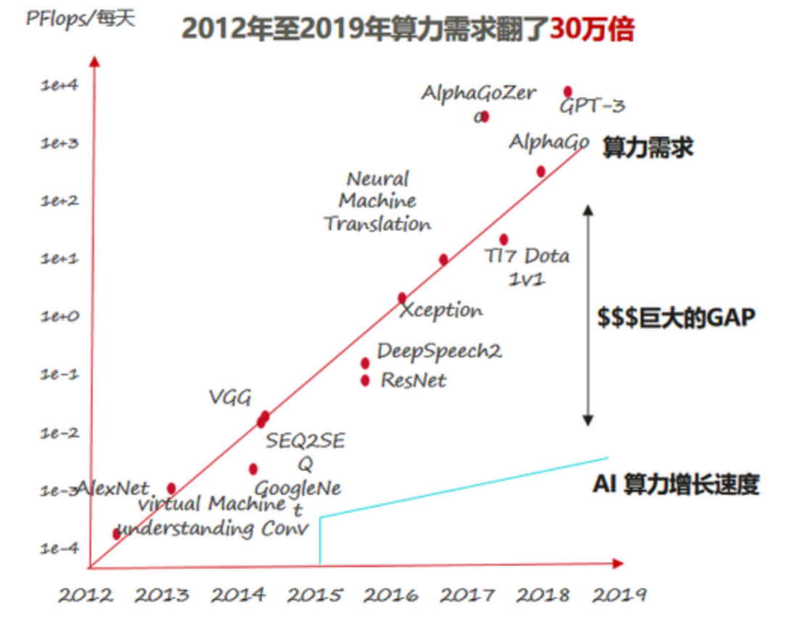

## 前瞻性与重要性分析

#### 1.增长的计算需求
随着人工智能、大数据分析、科学计算等领域的发展，对计算资源的需求不断增长。未来 GPU 需要处理更大规模、更复杂的计算任务，这将对显存的需求提出更高的要求。
 
具体有以下表现：
##### （1） 更大规模的数据处理
随着数据量的不断增加，特别是在大数据分析、机器学习、深度学习等领域，未来 GPU 需要处理更大规模的数据，需要更大容量的显存来存储数据和中间计算结果。
##### （2） 更复杂的计算任务：
未来 GPU 需要处理更加复杂和多样化的计算任务，包括模型训练、推理、图像处理、语音识别等各种计算任务。这些任务可能需要更多的显存来存储模型参数、中间计算结果等数据。
##### （3）更高的性能需求：
随着计算任务的不断增加和复杂化，未来 GPU 需要提供更高的性能来满足用户的需求。这包括更快的计算速度、更高的吞吐量、更低的延迟等方面。
##### （4）多任务并行处理：
未来 GPU 需要支持更多的并行计算任务，包括多个任务同时进行、多个任务之间的数据共享等。需要更有效地管理显存资源以支持多任务并行处理。

#### 2.新型应用场景：
随着人工智能、虚拟现实、增强现实等新型应用场景的不断涌现，对显存的需求也在不断变化。未来 GPU 需要适应更多样化的应用需求，需要在显存管理方面进行更多的优化，以下为几个例子。

##### （1）人工智能：
人工智能涵盖了机器学习、深度学习、自然语言处理、计算机视觉等各个方面。在这些领域中，GPU 被广泛应用于训练和推理深度神经网络模型。新的模型和算法不断涌现，需要更大规模、更复杂的计算和数据处理。例如大语言模型ChatGPT，需要大量的显存来存储模型参数和中间计算结果。

##### （2）虚拟现实：
虚拟现实技术通过模拟人类的感官体验，让用户沉浸在虚拟的三维环境中。在虚拟现实中，GPU 负责渲染图形、处理交互事件等任务。随着虚拟现实技术的不断进步，新的 VR 应用场景不断涌现，如虚拟会议、虚拟旅游、虚拟培训等。需要更快的图形渲染速度和更大的显存容量。

##### （3）增强现实：
增强现实技术通过将虚拟元素叠加到现实世界中，扩展人类的感知和交互能力。在增强现实中，GPU 负责识别现实世界中的场景、跟踪物体的位置、渲染虚拟元素等任务。随着增强现实技术的不断发展，新的 AR 应用场景不断涌现，如增强现实导航、增强现实游戏、增强现实演艺等。需要更复杂的算法和更高效的显存使用方式。

#### 3.智能化显存管理：
未来显存管理可能更加智能化，包括动态分配、内存压缩、数据重用等技术的应用。通过智能化显存管理，可以更好地适应不同的计算任务和应用场景，提高显存的利用率和性能。

##### （1）动态分配：
智能化显存管理可以根据系统的实时需求，动态分配显存资源给不同的计算任务。通过监测系统的负载情况和内存使用情况，智能化管理系统可以调整显存分配策略，确保每个任务都能获得适当的显存资源，从而最大程度地提高系统的整体性能。

##### （2）内存压缩：
智能化显存管理可以利用数据压缩技术来减少显存的占用量。通过识别和压缩内存中的重复数据、冗余数据或低频数据，可以显著减少显存的使用量，从而提高显存利用率并节省系统资源。例如，利用压缩算法对图像、模型参数等数据进行压缩，可以降低显存的空间占用，并提高系统的性能和效率。

##### （3）数据重用：
智能化显存管理可以通过数据重用技术来减少数据在内存和设备之间的传输量。通过识别和缓存经常使用的数据块或中间计算结果，可以减少数据的重复加载和传输，从而降低内存带宽消耗，提高系统的效率和性能。例如，在深度学习任务中，可以利用数据重用技术来减少模型参数的加载次数，加速模型训练和推理过程。

##### （4） 智能调度：
智能化显存管理可以通过智能调度算法来优化计算任务的执行顺序和并发度。通过分析任务之间的依赖关系和计算特性，智能化管理系统可以动态调整任务的执行顺序和并发度，以最大程度地提高系统的整体效率。例如，在多任务并行计算中，可以利用智能调度算法来平衡不同任务之间的资源竞争，避免资源浪费和性能下降。

#### 4.分布式显存系统：
未来可能会出现更多基于分布式显存系统的 GPU 架构，允许多个 GPU 之间共享显存资源。这种架构可以提高整个系统的显存利用率，并支持更大规模的计算任务。

##### （1）架构特点：
分布式显存系统通常由多个 GPU 节点组成，每个节点都包含一个或多个 GPU 设备以及相关的处理器和存储资源。这些节点通过高速网络连接在一起，形成一个统一的计算集群。每个节点上的 GPU 设备可以通过网络访问其他节点上的显存资源，实现数据共享和协同计算。

##### （2）数据共享：
分布式显存系统通过共享显存资源来实现数据共享和协同计算。在这种系统中，数据可以存储在任何一个节点的显存中，并且可以通过网络访问到其他节点上的 GPU 设备。这种数据共享方式可以极大地扩展系统的存储容量和计算能力，从而支持更大规模、更复杂的计算任务。

##### （3）任务调度：
在分布式显存系统中，任务调度是一个关键问题。由于多个 GPU 设备共享同一份数据，因此需要合理地调度计算任务，以最大程度地利用系统资源并确保任务的正确执行顺序。通常采用分布式调度算法来实现任务的分配和调度，以确保任务的负载均衡和系统的整体性能。

##### （4）应用场景：
分布式显存系统适用于需要大规模数据处理和并行计算的应用场景，如深度学习训练、大规模数据分析、科学计算等。这些应用通常需要大量的计算资源和存储资源，分布式显存系统可以提供更大的计算和存储能力，并且支持更复杂的计算任务和算法。

#### 5.软硬件协同优化
未来的显存优化将更多地涉及到软硬件协同设计。硬件厂商和软件开发者将密切合作，通过优化算法、编译器、驱动程序等多个层面来提高显存利用率和性能。软硬件协同优化可以充分发挥硬件的潜力，实现更高效的显存管理和计算处理。有以下几个方面

##### （1）内存访问模式优化：
软件开发人员可以通过优化算法和数据结构来改进内存访问模式，以最大程度地利用 GPU 的内存层次结构和并行计算能力。例如，通过数据局部性原则，合理地组织数据访问模式，以减少内存访问延迟和提高数据缓存命中率。

##### （2）内存分配与释放策略：
软件开发人员可以根据应用特点和系统需求，设计合适的内存分配与释放策略，以最小化内存碎片化、减少内存泄漏，并提高内存利用率。同时，需要考虑到 GPU 内存管理器的特点和限制，以避免因不当的内存操作而导致性能下降或系统崩溃。

##### （3）内存数据压缩算法优化：
硬件设计者可以设计专门的压缩引擎或硬件模块，以提供显存数据的压缩和解压功能。软件开发人员可以针对不同的应用场景和数据特点，选择合适的压缩算法，并对其进行优化，以降低数据传输带宽、减少显存占用，并提高系统的性能和效率。

##### （4）内存访问控制与并发管理：
软件开发人员可以通过合理的并发管理和内存访问控制策略，最大化利用 GPU 的并行计算能力，并避免因数据竞争而导致的性能下降或系统错误。硬件工程师可以设计支持并发访问和多线程操作的硬件结构，以提高系统的并行度和吞吐量。
